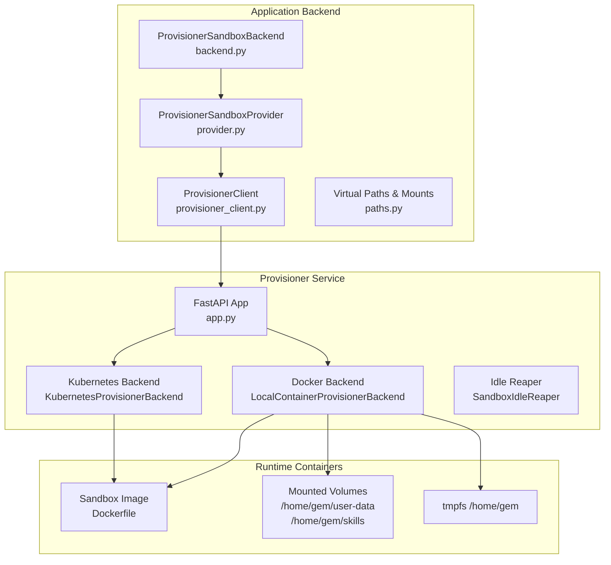
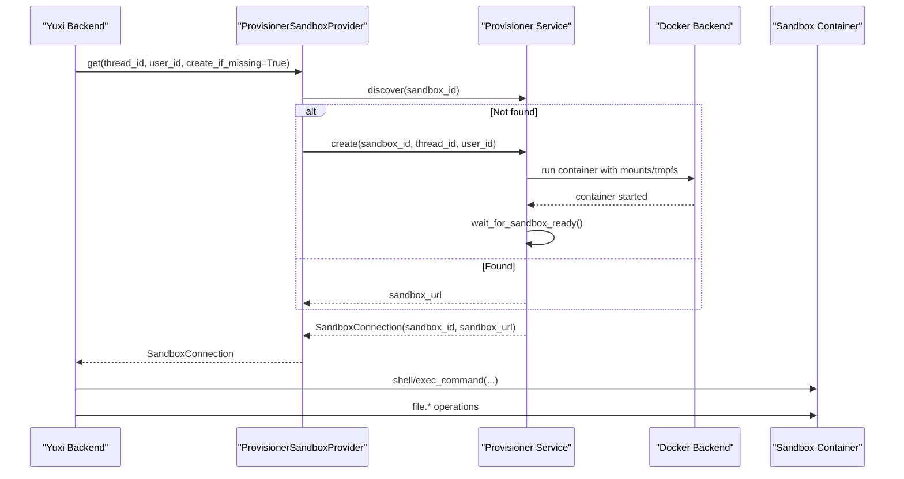
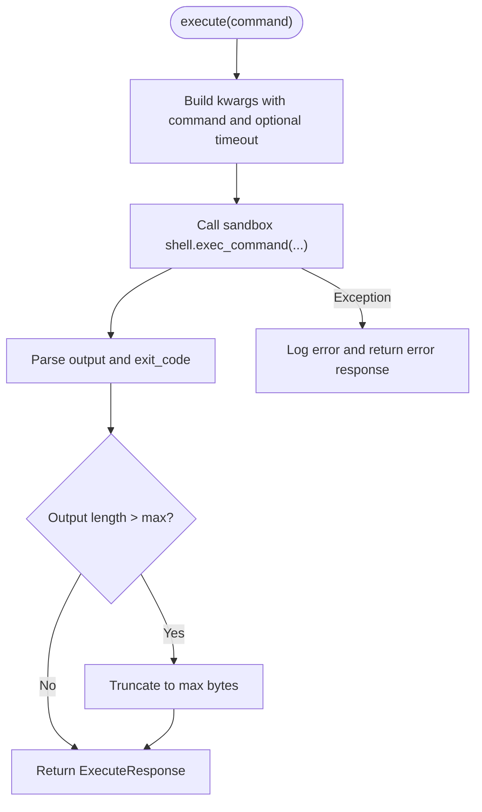
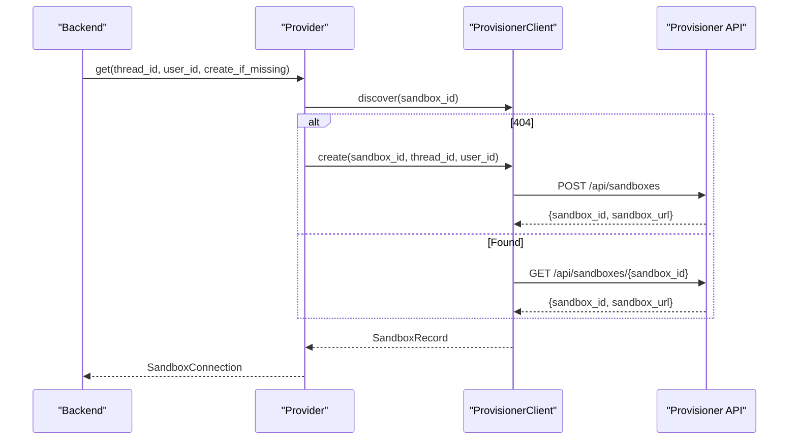
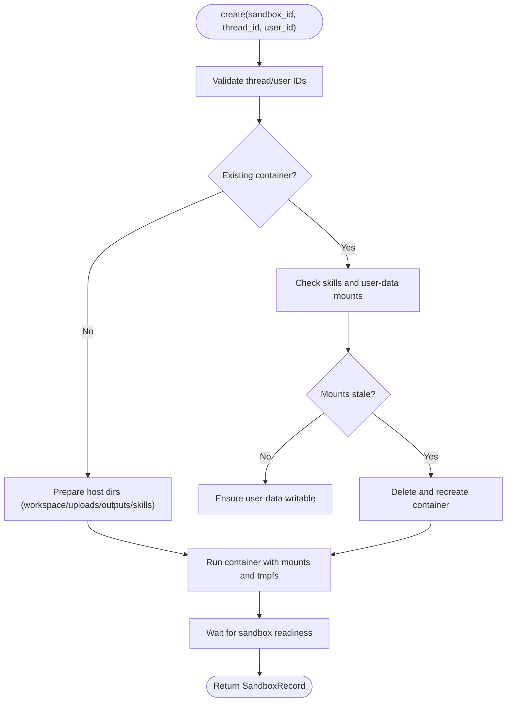
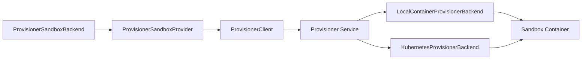

# Sandbox Security

<cite>
**Referenced Files in This Document**
- [backend.py](file://backend/package/yuxi/agents/backends/sandbox/backend.py)
- [provider.py](file://backend/package/yuxi/agents/backends/sandbox/provider.py)
- [provisioner_client.py](file://backend/package/yuxi/agents/backends/sandbox/provisioner_client.py)
- [paths.py](file://backend/package/yuxi/agents/backends/sandbox/paths.py)
- [app.py](file://docker/sandbox_provisioner/app.py)
- [Dockerfile](file://docker/sandbox_provisioner/Dockerfile)
- [requirements.txt](file://docker/sandbox_provisioner/requirements.txt)
- [api.Dockerfile](file://docker/api.Dockerfile)
- [web.Dockerfile](file://docker/web.Dockerfile)
- [sandbox-architecture.md](file://docs/agents/sandbox-architecture.md)
- [logging_config.py](file://backend/package/yuxi/utils/logging_config.py)
</cite>

## Table of Contents
1. [Introduction](#introduction)
2. [Project Structure](#project-structure)
3. [Core Components](#core-components)
4. [Architecture Overview](#architecture-overview)
5. [Detailed Component Analysis](#detailed-component-analysis)
6. [Dependency Analysis](#dependency-analysis)
7. [Performance Considerations](#performance-considerations)
8. [Troubleshooting Guide](#troubleshooting-guide)
9. [Conclusion](#conclusion)
10. [Appendices](#appendices)

## Introduction
This document provides comprehensive sandbox security documentation for the Yuxi agent execution environment. It explains the containerized sandbox architecture using Docker to isolate agent execution, manage privileges, and enforce resource and filesystem boundaries. It covers the provisioning pipeline, container lifecycle management, cleanup procedures, security policies for agent tool execution, filesystem access controls, inter-container communication, monitoring and logging for sandbox activities, practical configuration examples, and secure development practices.

## Project Structure
The sandbox security stack spans three layers:
- Application backend: a sandbox backend that communicates with a provisioner to obtain a sandbox URL and executes commands and file operations remotely.
- Provisioner service: a FastAPI service that provisions and manages sandbox instances (Docker or Kubernetes), exposes health and lifecycle APIs, and enforces lifecycle policies.
- Container runtime: Docker-based sandbox containers with controlled mounts, tmpfs, and minimal privileges.

**Diagram sources**
- [backend.py:64-402](file://backend/package/yuxi/agents/backends/sandbox/backend.py#L64-L402)
- [provider.py:27-171](file://backend/package/yuxi/agents/backends/sandbox/provider.py#L27-L171)
- [provisioner_client.py:15-73](file://backend/package/yuxi/agents/backends/sandbox/provisioner_client.py#L15-L73)
- [app.py:116-455](file://docker/sandbox_provisioner/app.py#L116-L455)
- [Dockerfile:1-16](file://docker/sandbox_provisioner/Dockerfile#L1-L16)

**Section sources**
- [backend.py:64-402](file://backend/package/yuxi/agents/backends/sandbox/backend.py#L64-L402)
- [provider.py:27-171](file://backend/package/yuxi/agents/backends/sandbox/provider.py#L27-L171)
- [provisioner_client.py:15-73](file://backend/package/yuxi/agents/backends/sandbox/provisioner_client.py#L15-L73)
- [app.py:116-455](file://docker/sandbox_provisioner/app.py#L116-L455)
- [Dockerfile:1-16](file://docker/sandbox_provisioner/Dockerfile#L1-L16)

## Core Components
- ProvisionerSandboxBackend: Thin client that talks to the provisioner to obtain a sandbox URL and performs remote shell and file operations with strict path normalization and output truncation.
- ProvisionerSandboxProvider: Thread-scoped provider that discovers or creates a sandbox via the provisioner, maintains keepalive touches, and caches connections per thread.
- ProvisionerClient: HTTP client that interacts with the provisioner’s REST API to create, discover, touch, and delete sandboxes.
- LocalContainerProvisionerBackend: Docker backend that validates thread/user IDs, ensures expected mounts, starts containers with controlled volumes and tmpfs, and waits for readiness.
- KubernetesProvisionerBackend: Kubernetes backend that creates Pods and Services, mounts shared PVCs with subPaths, and exposes sandboxes via NodePort.
- SandboxIdleReaper: Periodic reaper that deletes idle sandboxes after a configurable timeout.
- Virtual Paths and Mounts: Resolves virtual paths to host directories, enforces path traversal checks, and maps namespaces to persistent mounts.

Security highlights:
- Path normalization and traversal checks prevent unauthorized host path access.
- Controlled mounts: user-data writable, skills read-only, and ephemeral tmpfs for /home/gem.
- Resource and lifecycle controls via timeouts and idle reaper.
- Network exposure via NodePort or Docker port mapping with explicit host binding.

**Section sources**
- [backend.py:64-402](file://backend/package/yuxi/agents/backends/sandbox/backend.py#L64-L402)
- [provider.py:27-171](file://backend/package/yuxi/agents/backends/sandbox/provider.py#L27-L171)
- [provisioner_client.py:15-73](file://backend/package/yuxi/agents/backends/sandbox/provisioner_client.py#L15-L73)
- [app.py:116-455](file://docker/sandbox_provisioner/app.py#L116-L455)
- [paths.py:12-136](file://backend/package/yuxi/agents/backends/sandbox/paths.py#L12-L136)

## Architecture Overview
The sandbox execution architecture separates concerns across layers:
- Application layer: Yuxi backend requests a sandbox for a thread, then executes commands and reads/writes files via the sandbox URL.
- Provisioner layer: Creates or reuses sandbox containers, exposes health and lifecycle endpoints, and enforces lifecycle policies.
- Runtime layer: Docker/Kubernetes containers with controlled mounts and minimal privileges.

**Diagram sources**
- [provider.py:103-128](file://backend/package/yuxi/agents/backends/sandbox/provider.py#L103-L128)
- [provisioner_client.py:32-58](file://backend/package/yuxi/agents/backends/sandbox/provisioner_client.py#L32-L58)
- [app.py:322-399](file://docker/sandbox_provisioner/app.py#L322-L399)

**Section sources**
- [provider.py:103-128](file://backend/package/yuxi/agents/backends/sandbox/provider.py#L103-L128)
- [provisioner_client.py:32-58](file://backend/package/yuxi/agents/backends/sandbox/provisioner_client.py#L32-L58)
- [app.py:322-399](file://docker/sandbox_provisioner/app.py#L322-L399)

## Detailed Component Analysis

### ProvisionerSandboxBackend
Responsibilities:
- Normalizes paths and prevents path traversal.
- Executes shell commands with timeout and output truncation.
- Reads/writes/edit files via the sandbox file API with robust error handling.
- Uploads/downloads files with base64 encoding for binary safety.

Security and safety:
- Path normalization and traversal checks reduce host path injection risks.
- Output truncation protects against oversized outputs.
- Strict error mapping for permission/directory/file-not-found conditions.

**Diagram sources**
- [backend.py:171-199](file://backend/package/yuxi/agents/backends/sandbox/backend.py#L171-L199)

**Section sources**
- [backend.py:64-402](file://backend/package/yuxi/agents/backends/sandbox/backend.py#L64-L402)

### ProvisionerSandboxProvider and ProvisionerClient
Responsibilities:
- Provider resolves a stable sandbox_id from thread_id, discovers or creates a sandbox, and keeps it alive via periodic touches.
- Client wraps HTTP calls to the provisioner’s REST endpoints.

Security and reliability:
- Thread-scoped locks prevent race conditions during creation/reuse.
- Keepalive touch ensures liveness and avoids stale connections.
- Robust error handling and warnings for transient failures.

**Diagram sources**
- [provider.py:103-128](file://backend/package/yuxi/agents/backends/sandbox/provider.py#L103-L128)
- [provisioner_client.py:32-66](file://backend/package/yuxi/agents/backends/sandbox/provisioner_client.py#L32-L66)

**Section sources**
- [provider.py:27-171](file://backend/package/yuxi/agents/backends/sandbox/provider.py#L27-L171)
- [provisioner_client.py:15-73](file://backend/package/yuxi/agents/backends/sandbox/provisioner_client.py#L15-L73)

### LocalContainerProvisionerBackend (Docker)
Responsibilities:
- Validates thread/user IDs and sanitizes identifiers.
- Ensures expected mounts for skills (read-only) and user-data (workspace/uploads/outputs, writable).
- Starts containers with tmpfs on /home/gem and seccomp=unconfined for sandbox compatibility.
- Waits for sandbox readiness and handles stale mounts by recreating containers.

Security and isolation:
- Controlled bind mounts with explicit destinations.
- Ephemeral tmpfs for /home/gem reduces persistence of temporary artifacts.
- Minimal network exposure via port mapping; host binding configurable.

**Diagram sources**
- [app.py:322-399](file://docker/sandbox_provisioner/app.py#L322-L399)

**Section sources**
- [app.py:116-455](file://docker/sandbox_provisioner/app.py#L116-L455)

### KubernetesProvisionerBackend
Responsibilities:
- Creates a Pod with init container to prepare permissions and directories.
- Mounts a shared PVC with subPaths for user-data and skills.
- Exposes the sandbox via a NodePort Service.

Security and isolation:
- Uses PodSecurityContext with fs_group and run_as_user set to 0 for consistent permissions.
- Shared PVC with subPaths ensures tenant isolation at the filesystem level.
- NodePort exposure requires a reachable NODE_HOST.

**Section sources**
- [app.py:457-698](file://docker/sandbox_provisioner/app.py#L457-L698)

### SandboxIdleReaper
Responsibilities:
- Tracks last activity timestamps per sandbox and deletes sandboxes exceeding idle timeout.
- Prevents premature deletion by ensuring idle timeout exceeds exec timeout.

Security and operational benefits:
- Limits resource consumption by reclaiming idle containers/Pods.
- Avoids deleting running tasks by adjusting idle timeout if needed.

**Section sources**
- [app.py:700-776](file://docker/sandbox_provisioner/app.py#L700-L776)

### Virtual Paths and Mounts
Responsibilities:
- Enforces path traversal checks and validates thread/user IDs.
- Resolves virtual paths to host directories and maps namespaces to persistent mounts.

Security and isolation:
- Restricts access to predefined namespaces: user-data, skills, kbs.
- Prevents escaping host directories via relative path resolution and checks.

**Section sources**
- [paths.py:12-136](file://backend/package/yuxi/agents/backends/sandbox/paths.py#L12-L136)

## Dependency Analysis
The sandbox security relies on clear separation of responsibilities and minimal coupling:
- Application backend depends on the provisioner for sandbox URLs and lifecycle.
- Provisioner depends on Docker or Kubernetes backends for container orchestration.
- Both backends depend on validated thread/user IDs and controlled mounts.

**Diagram sources**
- [backend.py:64-105](file://backend/package/yuxi/agents/backends/sandbox/backend.py#L64-L105)
- [provider.py:27-128](file://backend/package/yuxi/agents/backends/sandbox/provider.py#L27-L128)
- [provisioner_client.py:15-73](file://backend/package/yuxi/agents/backends/sandbox/provisioner_client.py#L15-L73)
- [app.py:116-455](file://docker/sandbox_provisioner/app.py#L116-L455)

**Section sources**
- [backend.py:64-105](file://backend/package/yuxi/agents/backends/sandbox/backend.py#L64-L105)
- [provider.py:27-128](file://backend/package/yuxi/agents/backends/sandbox/provider.py#L27-L128)
- [provisioner_client.py:15-73](file://backend/package/yuxi/agents/backends/sandbox/provisioner_client.py#L15-L73)
- [app.py:116-455](file://docker/sandbox_provisioner/app.py#L116-L455)

## Performance Considerations
- Command timeouts and output truncation prevent runaway processes and excessive memory usage.
- Idle reaper reduces idle resource consumption; tune idle timeout to exceed execution timeout.
- Docker tmpfs minimizes disk writes for ephemeral data.
- Kubernetes shared PVC with subPaths optimizes IO and isolates tenants.

[No sources needed since this section provides general guidance]

## Troubleshooting Guide
Common issues and resolutions:
- Provisioner health and backend type: check health endpoint and backend type.
- Docker address reachability: verify DOCKER_SANDBOX_HOST and mapped port accessibility from the API container.
- Kubernetes address reachability: verify NODE_HOST and NodePort connectivity.
- File visibility: distinguish between host-side saves paths and sandbox-side mounted paths; confirm mounts and permissions.

Operational tips:
- Review provisioner logs for creation, reuse, health check failures, and idle reaper actions.
- Validate thread/user ID sanitization and path traversal checks when encountering permission errors.

**Section sources**
- [sandbox-architecture.md:199-206](file://docs/agents/sandbox-architecture.md#L199-L206)
- [app.py:101-113](file://docker/sandbox_provisioner/app.py#L101-L113)

## Conclusion
The Yuxi sandbox security model leverages a clear separation of concerns: the application backend delegates execution to a provisioner, which orchestrates sandbox instances with controlled mounts and lifecycle policies. Docker and Kubernetes backends provide flexible deployment options while maintaining strong isolation boundaries. Path normalization, output truncation, and an idle reaper further strengthen security and operational reliability.

[No sources needed since this section summarizes without analyzing specific files]

## Appendices

### Security Policies and Controls
- Path traversal prevention: enforced in both backend and path resolver.
- Controlled mounts: user-data writable, skills read-only, tmpfs for ephemeral data.
- Lifecycle management: keepalive touches, health checks, and idle reaper.
- Execution limits: command timeouts and output truncation.

**Section sources**
- [backend.py:26-34](file://backend/package/yuxi/agents/backends/sandbox/backend.py#L26-L34)
- [paths.py:95-110](file://backend/package/yuxi/agents/backends/sandbox/paths.py#L95-L110)
- [app.py:322-399](file://docker/sandbox_provisioner/app.py#L322-L399)
- [app.py:700-776](file://docker/sandbox_provisioner/app.py#L700-L776)

### Monitoring and Logging
- Centralized logging via loguru with file and console handlers.
- Third-party libraries bridged to loguru for consistent logging.
- Provisioner logs capture creation, reuse, health checks, and idle deletions.

**Section sources**
- [logging_config.py:14-99](file://backend/package/yuxi/utils/logging_config.py#L14-L99)
- [app.py:101-113](file://docker/sandbox_provisioner/app.py#L101-L113)

### Practical Configuration Examples
- Minimum Docker configuration for default development mode.
- Environment variables for Docker and Kubernetes backends.
- Notes on host reachability for Docker Desktop vs Linux hosts.

**Section sources**
- [sandbox-architecture.md:162-186](file://docs/agents/sandbox-architecture.md#L162-L186)
- [app.py:61-86](file://docker/sandbox_provisioner/app.py#L61-L86)
- [app.py:457-698](file://docker/sandbox_provisioner/app.py#L457-L698)

### Secure Agent Development Practices
- Prefer text-only writes for small files; use upload_files for binary payloads.
- Use virtual paths and the provided resolvers to avoid direct host path manipulation.
- Respect output truncation and command timeouts to prevent resource exhaustion.
- Avoid relying on absolute host paths; use the sandbox-visible namespaces.

**Section sources**
- [backend.py:230-253](file://backend/package/yuxi/agents/backends/sandbox/backend.py#L230-L253)
- [paths.py:95-136](file://backend/package/yuxi/agents/backends/sandbox/paths.py#L95-L136)