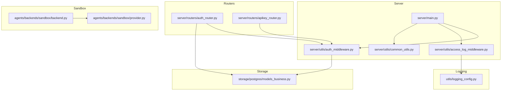
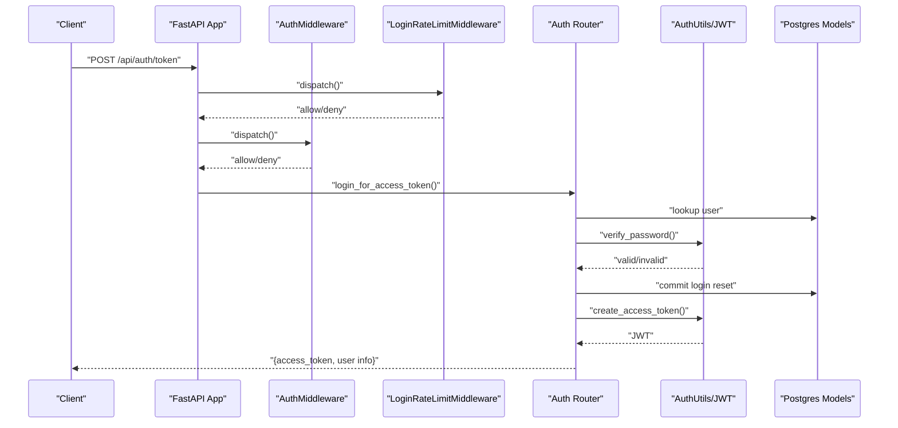
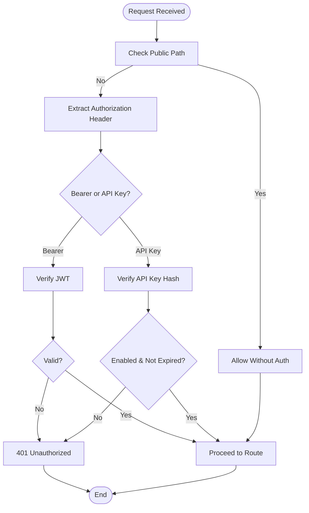
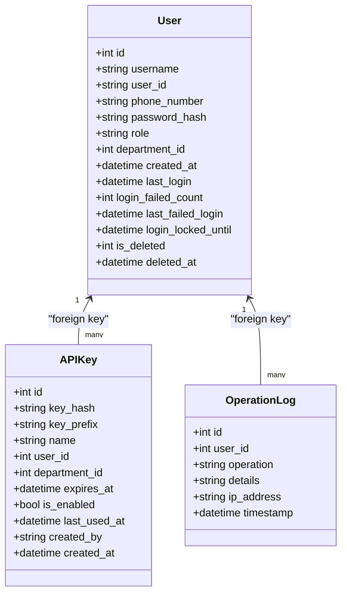
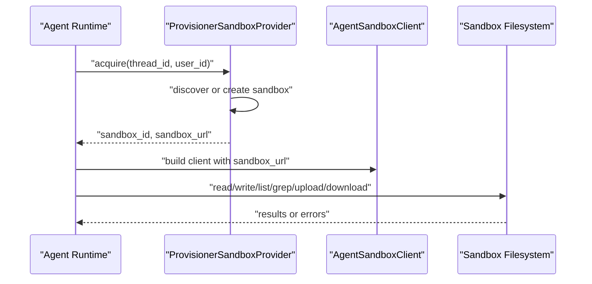
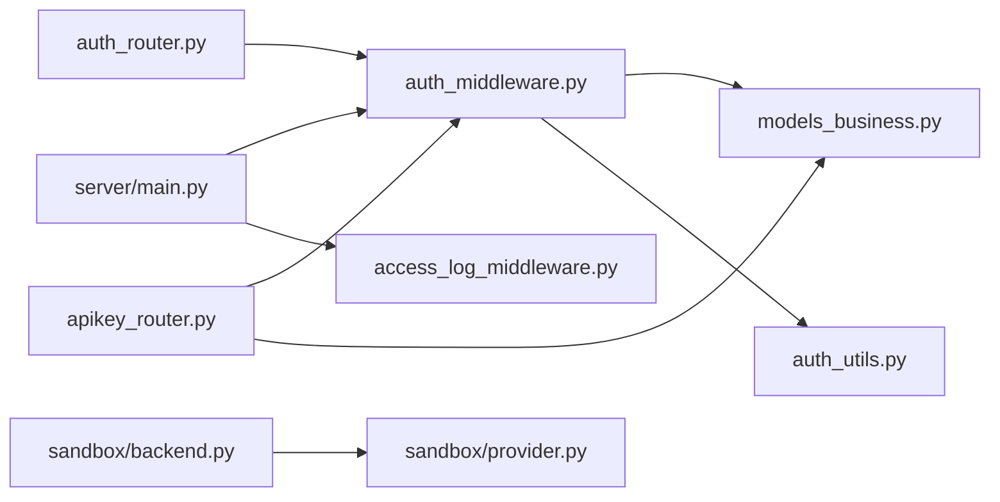

# Security Considerations

<cite>
**Referenced Files in This Document**
- [backend/server/main.py](file://backend/server/main.py)
- [backend/server/utils/auth_middleware.py](file://backend/server/utils/auth_middleware.py)
- [backend/server/routers/auth_router.py](file://backend/server/routers/auth_router.py)
- [backend/server/routers/apikey_router.py](file://backend/server/routers/apikey_router.py)
- [backend/server/utils/auth_utils.py](file://backend/server/utils/auth_utils.py)
- [backend/server/utils/access_log_middleware.py](file://backend/server/utils/access_log_middleware.py)
- [backend/server/utils/common_utils.py](file://backend/server/utils/common_utils.py)
- [backend/package/yuxi/storage/postgres/models_business.py](file://backend/package/yuxi/storage/postgres/models_business.py)
- [backend/package/yuxi/agents/backends/sandbox/backend.py](file://backend/package/yuxi/agents/backends/sandbox/backend.py)
- [backend/package/yuxi/agents/backends/sandbox/provider.py](file://backend/package/yuxi/agents/backends/sandbox/provider.py)
- [backend/package/yuxi/utils/logging_config.py](file://backend/package/yuxi/utils/logging_config.py)
- [backend/docker-compose.yml](file://backend/docker-compose.yml)
- [backend/docker-compose.prod.yml](file://backend/docker-compose.prod.yml)
- [docker/nginx/default.conf](file://docker/nginx/default.conf)
- [docker/nginx/nginx.conf](file://docker/nginx/nginx.conf)
</cite>

## Table of Contents
1. [Introduction](#introduction)
2. [Project Structure](#project-structure)
3. [Core Components](#core-components)
4. [Architecture Overview](#architecture-overview)
5. [Detailed Component Analysis](#detailed-component-analysis)
6. [Dependency Analysis](#dependency-analysis)
7. [Performance Considerations](#performance-considerations)
8. [Troubleshooting Guide](#troubleshooting-guide)
9. [Conclusion](#conclusion)
10. [Appendices](#appendices)

## Introduction
This document provides comprehensive security documentation for the Yuxi platform. It covers authentication and authorization mechanisms (JWT tokens, API keys, and session management), data protection (encryption at rest and in transit), sandbox security for agent execution isolation, access control for users and departments, audit logging and monitoring, practical configuration examples, threat modeling, vulnerability mitigation, and production compliance considerations.

## Project Structure
Security-critical components are organized across:
- Application entry and middleware stack
- Authentication and authorization utilities
- API routers for authentication and API key management
- Database models for users, departments, API keys, and operation logs
- Sandbox backend and provisioning for agent execution isolation
- Logging and access logging infrastructure
- Deployment configurations for development and production

**Diagram sources**
- [backend/server/main.py:40-137](file://backend/server/main.py#L40-L137)
- [backend/server/utils/auth_middleware.py:1-169](file://backend/server/utils/auth_middleware.py#L1-L169)
- [backend/server/utils/access_log_middleware.py:1-68](file://backend/server/utils/access_log_middleware.py#L1-L68)
- [backend/server/utils/common_utils.py:1-62](file://backend/server/utils/common_utils.py#L1-L62)
- [backend/server/routers/auth_router.py:1-829](file://backend/server/routers/auth_router.py#L1-L829)
- [backend/server/routers/apikey_router.py:1-259](file://backend/server/routers/apikey_router.py#L1-L259)
- [backend/package/yuxi/storage/postgres/models_business.py:1-706](file://backend/package/yuxi/storage/postgres/models_business.py#L1-L706)
- [backend/package/yuxi/agents/backends/sandbox/backend.py:1-402](file://backend/package/yuxi/agents/backends/sandbox/backend.py#L1-L402)
- [backend/package/yuxi/agents/backends/sandbox/provider.py:1-171](file://backend/package/yuxi/agents/backends/sandbox/provider.py#L1-L171)
- [backend/package/yuxi/utils/logging_config.py:1-99](file://backend/package/yuxi/utils/logging_config.py#L1-L99)

**Section sources**
- [backend/server/main.py:1-150](file://backend/server/main.py#L1-L150)
- [backend/server/utils/auth_middleware.py:1-169](file://backend/server/utils/auth_middleware.py#L1-L169)
- [backend/server/routers/auth_router.py:1-829](file://backend/server/routers/auth_router.py#L1-L829)
- [backend/server/routers/apikey_router.py:1-259](file://backend/server/routers/apikey_router.py#L1-L259)
- [backend/package/yuxi/storage/postgres/models_business.py:1-706](file://backend/package/yuxi/storage/postgres/models_business.py#L1-L706)
- [backend/package/yuxi/agents/backends/sandbox/backend.py:1-402](file://backend/package/yuxi/agents/backends/sandbox/backend.py#L1-L402)
- [backend/package/yuxi/agents/backends/sandbox/provider.py:1-171](file://backend/package/yuxi/agents/backends/sandbox/provider.py#L1-L171)
- [backend/package/yuxi/utils/logging_config.py:1-99](file://backend/package/yuxi/utils/logging_config.py#L1-L99)

## Core Components
- Authentication and Authorization
  - JWT-based access tokens with HS256 and 7-day expiration
  - API Key support with SHA-256 hashing and optional per-user or per-department binding
  - Role-based access control (superadmin, admin, user) with department-scoped visibility
  - Rate limiting for login attempts and brute-force mitigation
- Data Protection
  - Password hashing with Argon2; legacy SHA-256+salt compatibility
  - Secrets stored as hashes; API key secret revealed only upon creation
  - Operation logs capture user actions and IP addresses
- Sandbox Security
  - Thread- and user-scoped sandbox isolation via provisioner
  - Path normalization and traversal checks; binary detection safeguards
  - Output truncation and timeouts to constrain resource usage
- Audit Logging and Monitoring
  - Access log middleware records request method, path, status, and latency
  - Dedicated access logger with structured formatting
  - Centralized logging bridge to Loguru for operational observability

**Section sources**
- [backend/server/utils/auth_utils.py:1-81](file://backend/server/utils/auth_utils.py#L1-L81)
- [backend/server/utils/auth_middleware.py:1-169](file://backend/server/utils/auth_middleware.py#L1-L169)
- [backend/server/routers/apikey_router.py:1-259](file://backend/server/routers/apikey_router.py#L1-L259)
- [backend/package/yuxi/storage/postgres/models_business.py:51-131](file://backend/package/yuxi/storage/postgres/models_business.py#L51-L131)
- [backend/server/main.py:32-96](file://backend/server/main.py#L32-L96)
- [backend/package/yuxi/agents/backends/sandbox/backend.py:26-50](file://backend/package/yuxi/agents/backends/sandbox/backend.py#L26-L50)
- [backend/server/utils/access_log_middleware.py:1-68](file://backend/server/utils/access_log_middleware.py#L1-L68)
- [backend/package/yuxi/utils/logging_config.py:1-99](file://backend/package/yuxi/utils/logging_config.py#L1-L99)

## Architecture Overview
The security architecture integrates middleware, routers, and storage to enforce authentication, authorization, rate limiting, and auditing. The sandbox subsystem isolates agent execution and constrains resource usage.

**Diagram sources**
- [backend/server/main.py:63-96](file://backend/server/main.py#L63-L96)
- [backend/server/utils/auth_middleware.py:100-139](file://backend/server/utils/auth_middleware.py#L100-L139)
- [backend/server/routers/auth_router.py:115-207](file://backend/server/routers/auth_router.py#L115-L207)
- [backend/server/utils/auth_utils.py:46-81](file://backend/server/utils/auth_utils.py#L46-L81)
- [backend/package/yuxi/storage/postgres/models_business.py:51-131](file://backend/package/yuxi/storage/postgres/models_business.py#L51-L131)

## Detailed Component Analysis

### Authentication and Authorization
- JWT Tokens
  - HS256 signing with configurable secret; 7-day expiration
  - Token verification decodes payload and validates expiration
- API Keys
  - Creation generates a random secret once; stored as SHA-256 hash
  - Supports per-user or per-department binding; optional expiry
  - Validation distinguishes API key vs JWT tokens by prefix
- Session Management
  - Stateless JWT bearer tokens; no server-side session storage
  - Public paths bypass authentication; others require either JWT or API key
- Access Control
  - Roles enforced via dependency injectors (superadmin, admin, required user)
  - Department-scoped visibility and administrative actions
  - Soft-deletion for users with de-identification on deletion

**Diagram sources**
- [backend/server/utils/auth_middleware.py:16-169](file://backend/server/utils/auth_middleware.py#L16-L169)
- [backend/server/utils/auth_utils.py:46-81](file://backend/server/utils/auth_utils.py#L46-L81)
- [backend/server/routers/apikey_router.py:19-31](file://backend/server/routers/apikey_router.py#L19-L31)

**Section sources**
- [backend/server/utils/auth_utils.py:1-81](file://backend/server/utils/auth_utils.py#L1-L81)
- [backend/server/utils/auth_middleware.py:1-169](file://backend/server/utils/auth_middleware.py#L1-L169)
- [backend/server/routers/auth_router.py:115-207](file://backend/server/routers/auth_router.py#L115-L207)
- [backend/server/routers/apikey_router.py:1-259](file://backend/server/routers/apikey_router.py#L1-L259)
- [backend/package/yuxi/storage/postgres/models_business.py:618-663](file://backend/package/yuxi/storage/postgres/models_business.py#L618-L663)

### Data Protection Measures
- Encryption at Rest
  - Secrets (passwords, API key hashes) persisted as hashes; secrets are never stored in plaintext
- Encryption in Transit
  - HTTPS termination recommended via Nginx reverse proxy in production
- Secure Defaults
  - Argon2 password hashing with salt; legacy SHA-256+salt compatibility maintained
  - Environment-driven JWT secret; default value present in code for development

**Diagram sources**
- [backend/package/yuxi/storage/postgres/models_business.py:51-131](file://backend/package/yuxi/storage/postgres/models_business.py#L51-L131)
- [backend/package/yuxi/storage/postgres/models_business.py:618-663](file://backend/package/yuxi/storage/postgres/models_business.py#L618-L663)
- [backend/package/yuxi/storage/postgres/models_business.py:373-396](file://backend/package/yuxi/storage/postgres/models_business.py#L373-L396)

**Section sources**
- [backend/server/utils/auth_utils.py:24-44](file://backend/server/utils/auth_utils.py#L24-L44)
- [backend/server/routers/apikey_router.py:19-31](file://backend/server/routers/apikey_router.py#L19-L31)
- [backend/package/yuxi/storage/postgres/models_business.py:51-131](file://backend/package/yuxi/storage/postgres/models_business.py#L51-L131)
- [backend/package/yuxi/storage/postgres/models_business.py:618-663](file://backend/package/yuxi/storage/postgres/models_business.py#L618-L663)

### Sandbox Security Model
- Isolation
  - Thread-scoped sandbox identifiers derived from thread IDs
  - User-scoped access checks during acquisition
- Privilege Management
  - Path normalization prevents traversal; binary detection avoids rendering
  - Output truncated and commands executed with timeouts
- Provisioning
  - Provisioner-backed lifecycle; keepalive touch interval configured
  - Reuse or creation of sandboxes per thread/user

**Diagram sources**
- [backend/package/yuxi/agents/backends/sandbox/provider.py:78-101](file://backend/package/yuxi/agents/backends/sandbox/provider.py#L78-L101)
- [backend/package/yuxi/agents/backends/sandbox/backend.py:85-105](file://backend/package/yuxi/agents/backends/sandbox/backend.py#L85-L105)

**Section sources**
- [backend/package/yuxi/agents/backends/sandbox/provider.py:1-171](file://backend/package/yuxi/agents/backends/sandbox/provider.py#L1-L171)
- [backend/package/yuxi/agents/backends/sandbox/backend.py:26-50](file://backend/package/yuxi/agents/backends/sandbox/backend.py#L26-L50)
- [backend/package/yuxi/agents/backends/sandbox/backend.py:171-200](file://backend/package/yuxi/agents/backends/sandbox/backend.py#L171-L200)

### Access Control Implementation
- Users and Departments
  - Users belong to departments; soft-deletion masks personal data
  - Department admin count enforcement prevents orphaning departments
- Resource Permissions
  - Superadmin can manage all resources; admins scoped to own department
  - API key ownership and regeneration restricted to authorized users

**Section sources**
- [backend/package/yuxi/storage/postgres/models_business.py:29-48](file://backend/package/yuxi/storage/postgres/models_business.py#L29-L48)
- [backend/package/yuxi/storage/postgres/models_business.py:51-131](file://backend/package/yuxi/storage/postgres/models_business.py#L51-L131)
- [backend/server/routers/auth_router.py:474-496](file://backend/server/routers/auth_router.py#L474-L496)
- [backend/server/routers/apikey_router.py:100-149](file://backend/server/routers/apikey_router.py#L100-L149)

### Audit Logging and Monitoring
- Access Logs
  - Middleware captures method, path, status, and latency; extracts client IP
- Operation Logs
  - Structured logs for user actions with IP address and details
- Observability
  - Logging bridge to Loguru; file rotation and retention configured

**Section sources**
- [backend/server/utils/access_log_middleware.py:1-68](file://backend/server/utils/access_log_middleware.py#L1-L68)
- [backend/server/utils/common_utils.py:33-45](file://backend/server/utils/common_utils.py#L33-L45)
- [backend/package/yuxi/utils/logging_config.py:55-99](file://backend/package/yuxi/utils/logging_config.py#L55-L99)

## Dependency Analysis
- Authentication depends on:
  - Auth utilities for JWT and password hashing
  - Postgres models for user and API key persistence
  - Access log middleware for request telemetry
- Sandbox depends on:
  - Provisioner client for lifecycle management
  - Backend utilities for path normalization and safety checks

**Diagram sources**
- [backend/server/utils/auth_middleware.py:1-169](file://backend/server/utils/auth_middleware.py#L1-L169)
- [backend/server/utils/auth_utils.py:1-81](file://backend/server/utils/auth_utils.py#L1-L81)
- [backend/package/yuxi/storage/postgres/models_business.py:1-706](file://backend/package/yuxi/storage/postgres/models_business.py#L1-L706)
- [backend/server/routers/auth_router.py:1-829](file://backend/server/routers/auth_router.py#L1-L829)
- [backend/server/routers/apikey_router.py:1-259](file://backend/server/routers/apikey_router.py#L1-L259)
- [backend/server/main.py:40-137](file://backend/server/main.py#L40-L137)
- [backend/server/utils/access_log_middleware.py:1-68](file://backend/server/utils/access_log_middleware.py#L1-L68)
- [backend/package/yuxi/agents/backends/sandbox/backend.py:1-402](file://backend/package/yuxi/agents/backends/sandbox/backend.py#L1-L402)
- [backend/package/yuxi/agents/backends/sandbox/provider.py:1-171](file://backend/package/yuxi/agents/backends/sandbox/provider.py#L1-L171)

**Section sources**
- [backend/server/utils/auth_middleware.py:1-169](file://backend/server/utils/auth_middleware.py#L1-L169)
- [backend/server/routers/auth_router.py:1-829](file://backend/server/routers/auth_router.py#L1-L829)
- [backend/server/routers/apikey_router.py:1-259](file://backend/server/routers/apikey_router.py#L1-L259)
- [backend/package/yuxi/agents/backends/sandbox/backend.py:1-402](file://backend/package/yuxi/agents/backends/sandbox/backend.py#L1-L402)
- [backend/package/yuxi/agents/backends/sandbox/provider.py:1-171](file://backend/package/yuxi/agents/backends/sandbox/provider.py#L1-L171)

## Performance Considerations
- Token verification and database lookups occur per request; caching JWT claims server-side is not implemented
- Rate limiting uses in-memory counters per worker; consider external cache for multi-instance deployments
- Sandbox operations enforce timeouts and output limits; tune configuration for workload characteristics

[No sources needed since this section provides general guidance]

## Troubleshooting Guide
- Authentication Failures
  - Verify JWT secret environment variable and token expiration
  - Confirm user role and department binding for route access
- API Key Issues
  - Ensure key hash matches stored value; regenerate secret when needed
  - Check enablement and expiry timestamps
- Sandbox Errors
  - Inspect path normalization and binary detection warnings
  - Review timeout and output truncation thresholds
- Logging
  - Confirm access log middleware is registered and logger handlers initialized

**Section sources**
- [backend/server/utils/auth_utils.py:14-17](file://backend/server/utils/auth_utils.py#L14-L17)
- [backend/server/utils/auth_middleware.py:35-70](file://backend/server/utils/auth_middleware.py#L35-L70)
- [backend/package/yuxi/agents/backends/sandbox/backend.py:107-135](file://backend/package/yuxi/agents/backends/sandbox/backend.py#L107-L135)
- [backend/server/utils/access_log_middleware.py:11-21](file://backend/server/utils/access_log_middleware.py#L11-L21)

## Conclusion
The Yuxi platform implements robust authentication via JWT and API keys, enforces role-based access control with department scoping, and logs security-relevant events. The sandbox subsystem provides strong isolation and resource constraints for agent execution. Production deployments should harden secrets, enforce HTTPS, and configure rate limiting and logging appropriately.

[No sources needed since this section summarizes without analyzing specific files]

## Appendices

### Practical Security Configuration Examples
- JWT Secret
  - Set a strong, random secret via environment variable for production
- API Key Lifecycle
  - Create API keys with explicit names and optional expiry; bind to user or department as appropriate
- Rate Limiting
  - Adjust login attempt thresholds and window sizes according to risk posture
- HTTPS and Reverse Proxy
  - Use Nginx to terminate TLS and forward to the application

**Section sources**
- [backend/server/utils/auth_utils.py:14-17](file://backend/server/utils/auth_utils.py#L14-L17)
- [backend/server/routers/apikey_router.py:100-149](file://backend/server/routers/apikey_router.py#L100-L149)
- [backend/server/main.py:32-38](file://backend/server/main.py#L32-L38)
- [docker/nginx/default.conf](file://docker/nginx/default.conf)
- [docker/nginx/nginx.conf](file://docker/nginx/nginx.conf)

### Threat Modeling and Mitigation
- Credential Exposure
  - Store secrets as hashes; never expose raw secrets except creation moment
- Brute Force Login
  - Enforce login lockout and rate limiting; monitor lockout headers
- Privilege Escalation
  - Role checks and department constraints prevent unauthorized elevation
- Sandbox Escape
  - Path normalization, binary detection, and output limits mitigate malicious file operations

**Section sources**
- [backend/package/yuxi/storage/postgres/models_business.py:106-131](file://backend/package/yuxi/storage/postgres/models_business.py#L106-L131)
- [backend/server/main.py:63-96](file://backend/server/main.py#L63-L96)
- [backend/package/yuxi/agents/backends/sandbox/backend.py:26-50](file://backend/package/yuxi/agents/backends/sandbox/backend.py#L26-L50)

### Incident Response Procedures
- Detect Suspicious Activity
  - Monitor access logs and operation logs for repeated failures and unusual routes
- Contain and Investigate
  - Lock affected accounts, revoke compromised API keys, and review sandbox activity
- Recover and Remediate
  - Rotate secrets, reconfigure rate limits, and harden deployment configurations

**Section sources**
- [backend/server/utils/access_log_middleware.py:24-65](file://backend/server/utils/access_log_middleware.py#L24-L65)
- [backend/server/utils/common_utils.py:33-45](file://backend/server/utils/common_utils.py#L33-L45)
- [backend/server/routers/apikey_router.py:206-226](file://backend/server/routers/apikey_router.py#L206-L226)

### Compliance and Best Practices
- Secrets Management
  - Use environment variables for secrets; avoid committing to version control
- Transport Security
  - Enforce HTTPS in production via reverse proxy configuration
- Least Privilege
  - Assign roles and API key scopes minimally required for function
- Logging and Retention
  - Configure log rotation and retention policies; protect audit trails

**Section sources**
- [backend/server/utils/auth_utils.py:14-17](file://backend/server/utils/auth_utils.py#L14-L17)
- [docker/nginx/default.conf](file://docker/nginx/default.conf)
- [docker/nginx/nginx.conf](file://docker/nginx/nginx.conf)
- [backend/package/yuxi/utils/logging_config.py:63-87](file://backend/package/yuxi/utils/logging_config.py#L63-L87)