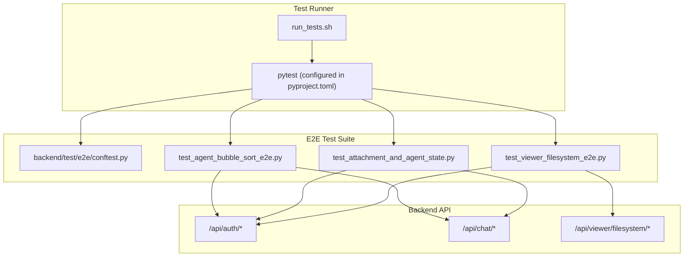
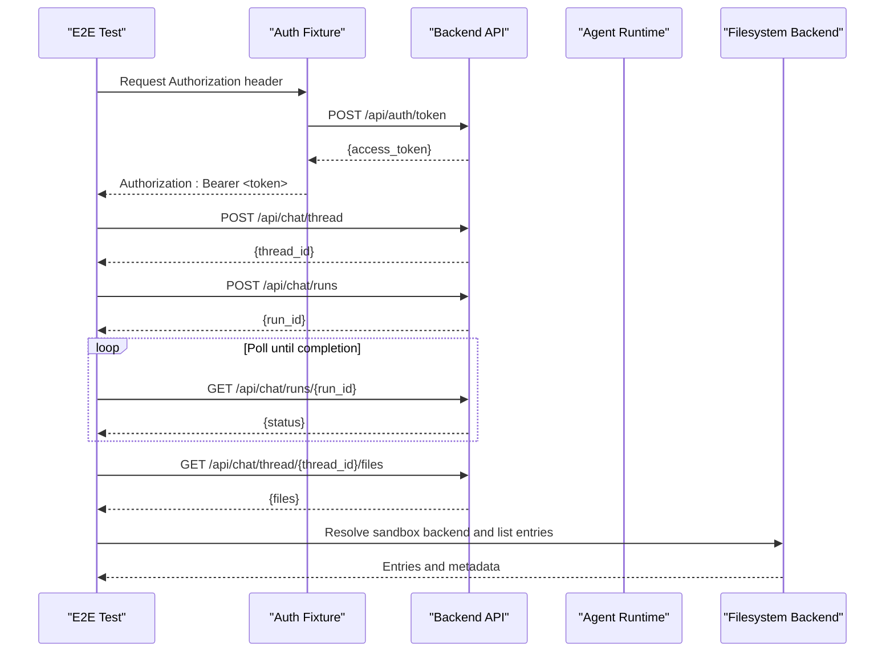
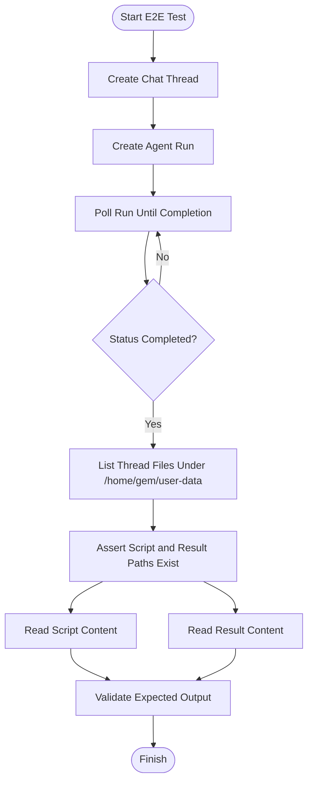
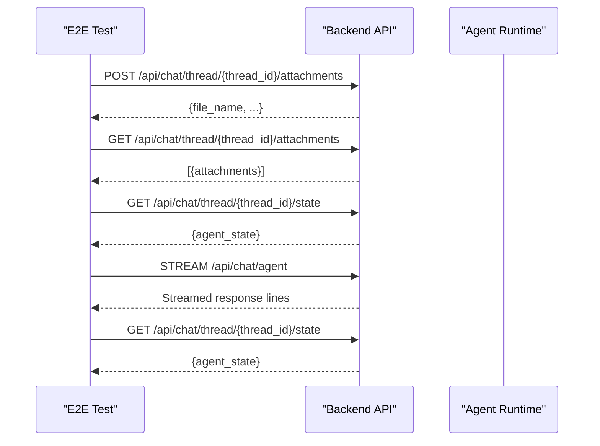
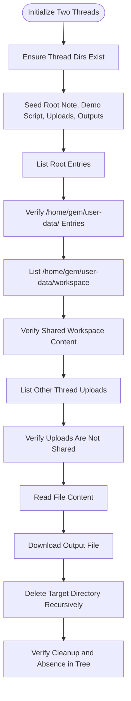
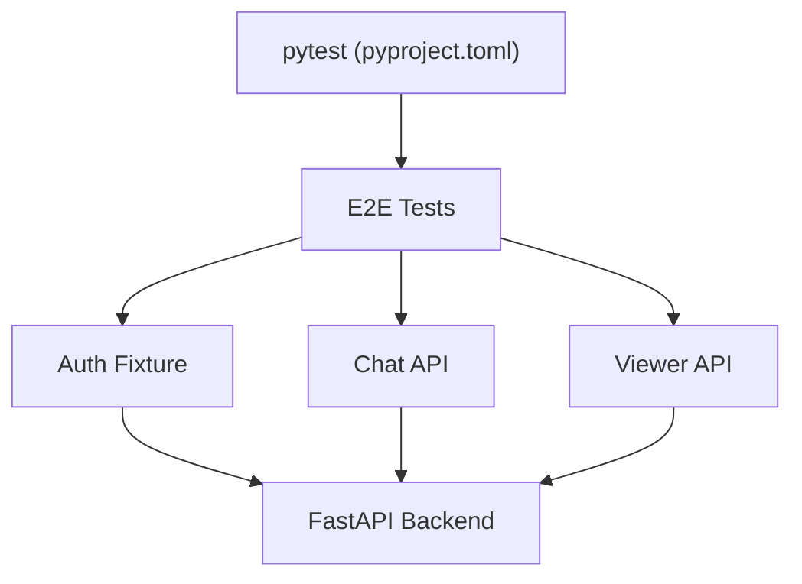

# End-to-End Testing

<cite>
**Referenced Files in This Document**
- [conftest.py](file://backend/test/e2e/conftest.py)
- [test_agent_bubble_sort_e2e.py](file://backend/test/e2e/test_agent_bubble_sort_e2e.py)
- [test_attachment_and_agent_state.py](file://backend/test/e2e/test_attachment_and_agent_state.py)
- [test_viewer_filesystem_e2e.py](file://backend/test/e2e/test_viewer_filesystem_e2e.py)
- [conftest.py](file://backend/test/conftest.py)
- [run_tests.sh](file://backend/test/run_tests.sh)
- [pyproject.toml](file://backend/pyproject.toml)
- [backend.py](file://backend/package/yuxi/agents/backends/sandbox/backend.py)
- [filesystem_service.py](file://backend/package/yuxi/services/filesystem_service.py)
- [agentPanelAutoOpen.js](file://web/src/utils/agentPanelAutoOpen.js)
</cite>

## Table of Contents
1. [Introduction](#introduction)
2. [Project Structure](#project-structure)
3. [Core Components](#core-components)
4. [Architecture Overview](#architecture-overview)
5. [Detailed Component Analysis](#detailed-component-analysis)
6. [Dependency Analysis](#dependency-analysis)
7. [Performance Considerations](#performance-considerations)
8. [Troubleshooting Guide](#troubleshooting-guide)
9. [Conclusion](#conclusion)

## Introduction
This document describes the end-to-end (E2E) testing implementation for the Yuxi platform. It focuses on how Playwright-based browser automation is used to validate full application workflows, including agent execution, file attachment handling, and state persistence across sessions. It also documents the E2E test fixtures for authentication, environment preparation, and backend integration, along with practical examples such as agent bubble sort execution, attachment processing, and filesystem operations. Strategies for real-time features, WebSocket communications, and interactive UI components are covered, alongside guidance for test stability, screenshots, and debugging failed scenarios.

## Project Structure
The E2E tests reside under backend/test/e2e and leverage pytest with asyncio fixtures to orchestrate HTTP requests against the backend API. The test runner script executes tests inside the Docker Compose environment, ensuring a realistic production-like setup.

**Diagram sources**
- [run_tests.sh:1-88](file://backend/test/run_tests.sh#L1-L88)
- [pyproject.toml:41-54](file://backend/pyproject.toml#L41-L54)
- [conftest.py:1-100](file://backend/test/e2e/conftest.py#L1-L100)
- [test_agent_bubble_sort_e2e.py:1-145](file://backend/test/e2e/test_agent_bubble_sort_e2e.py#L1-L145)
- [test_attachment_and_agent_state.py:1-135](file://backend/test/e2e/test_attachment_and_agent_state.py#L1-L135)
- [test_viewer_filesystem_e2e.py:1-252](file://backend/test/e2e/test_viewer_filesystem_e2e.py#L1-L252)

**Section sources**
- [run_tests.sh:1-88](file://backend/test/run_tests.sh#L1-L88)
- [pyproject.toml:41-54](file://backend/pyproject.toml#L41-L54)

## Core Components
- E2E fixtures:
  - Base URL resolution and HTTP client creation for API calls.
  - Authentication via token exchange and Authorization header injection.
  - Agent context resolution including agent ID, agent config ID, and user ID.
- Test scenarios:
  - Agent bubble sort execution validating artifacts and outputs.
  - Attachment upload reflected in agent state and subsequent chat interactions.
  - Viewer filesystem operations respecting workspace sharing and thread-local isolation.

Key behaviors validated:
- Thread lifecycle management and run polling until completion.
- Filesystem tree listing, content retrieval, download, and recursive deletion.
- Attachment upload, listing, and agent state reflection.

**Section sources**
- [conftest.py:34-100](file://backend/test/e2e/conftest.py#L34-L100)
- [test_agent_bubble_sort_e2e.py:110-145](file://backend/test/e2e/test_agent_bubble_sort_e2e.py#L110-L145)
- [test_attachment_and_agent_state.py:84-135](file://backend/test/e2e/test_attachment_and_agent_state.py#L84-L135)
- [test_viewer_filesystem_e2e.py:100-252](file://backend/test/e2e/test_viewer_filesystem_e2e.py#L100-L252)

## Architecture Overview
The E2E tests simulate a complete user journey: authenticate, select an agent and configuration, create a thread, submit a query that triggers agent actions (script generation and execution), and validate filesystem artifacts and state updates.

**Diagram sources**
- [conftest.py:45-99](file://backend/test/e2e/conftest.py#L45-L99)
- [test_agent_bubble_sort_e2e.py:21-78](file://backend/test/e2e/test_agent_bubble_sort_e2e.py#L21-L78)
- [backend.py:64-105](file://backend/package/yuxi/agents/backends/sandbox/backend.py#L64-L105)

## Detailed Component Analysis

### E2E Fixtures and Environment Setup
- Base URL and client:
  - Resolves TEST_BASE_URL or API_BASE_URL with a trailing slash stripped.
  - Creates an httpx.AsyncClient with a long timeout suitable for long-running agent runs.
- Authentication:
  - Reads E2E_USERNAME and E2E_PASSWORD from environment (.env and test/.env.test loaded).
  - Exchanges credentials for an access token and injects Authorization header.
- Agent context:
  - Fetches current user ID.
  - Resolves default agent or falls back to listing agents.
  - Retrieves agent configs and selects the first available config ID.

Best practices:
- Skip tests when credentials are missing.
- Fail fast on authentication failures.
- Normalize timeouts and polling intervals via environment variables.

**Section sources**
- [conftest.py:13-31](file://backend/test/e2e/conftest.py#L13-L31)
- [conftest.py:34-55](file://backend/test/e2e/conftest.py#L34-L55)
- [conftest.py:58-99](file://backend/test/e2e/conftest.py#L58-L99)

### Agent Bubble Sort Execution Workflow
This scenario validates that an agent can:
- Create a Python script in the workspace.
- Execute the script and persist output to a designated result file.
- Persist artifacts and expose them via the filesystem viewer.

Key steps:
- Create a thread for the agent.
- Submit a run request with a query instructing the agent to write and execute a script.
- Poll run status until completion.
- List thread files under /home/gem/user-data and assert expected paths exist.
- Read script and result content and assert expected output.

**Diagram sources**
- [test_agent_bubble_sort_e2e.py:110-145](file://backend/test/e2e/test_agent_bubble_sort_e2e.py#L110-L145)

**Section sources**
- [test_agent_bubble_sort_e2e.py:110-145](file://backend/test/e2e/test_agent_bubble_sort_e2e.py#L110-L145)

### Attachment Upload and Agent State Reflection
This scenario validates:
- Uploading an attachment to a thread.
- Listing attachments and asserting presence.
- Retrieving agent state and verifying keys such as files, todos, and artifacts.
- Sending a chat message and asserting state update.

**Diagram sources**
- [test_attachment_and_agent_state.py:84-135](file://backend/test/e2e/test_attachment_and_agent_state.py#L84-L135)

**Section sources**
- [test_attachment_and_agent_state.py:84-135](file://backend/test/e2e/test_attachment_and_agent_state.py#L84-L135)

### Viewer Filesystem Operations and Persistence
This scenario validates:
- Workspace sharing across threads.
- Thread-local uploads isolation.
- File listing, content retrieval, and download.
- Recursive deletion of directories within the workspace.

**Diagram sources**
- [test_viewer_filesystem_e2e.py:100-252](file://backend/test/e2e/test_viewer_filesystem_e2e.py#L100-L252)

**Section sources**
- [test_viewer_filesystem_e2e.py:100-252](file://backend/test/e2e/test_viewer_filesystem_e2e.py#L100-L252)

### Backend Sandboxing and Filesystem Services
- Sandbox backend:
  - Provides read, execute, and file operations via a sandbox provider.
  - Normalizes read responses and detects binary content.
  - Executes shell commands with configurable timeouts and output truncation.
- Filesystem service:
  - Resolves filesystem context and state for a given thread and user.
  - Lists directory entries and reads file content safely, raising appropriate HTTP exceptions.

These components underpin the E2E validations for artifact creation, execution, and filesystem operations.

**Section sources**
- [backend.py:64-200](file://backend/package/yuxi/agents/backends/sandbox/backend.py#L64-L200)
- [filesystem_service.py:74-164](file://backend/package/yuxi/services/filesystem_service.py#L74-L164)

### Frontend Integration Notes
- The web client auto-opens panels for tracked paths under /home/gem/user-data/uploads and /home/gem/user-data/outputs, aligning UI behavior with E2E expectations for artifact visibility.

**Section sources**
- [agentPanelAutoOpen.js:1-18](file://web/src/utils/agentPanelAutoOpen.js#L1-L18)

## Dependency Analysis
The E2E suite depends on:
- Pytest configuration and markers for test categorization.
- Docker Compose environment for running the API service.
- Backend services for authentication, chat, and filesystem operations.

**Diagram sources**
- [pyproject.toml:41-54](file://backend/pyproject.toml#L41-L54)
- [run_tests.sh:33-37](file://backend/test/run_tests.sh#L33-L37)

**Section sources**
- [pyproject.toml:41-54](file://backend/pyproject.toml#L41-L54)
- [run_tests.sh:33-37](file://backend/test/run_tests.sh#L33-L37)

## Performance Considerations
- Long-running agent executions:
  - Configure polling interval and run timeout via environment variables to balance responsiveness and stability.
- Network and sandbox overhead:
  - Use appropriate timeouts for HTTP client and sandbox operations.
- Test isolation:
  - Create dedicated threads per scenario to avoid cross-test interference.
- Resource cleanup:
  - Ensure sandbox containers and thread directories are cleaned up after tests to prevent resource exhaustion.

## Troubleshooting Guide
Common issues and remedies:
- Authentication failures:
  - Confirm E2E_USERNAME and E2E_PASSWORD are set and valid.
  - Verify the API health endpoint is reachable before running tests.
- Missing access token:
  - Inspect the token exchange response and Authorization header fixture.
- Run timeouts:
  - Increase E2E_RUN_TIMEOUT_SECONDS and adjust E2E_RUN_POLL_INTERVAL_SECONDS.
- Filesystem errors:
  - Validate paths and permissions; ensure sandbox backend is available.
  - Use explicit assertions for error conditions (e.g., binary file read, directory vs file).
- Real-time and streaming:
  - For streaming chat responses, ensure the stream is consumed and validated line-by-line.
- Stability and screenshots:
  - Introduce deterministic waits and assertions around state transitions.
  - Capture screenshots on failure using Playwright hooks or external tools.
  - Use verbose logging and structured test reports to aid debugging.

Operational checks:
- Health check the API before running E2E tests.
- Use the test runner script to execute E2E suites with proper environment setup.

**Section sources**
- [conftest.py:26-31](file://backend/test/e2e/conftest.py#L26-L31)
- [conftest.py:48-55](file://backend/test/e2e/conftest.py#L48-L55)
- [run_tests.sh:10-20](file://backend/test/run_tests.sh#L10-L20)
- [run_tests.sh:33-37](file://backend/test/run_tests.sh#L33-L37)

## Conclusion
The Yuxi E2E testing framework integrates tightly with the backend’s authentication, agent execution, and filesystem services to validate complete user workflows. By leveraging pytest fixtures, long-running run polling, and targeted assertions over artifacts and state, the suite ensures robust coverage of agent capabilities, attachment handling, and filesystem operations. Adhering to the recommended stability and debugging practices will improve reliability and maintainability of the E2E suite.