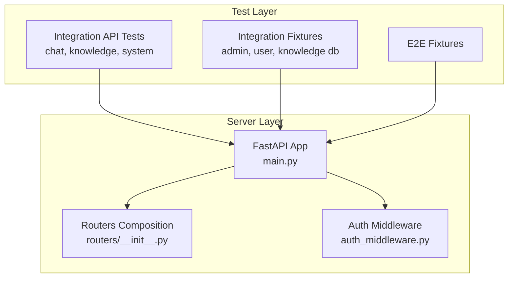
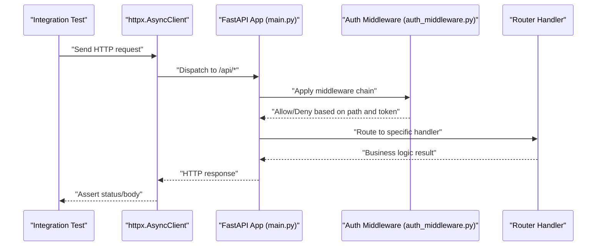
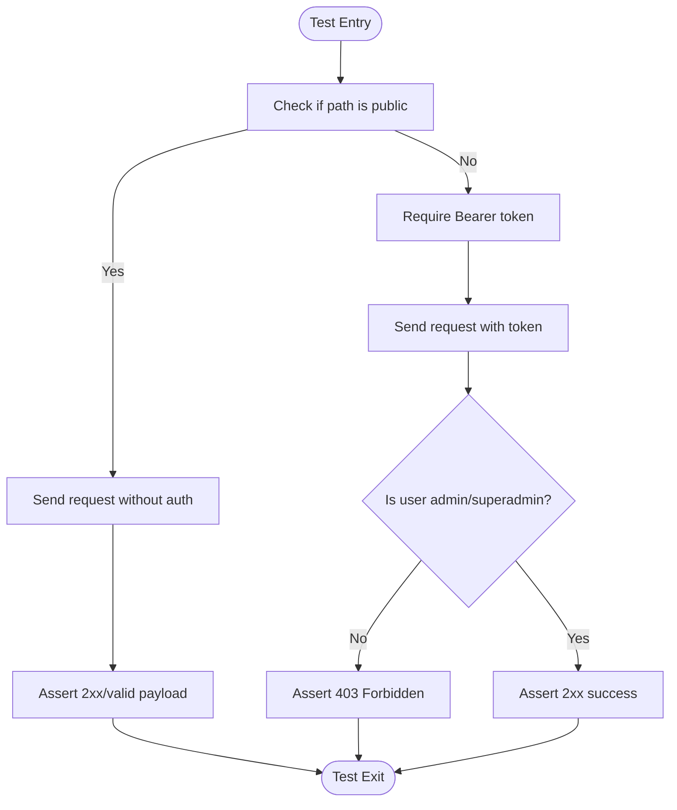
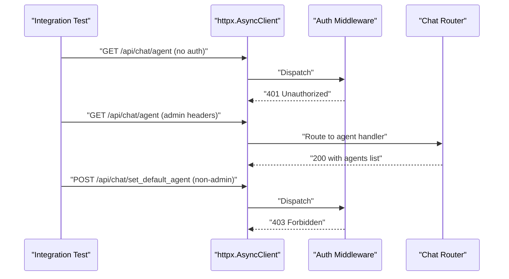
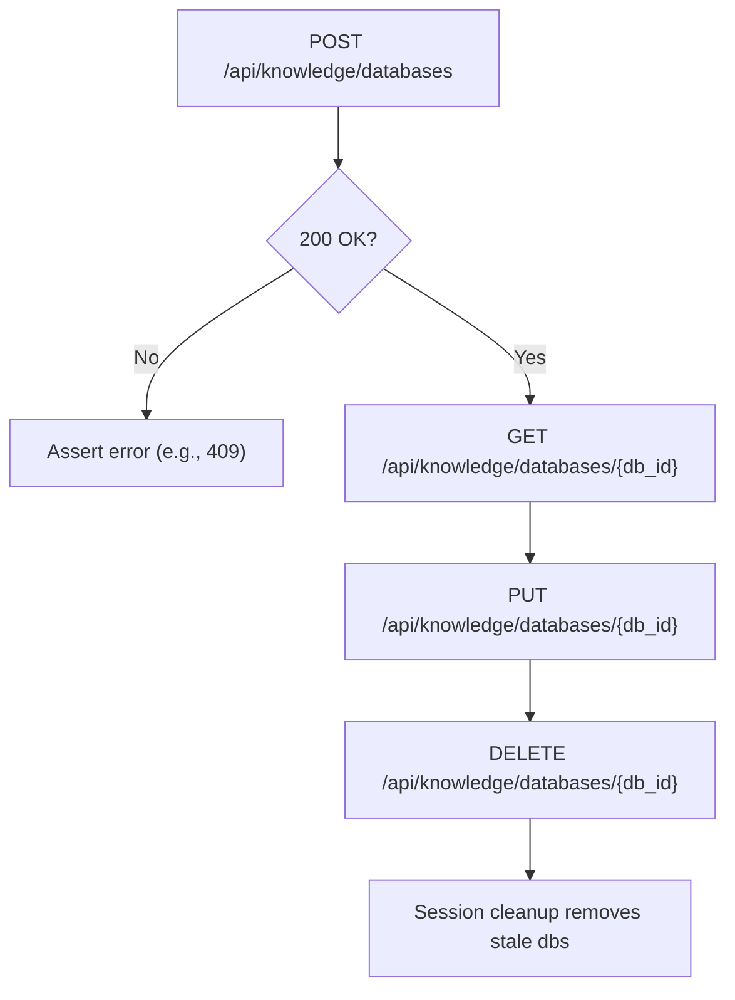
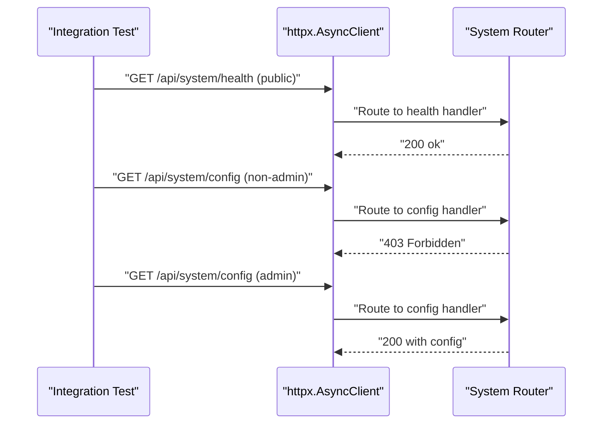
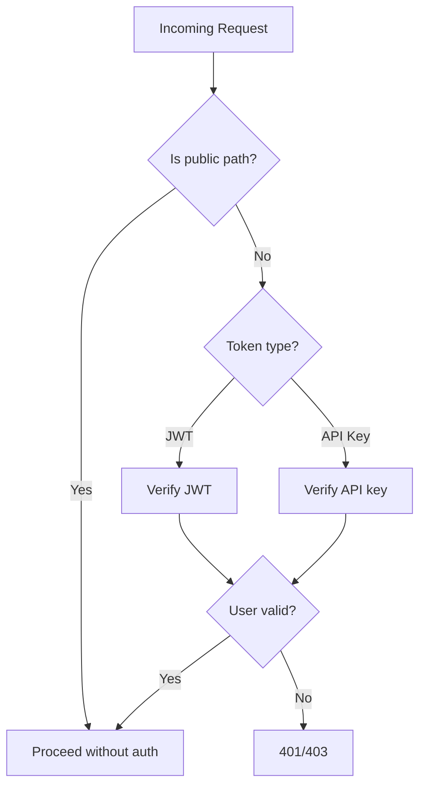
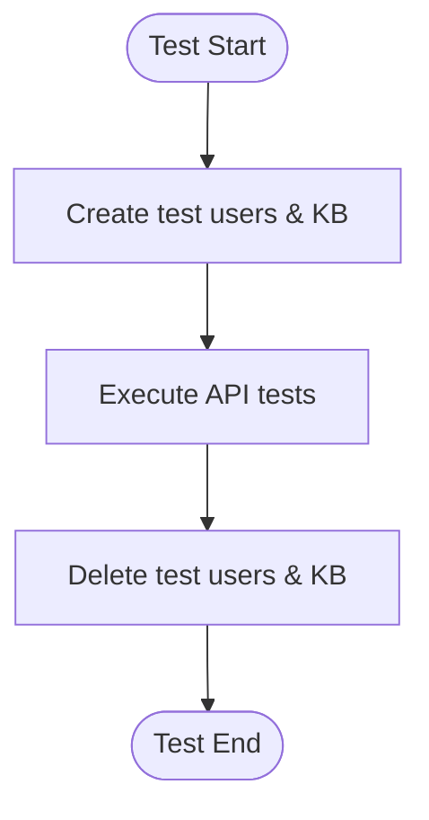
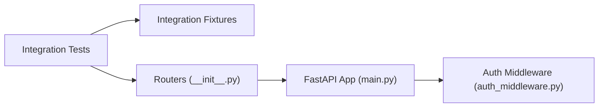

# Integration Testing

<cite>
**Referenced Files in This Document**
- [conftest.py](file://backend/test/integration/conftest.py)
- [conftest.py](file://backend/test/conftest.py)
- [test_chat_router.py](file://backend/test/integration/api/test_chat_router.py)
- [test_knowledge_router.py](file://backend/test/integration/api/test_knowledge_router.py)
- [test_system_router.py](file://backend/test/integration/api/test_system_router.py)
- [main.py](file://backend/server/main.py)
- [routers/__init__.py](file://backend/server/routers/__init__.py)
- [auth_middleware.py](file://backend/server/utils/auth_middleware.py)
- [conftest.py](file://backend/test/e2e/conftest.py)
</cite>

## Table of Contents
1. [Introduction](#introduction)
2. [Project Structure](#project-structure)
3. [Core Components](#core-components)
4. [Architecture Overview](#architecture-overview)
5. [Detailed Component Analysis](#detailed-component-analysis)
6. [Dependency Analysis](#dependency-analysis)
7. [Performance Considerations](#performance-considerations)
8. [Troubleshooting Guide](#troubleshooting-guide)
9. [Conclusion](#conclusion)

## Introduction
This document describes the integration testing implementation for the Yuxi platform. It focuses on how API endpoints are tested end-to-end against a live service, how authentication and authorization are validated, and how middleware and database-backed services behave under realistic conditions. It also documents shared fixtures for managing test users, knowledge bases, and sandbox resources, along with testing strategies for concurrent operations, transactions, and error propagation. Practical examples cover chat operations, knowledge base management, and system administration APIs.

## Project Structure
The integration tests reside under backend/test/integration and are organized by functional area:
- backend/test/integration/api: Endpoint-level tests for routers (chat, knowledge, system, etc.)
- backend/test/integration/conftest.py: Shared fixtures for test clients, admin tokens, standard users, and knowledge databases
- backend/test/conftest.py: Global pytest configuration and markers
- backend/test/e2e: End-to-end fixtures and flows (optional complement to integration tests)

Key server-side components relevant to integration testing:
- backend/server/main.py: Application entrypoint, middleware stack, and CORS configuration
- backend/server/routers/__init__.py: Central router composition and conditional inclusion of knowledge-related routers
- backend/server/utils/auth_middleware.py: Authentication and authorization utilities, including public paths and role checks

**Diagram sources**
- [main.py:1-150](file://backend/server/main.py#L1-L150)
- [routers/__init__.py:1-49](file://backend/server/routers/__init__.py#L1-L49)
- [auth_middleware.py:1-169](file://backend/server/utils/auth_middleware.py#L1-L169)

**Section sources**
- [conftest.py:1-298](file://backend/test/integration/conftest.py#L1-L298)
- [conftest.py:1-27](file://backend/test/conftest.py#L1-L27)
- [main.py:1-150](file://backend/server/main.py#L1-L150)
- [routers/__init__.py:1-49](file://backend/server/routers/__init__.py#L1-L49)
- [auth_middleware.py:1-169](file://backend/server/utils/auth_middleware.py#L1-L169)

## Core Components
- Test client and environment
  - An httpx.AsyncClient is provided per test function with a configurable base URL and timeouts.
  - Environment variables define the target base URL and credentials for admin and standard users.
- Authentication and authorization
  - Admin token is cached and reused across tests to avoid redundant logins.
  - Public endpoints (e.g., health, info) are validated as accessible without authentication.
  - Role-based access control is enforced for protected endpoints (admin/superadmin).
- Test users and permissions
  - Standard users are created and cleaned up automatically; they receive scoped access tokens.
  - Permission enforcement is verified by attempting forbidden actions and asserting 403 responses.
- Knowledge database lifecycle
  - Knowledge databases are created with unique names and cleaned up after use.
  - Special cleanup runs at session start/end to remove stale test databases.
- Sandbox and external resource cleanup
  - Sandbox containers are listed and removed around test sessions to keep environments clean.

**Section sources**
- [conftest.py:25-34](file://backend/test/integration/conftest.py#L25-L34)
- [conftest.py:43-84](file://backend/test/integration/conftest.py#L43-L84)
- [conftest.py:87-89](file://backend/test/integration/conftest.py#L87-L89)
- [conftest.py:92-152](file://backend/test/integration/conftest.py#L92-L152)
- [conftest.py:154-201](file://backend/test/integration/conftest.py#L154-L201)
- [conftest.py:204-250](file://backend/test/integration/conftest.py#L204-L250)
- [conftest.py:252-298](file://backend/test/integration/conftest.py#L252-L298)

## Architecture Overview
The integration tests exercise the FastAPI application stack, including middleware and routers. The authentication middleware determines whether a request is public or requires a bearer token. Protected endpoints enforce roles (admin/superadmin), while public endpoints remain unauthenticated.

**Diagram sources**
- [main.py:40-137](file://backend/server/main.py#L40-L137)
- [auth_middleware.py:74-168](file://backend/server/utils/auth_middleware.py#L74-L168)

**Section sources**
- [main.py:40-137](file://backend/server/main.py#L40-L137)
- [auth_middleware.py:18-26](file://backend/server/utils/auth_middleware.py#L18-L26)
- [auth_middleware.py:142-159](file://backend/server/utils/auth_middleware.py#L142-L159)

## Detailed Component Analysis

### Authentication and Authorization Testing Patterns
- Public endpoints
  - Health and info endpoints are validated as publicly accessible.
- Admin-only endpoints
  - Config retrieval and reload require admin privileges; unauthorized attempts return 401/403.
- Role enforcement
  - Standard users attempting admin actions receive 403 responses.
- Token caching
  - Admin token is cached globally to reduce repeated authentication overhead.

**Diagram sources**
- [auth_middleware.py:18-26](file://backend/server/utils/auth_middleware.py#L18-L26)
- [auth_middleware.py:142-159](file://backend/server/utils/auth_middleware.py#L142-L159)
- [test_system_router.py:12-41](file://backend/test/integration/api/test_system_router.py#L12-L41)

**Section sources**
- [test_system_router.py:12-41](file://backend/test/integration/api/test_system_router.py#L12-L41)
- [auth_middleware.py:18-26](file://backend/server/utils/auth_middleware.py#L18-L26)
- [auth_middleware.py:142-159](file://backend/server/utils/auth_middleware.py#L142-L159)

### Chat Operations Testing
- Authentication gating
  - Unauthenticated requests to chat endpoints return 401.
- Agent management
  - Admins can list agents and set default agent; non-admins are forbidden.
- Thread artifacts
  - Artifacts saved from sandbox outputs are validated for correct renaming and persisted paths.
  - Invalid paths and directories are rejected appropriately.

**Diagram sources**
- [test_chat_router.py:15-91](file://backend/test/integration/api/test_chat_router.py#L15-L91)
- [auth_middleware.py:100-129](file://backend/server/utils/auth_middleware.py#L100-L129)

**Section sources**
- [test_chat_router.py:15-91](file://backend/test/integration/api/test_chat_router.py#L15-L91)
- [test_chat_router.py:93-182](file://backend/test/integration/api/test_chat_router.py#L93-L182)
- [auth_middleware.py:100-129](file://backend/server/utils/auth_middleware.py#L100-L129)

### Knowledge Base Management Testing
- Database lifecycle
  - Creation, listing, retrieval, updates, and deletion of knowledge databases are exercised.
  - Duplicate names trigger 409 conflicts; cleanup ensures isolation.
- Permissions
  - Non-admins are denied access to database management endpoints.
- Vector DB configuration
  - Milvus-specific query parameters and reranker options are validated.
- Dify integration
  - Valid and invalid configurations are tested; read-only constraints are enforced for Dify-backed databases.
- Mindmap operations
  - Permissions and empty-file scenarios are covered; tests mark incomplete cases pending file upload support.

**Diagram sources**
- [test_knowledge_router.py:23-42](file://backend/test/integration/api/test_knowledge_router.py#L23-L42)
- [test_knowledge_router.py:44-64](file://backend/test/integration/api/test_knowledge_router.py#L44-L64)
- [test_knowledge_router.py:97-116](file://backend/test/integration/api/test_knowledge_router.py#L97-L116)
- [test_knowledge_router.py:118-187](file://backend/test/integration/api/test_knowledge_router.py#L118-L187)
- [test_knowledge_router.py:189-229](file://backend/test/integration/api/test_knowledge_router.py#L189-L229)
- [test_knowledge_router.py:248-293](file://backend/test/integration/api/test_knowledge_router.py#L248-L293)
- [conftest.py:92-152](file://backend/test/integration/conftest.py#L92-L152)

**Section sources**
- [test_knowledge_router.py:23-42](file://backend/test/integration/api/test_knowledge_router.py#L23-L42)
- [test_knowledge_router.py:97-116](file://backend/test/integration/api/test_knowledge_router.py#L97-L116)
- [test_knowledge_router.py:118-187](file://backend/test/integration/api/test_knowledge_router.py#L118-L187)
- [test_knowledge_router.py:189-229](file://backend/test/integration/api/test_knowledge_router.py#L189-L229)
- [test_knowledge_router.py:248-293](file://backend/test/integration/api/test_knowledge_router.py#L248-L293)
- [conftest.py:92-152](file://backend/test/integration/conftest.py#L92-L152)

### System Administration APIs Testing
- Public endpoints
  - Health and info endpoints are accessible without authentication.
- Admin endpoints
  - Configuration retrieval and reload require admin privileges; unauthorized attempts fail.
  - Tools listing includes a config guide field for admin users.

**Diagram sources**
- [test_system_router.py:12-41](file://backend/test/integration/api/test_system_router.py#L12-L41)
- [auth_middleware.py:142-159](file://backend/server/utils/auth_middleware.py#L142-L159)

**Section sources**
- [test_system_router.py:12-41](file://backend/test/integration/api/test_system_router.py#L12-L41)
- [auth_middleware.py:142-159](file://backend/server/utils/auth_middleware.py#L142-L159)

### Middleware Functionality and Request Validation
- Public paths
  - Paths like health and info are whitelisted and bypass authentication.
- Rate limiting
  - Login attempts are rate-limited to mitigate brute-force attacks.
- Access logging
  - A dedicated access log middleware records request durations and outcomes.
- Authentication flow
  - Supports both JWT and API key authentication; API keys can be bound to users or departments.

**Diagram sources**
- [auth_middleware.py:18-26](file://backend/server/utils/auth_middleware.py#L18-L26)
- [auth_middleware.py:74-123](file://backend/server/utils/auth_middleware.py#L74-L123)
- [main.py:63-96](file://backend/server/main.py#L63-L96)
- [main.py:132-137](file://backend/server/main.py#L132-L137)

**Section sources**
- [auth_middleware.py:18-26](file://backend/server/utils/auth_middleware.py#L18-L26)
- [auth_middleware.py:74-123](file://backend/server/utils/auth_middleware.py#L74-L123)
- [main.py:63-96](file://backend/server/main.py#L63-L96)
- [main.py:132-137](file://backend/server/main.py#L132-L137)

### Database Transactions and Cleanup
- Transaction handling
  - Database operations are performed within async sessions managed by the auth middleware’s dependency.
- Cleanup strategies
  - Per-test fixtures ensure creation and deletion of test users and knowledge databases.
  - Session-scoped cleanup removes stale knowledge databases and sandbox containers to maintain isolation.

**Diagram sources**
- [conftest.py:204-250](file://backend/test/integration/conftest.py#L204-L250)
- [conftest.py:252-298](file://backend/test/integration/conftest.py#L252-L298)
- [conftest.py:92-152](file://backend/test/integration/conftest.py#L92-L152)
- [auth_middleware.py:30-33](file://backend/server/utils/auth_middleware.py#L30-L33)

**Section sources**
- [conftest.py:204-250](file://backend/test/integration/conftest.py#L204-L250)
- [conftest.py:252-298](file://backend/test/integration/conftest.py#L252-L298)
- [conftest.py:92-152](file://backend/test/integration/conftest.py#L92-L152)
- [auth_middleware.py:30-33](file://backend/server/utils/auth_middleware.py#L30-L33)

### Concurrent Operations and Error Propagation
- Concurrency
  - Tests use httpx.AsyncClient to issue concurrent requests where appropriate.
- Error propagation
  - Middleware returns structured errors (e.g., 401/403/429) aligned with authentication and rate-limiting logic.
  - Integration tests assert these statuses to validate error propagation.

**Section sources**
- [main.py:63-96](file://backend/server/main.py#L63-L96)
- [auth_middleware.py:142-159](file://backend/server/utils/auth_middleware.py#L142-L159)

## Dependency Analysis
The integration tests depend on:
- Shared fixtures for admin and standard users, knowledge databases, and cleanup routines
- Router composition that exposes endpoints under /api/*
- Middleware enforcing authentication and authorization

**Diagram sources**
- [routers/__init__.py:20-49](file://backend/server/routers/__init__.py#L20-L49)
- [main.py:40-137](file://backend/server/main.py#L40-L137)
- [auth_middleware.py:74-168](file://backend/server/utils/auth_middleware.py#L74-L168)

**Section sources**
- [routers/__init__.py:20-49](file://backend/server/routers/__init__.py#L20-L49)
- [main.py:40-137](file://backend/server/main.py#L40-L137)
- [auth_middleware.py:74-168](file://backend/server/utils/auth_middleware.py#L74-L168)

## Performance Considerations
- Timeouts
  - HTTP client timeouts are configured to handle slow operations without hanging tests.
- Rate limiting
  - Login attempts are throttled to prevent test flakiness due to 429 responses.
- Logging
  - Access logs help diagnose slow endpoints and bottlenecks during test runs.
- Test isolation
  - Session-scoped cleanup reduces cumulative overhead and prevents cross-test interference.

**Section sources**
- [conftest.py:33](file://backend/test/integration/conftest.py#L33)
- [main.py:63-96](file://backend/server/main.py#L63-L96)
- [main.py:132-137](file://backend/server/main.py#L132-L137)

## Troubleshooting Guide
- Missing credentials
  - If TEST_USERNAME or TEST_PASSWORD are not set, admin fixtures skip or fail early to avoid ambiguous failures.
- First-run initialization
  - If the admin account is uninitialized, token requests fail with guidance to initialize the super admin.
- Cleanup failures
  - Cleanup routines catch and log exceptions; tests continue to avoid masking primary failures.
- Sandbox containers
  - Docker API socket usage is configurable; failures are logged and do not block test execution.
- E2E credentials
  - E2E tests require separate credentials; missing values cause tests to skip with explicit messages.

**Section sources**
- [conftest.py:37-40](file://backend/test/integration/conftest.py#L37-L40)
- [conftest.py:68-77](file://backend/test/integration/conftest.py#L68-L77)
- [conftest.py:143-151](file://backend/test/integration/conftest.py#L143-L151)
- [conftest.py:173-194](file://backend/test/integration/conftest.py#L173-L194)
- [conftest.py:26-31](file://backend/test/e2e/conftest.py#L26-L31)

## Conclusion
The Yuxi integration testing suite provides robust coverage of API endpoints, authentication, authorization, and middleware behavior. Shared fixtures manage test isolation and resource cleanup, while session-scoped routines ensure long-lived environments remain healthy. The patterns documented here enable reliable testing of chat, knowledge base, and system administration workflows, with clear strategies for concurrency, transactions, and error handling.