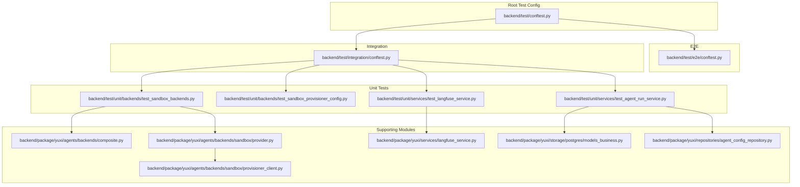
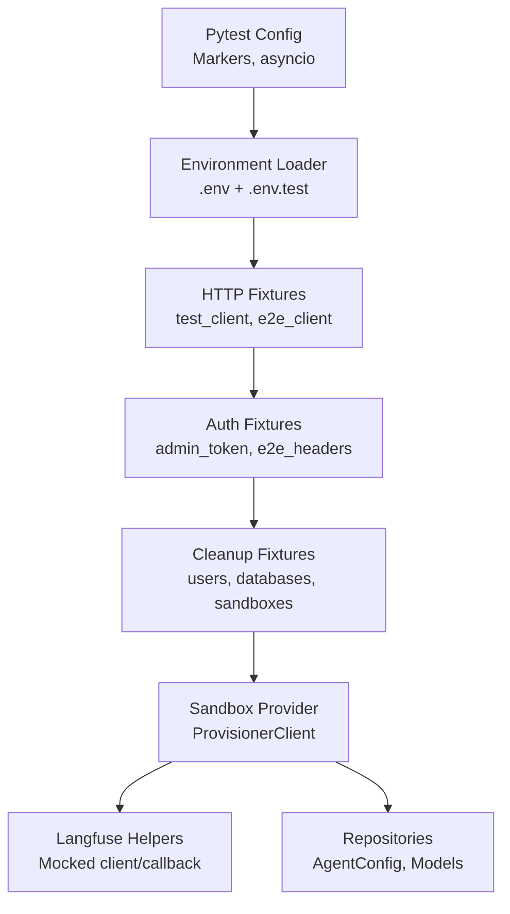
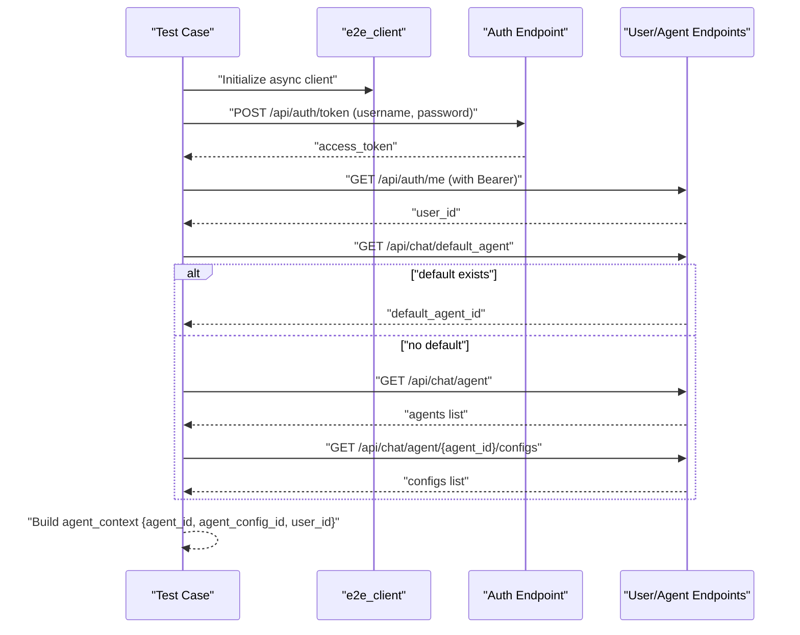
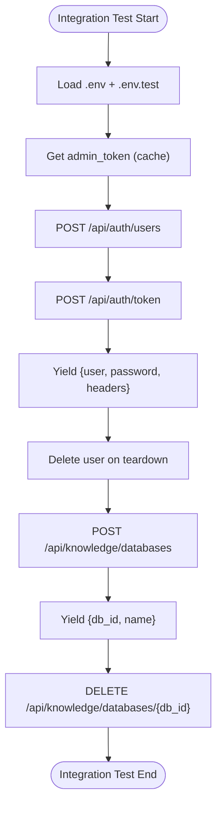
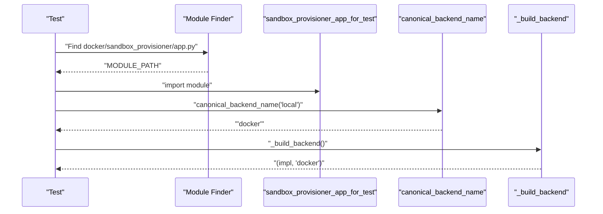
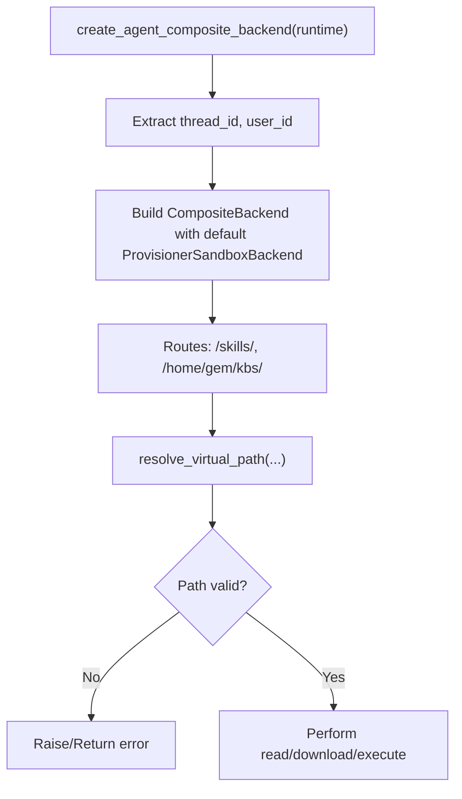
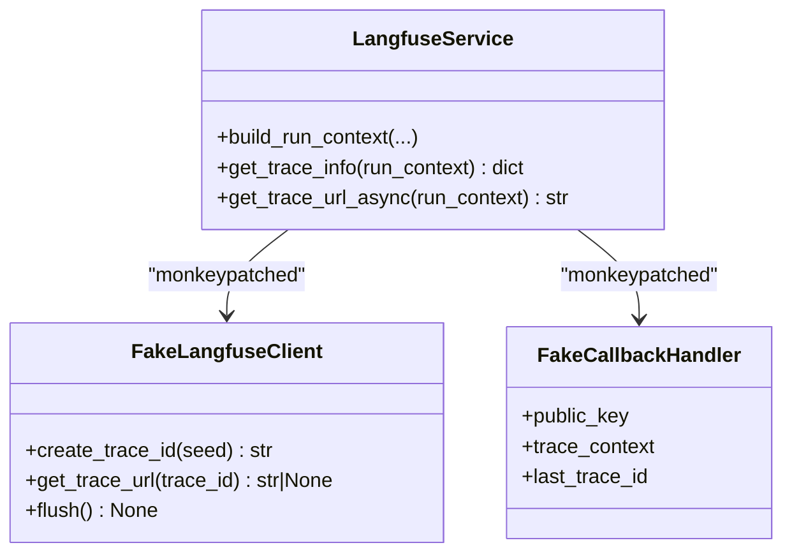
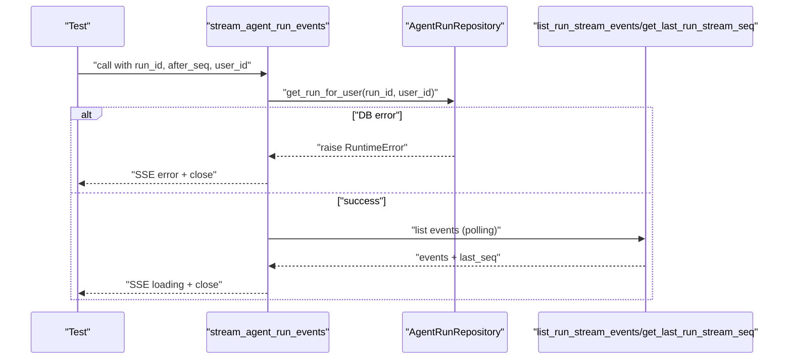
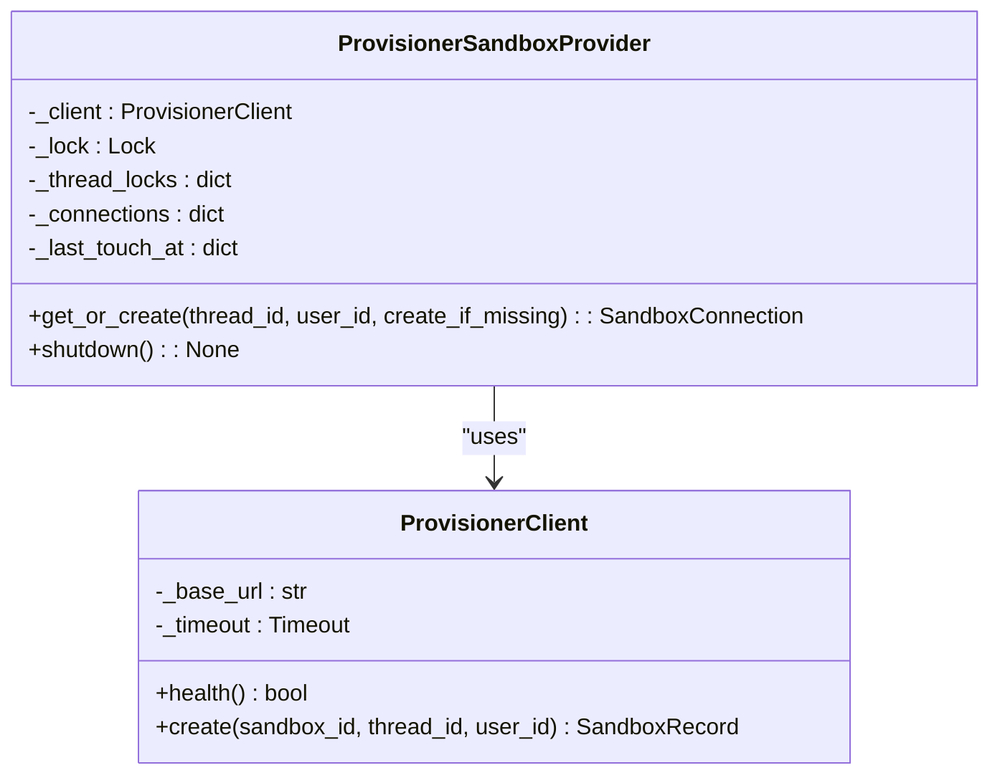
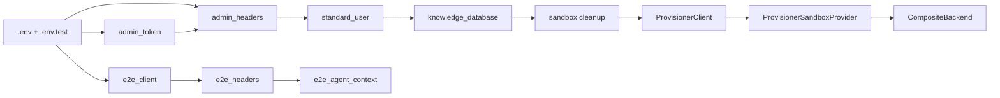

# Test Utilities & Fixtures

<cite>
**Referenced Files in This Document**
- [backend/test/conftest.py](file://backend/test/conftest.py)
- [backend/test/e2e/conftest.py](file://backend/test/e2e/conftest.py)
- [backend/test/integration/conftest.py](file://backend/test/integration/conftest.py)
- [backend/test/unit/backends/test_sandbox_backends.py](file://backend/test/unit/backends/test_sandbox_backends.py)
- [backend/test/unit/backends/test_sandbox_provisioner_config.py](file://backend/test/unit/backends/test_sandbox_provisioner_config.py)
- [backend/test/unit/services/test_langfuse_service.py](file://backend/test/unit/services/test_langfuse_service.py)
- [backend/test/unit/services/test_agent_run_service.py](file://backend/test/unit/services/test_agent_run_service.py)
- [backend/package/yuxi/agents/backends/composite.py](file://backend/package/yuxi/agents/backends/composite.py)
- [backend/package/yuxi/agents/backends/sandbox/provider.py](file://backend/package/yuxi/agents/backends/sandbox/provider.py)
- [backend/package/yuxi/agents/backends/sandbox/provisioner_client.py](file://backend/package/yuxi/agents/backends/sandbox/provisioner_client.py)
- [backend/package/yuxi/services/langfuse_service.py](file://backend/package/yuxi/services/langfuse_service.py)
- [backend/package/yuxi/storage/postgres/models_business.py](file://backend/package/yuxi/storage/postgres/models_business.py)
- [backend/package/yuxi/repositories/agent_config_repository.py](file://backend/package/yuxi/repositories/agent_config_repository.py)
</cite>

## Table of Contents
1. [Introduction](#introduction)
2. [Project Structure](#project-structure)
3. [Core Components](#core-components)
4. [Architecture Overview](#architecture-overview)
5. [Detailed Component Analysis](#detailed-component-analysis)
6. [Dependency Analysis](#dependency-analysis)
7. [Performance Considerations](#performance-considerations)
8. [Troubleshooting Guide](#troubleshooting-guide)
9. [Conclusion](#conclusion)
10. [Appendices](#appendices)

## Introduction
This document describes the Yuxi testing framework’s shared test configuration, fixtures, and utilities. It covers:
- Shared pytest configuration and markers
- Environment variable loading and test isolation
- HTTP client fixtures for integration and E2E tests
- Database and sandbox cleanup strategies
- Mocking patterns for external services and agent behaviors
- Langfuse service testing helpers
- Test data management and repository-backed fixtures
- Asynchronous testing patterns and error simulation
- Best practices for performance and resource management

## Project Structure
The test suite is organized by scope:
- Root test configuration and shared pytest settings
- End-to-end (E2E) fixtures for live API authentication and context
- Integration fixtures for admin auth, test users, knowledge databases, and sandbox cleanup
- Unit tests for sandbox backends, Langfuse service, and agent run service
- Supporting modules for sandbox provisioning and repository logic

**Diagram sources**
- [backend/test/conftest.py:1-27](file://backend/test/conftest.py#L1-L27)
- [backend/test/e2e/conftest.py:1-100](file://backend/test/e2e/conftest.py#L1-L100)
- [backend/test/integration/conftest.py:1-298](file://backend/test/integration/conftest.py#L1-L298)
- [backend/test/unit/backends/test_sandbox_backends.py:1-131](file://backend/test/unit/backends/test_sandbox_backends.py#L1-L131)
- [backend/test/unit/backends/test_sandbox_provisioner_config.py:1-57](file://backend/test/unit/backends/test_sandbox_provisioner_config.py#L1-L57)
- [backend/test/unit/services/test_langfuse_service.py:1-111](file://backend/test/unit/services/test_langfuse_service.py#L1-L111)
- [backend/test/unit/services/test_agent_run_service.py:1-323](file://backend/test/unit/services/test_agent_run_service.py#L1-L323)
- [backend/package/yuxi/agents/backends/composite.py:93-133](file://backend/package/yuxi/agents/backends/composite.py#L93-L133)
- [backend/package/yuxi/agents/backends/sandbox/provider.py:1-170](file://backend/package/yuxi/agents/backends/sandbox/provider.py#L1-L170)
- [backend/package/yuxi/agents/backends/sandbox/provisioner_client.py:1-43](file://backend/package/yuxi/agents/backends/sandbox/provisioner_client.py#L1-L43)
- [backend/package/yuxi/services/langfuse_service.py](file://backend/package/yuxi/services/langfuse_service.py)
- [backend/package/yuxi/storage/postgres/models_business.py:135-170](file://backend/package/yuxi/storage/postgres/models_business.py#L135-L170)
- [backend/package/yuxi/repositories/agent_config_repository.py:73-191](file://backend/package/yuxi/repositories/agent_config_repository.py#L73-L191)

**Section sources**
- [backend/test/conftest.py:1-27](file://backend/test/conftest.py#L1-L27)
- [backend/test/e2e/conftest.py:1-100](file://backend/test/e2e/conftest.py#L1-L100)
- [backend/test/integration/conftest.py:1-298](file://backend/test/integration/conftest.py#L1-L298)

## Core Components
- Shared pytest configuration and markers
  - Registers markers for unit, auth, integration, e2e, and slow tests
  - Enables asyncio plugin globally
  - Skips app initialization during collection to avoid side effects
- Environment configuration
  - Loads .env and test-specific .env.test
  - Exposes base URLs and credentials for tests
- HTTP clients and headers
  - Async HTTP client fixtures for integration and E2E
  - Admin token caching and header generation
  - E2E login and context resolution for agent and config selection
- Cleanup utilities
  - Session-scoped cleanup for knowledge databases and sandbox containers
  - Per-test cleanup for users and databases
- Sandbox provisioning configuration testing
  - Dynamic module loading for sandbox provisioner app
  - Backend name canonicalization and backend construction assertions
- Langfuse service testing helpers
  - Mocked client and callback handler for deterministic trace metadata and URLs
- Agent run service testing
  - Fake repositories and DB sessions to simulate concurrency, errors, and event streaming

**Section sources**
- [backend/test/conftest.py:17-27](file://backend/test/conftest.py#L17-L27)
- [backend/test/e2e/conftest.py:17-55](file://backend/test/e2e/conftest.py#L17-L55)
- [backend/test/integration/conftest.py:25-84](file://backend/test/integration/conftest.py#L25-L84)
- [backend/test/integration/conftest.py:92-151](file://backend/test/integration/conftest.py#L92-L151)
- [backend/test/integration/conftest.py:197-201](file://backend/test/integration/conftest.py#L197-L201)
- [backend/test/unit/backends/test_sandbox_provisioner_config.py:23-57](file://backend/test/unit/backends/test_sandbox_provisioner_config.py#L23-L57)
- [backend/test/unit/services/test_langfuse_service.py:6-111](file://backend/test/unit/services/test_langfuse_service.py#L6-L111)
- [backend/test/unit/services/test_agent_run_service.py:12-323](file://backend/test/unit/services/test_agent_run_service.py#L12-L323)

## Architecture Overview
The testing architecture separates concerns across layers:
- Configuration layer: pytest configuration and environment loading
- Fixture layer: HTTP clients, auth tokens, test users, and cleanup routines
- Service layer: Langfuse helpers and agent run service tests
- Sandbox layer: Provisioner client and provider orchestration
- Repository layer: Agent config and business models for test data

**Diagram sources**
- [backend/test/conftest.py:17-27](file://backend/test/conftest.py#L17-L27)
- [backend/test/e2e/conftest.py:17-55](file://backend/test/e2e/conftest.py#L17-L55)
- [backend/test/integration/conftest.py:25-84](file://backend/test/integration/conftest.py#L25-L84)
- [backend/test/integration/conftest.py:92-151](file://backend/test/integration/conftest.py#L92-L151)
- [backend/test/integration/conftest.py:197-201](file://backend/test/integration/conftest.py#L197-L201)
- [backend/package/yuxi/agents/backends/sandbox/provisioner_client.py:15-43](file://backend/package/yuxi/agents/backends/sandbox/provisioner_client.py#L15-L43)
- [backend/package/yuxi/services/langfuse_service.py](file://backend/package/yuxi/services/langfuse_service.py)
- [backend/package/yuxi/storage/postgres/models_business.py:135-170](file://backend/package/yuxi/storage/postgres/models_business.py#L135-L170)
- [backend/package/yuxi/repositories/agent_config_repository.py:73-191](file://backend/package/yuxi/repositories/agent_config_repository.py#L73-L191)

## Detailed Component Analysis

### Shared Test Configuration Setup
- Purpose: Centralized pytest configuration and environment loading
- Key behaviors:
  - Registers markers for categorizing tests
  - Sets YUXI_SKIP_APP_INIT to prevent app initialization during collection
  - Loads environment files for test runs
  - Enables pytest-asyncio plugin

**Section sources**
- [backend/test/conftest.py:17-27](file://backend/test/conftest.py#L17-L27)

### E2E Test Fixtures
- Purpose: Provide authenticated client and agent context for end-to-end scenarios
- Key fixtures:
  - e2e_base_url: resolves base URL from environment
  - e2e_client: async HTTP client with timeouts and redirects
  - e2e_headers: authenticates via /api/auth/token and injects Authorization header
  - e2e_agent_context: selects default or first agent and config, validates payloads

**Diagram sources**
- [backend/test/e2e/conftest.py:34-99](file://backend/test/e2e/conftest.py#L34-L99)

**Section sources**
- [backend/test/e2e/conftest.py:20-55](file://backend/test/e2e/conftest.py#L20-L55)
- [backend/test/e2e/conftest.py:58-99](file://backend/test/e2e/conftest.py#L58-L99)

### Integration Test Fixtures
- Purpose: Provide admin authentication, test users, and managed knowledge databases
- Key fixtures:
  - test_client: async HTTP client bound to TEST_BASE_URL
  - admin_token: caches admin token and handles first-run checks
  - admin_headers: generates Authorization header
  - standard_user: creates a temporary user, authenticates, yields headers, and deletes on teardown
  - knowledge_database: creates a unique KB, yields payload, and deletes on teardown
  - cleanup_test_knowledge_databases: session-scoped cleanup of test KBs
  - cleanup_test_sandboxes: session-scoped cleanup of sandbox containers via Docker API

**Diagram sources**
- [backend/test/integration/conftest.py:43-84](file://backend/test/integration/conftest.py#L43-L84)
- [backend/test/integration/conftest.py:204-250](file://backend/test/integration/conftest.py#L204-L250)
- [backend/test/integration/conftest.py:252-298](file://backend/test/integration/conftest.py#L252-L298)
- [backend/test/integration/conftest.py:92-151](file://backend/test/integration/conftest.py#L92-L151)
- [backend/test/integration/conftest.py:197-201](file://backend/test/integration/conftest.py#L197-L201)

**Section sources**
- [backend/test/integration/conftest.py:25-84](file://backend/test/integration/conftest.py#L25-L84)
- [backend/test/integration/conftest.py:92-151](file://backend/test/integration/conftest.py#L92-L151)
- [backend/test/integration/conftest.py:197-201](file://backend/test/integration/conftest.py#L197-L201)
- [backend/test/integration/conftest.py:204-250](file://backend/test/integration/conftest.py#L204-L250)
- [backend/test/integration/conftest.py:252-298](file://backend/test/integration/conftest.py#L252-L298)

### Sandbox Provisioning Configuration Testing Utilities
- Purpose: Validate backend selection and construction for sandbox provisioning
- Key behaviors:
  - Dynamically loads sandbox provisioner app module from docker/sandbox_provisioner/app.py
  - Asserts canonical backend name mapping (local -> docker)
  - Validates backend builder returns docker backend for local in test context

**Diagram sources**
- [backend/test/unit/backends/test_sandbox_provisioner_config.py:11-57](file://backend/test/unit/backends/test_sandbox_provisioner_config.py#L11-L57)

**Section sources**
- [backend/test/unit/backends/test_sandbox_provisioner_config.py:11-57](file://backend/test/unit/backends/test_sandbox_provisioner_config.py#L11-L57)

### Sandbox Backend Behavior Testing
- Purpose: Validate sandbox backend routing, path resolution, and error handling
- Key behaviors:
  - Composite backend creation uses ProvisionerSandboxBackend by default
  - Path resolution rejects out-of-prefix and traversal attempts
  - Binary file reads return safe error messages
  - Execution failures return structured error responses

**Diagram sources**
- [backend/test/unit/backends/test_sandbox_backends.py:32-43](file://backend/test/unit/backends/test_sandbox_backends.py#L32-L43)
- [backend/package/yuxi/agents/backends/composite.py:122-133](file://backend/package/yuxi/agents/backends/composite.py#L122-L133)

**Section sources**
- [backend/test/unit/backends/test_sandbox_backends.py:32-43](file://backend/test/unit/backends/test_sandbox_backends.py#L32-L43)
- [backend/test/unit/backends/test_sandbox_backends.py:56-73](file://backend/test/unit/backends/test_sandbox_backends.py#L56-L73)
- [backend/test/unit/backends/test_sandbox_backends.py:75-97](file://backend/test/unit/backends/test_sandbox_backends.py#L75-L97)
- [backend/test/unit/backends/test_sandbox_backends.py:99-131](file://backend/test/unit/backends/test_sandbox_backends.py#L99-L131)
- [backend/package/yuxi/agents/backends/composite.py:122-133](file://backend/package/yuxi/agents/backends/composite.py#L122-L133)

### Langfuse Service Testing Helpers
- Purpose: Verify trace metadata building, callback context, and URL retrieval without external dependencies
- Key behaviors:
  - Monkeypatches environment variables for Langfuse
  - Replaces Langfuse client and CallbackHandler with fakes
  - Verifies trace_id derivation from request_id and metadata propagation
  - Ensures get_trace_url_async returns deterministic URLs

**Diagram sources**
- [backend/test/unit/services/test_langfuse_service.py:6-20](file://backend/test/unit/services/test_langfuse_service.py#L6-L20)
- [backend/test/unit/services/test_langfuse_service.py:29-65](file://backend/test/unit/services/test_langfuse_service.py#L29-L65)
- [backend/test/unit/services/test_langfuse_service.py:67-89](file://backend/test/unit/services/test_langfuse_service.py#L67-L89)
- [backend/test/unit/services/test_langfuse_service.py:92-111](file://backend/test/unit/services/test_langfuse_service.py#L92-L111)

**Section sources**
- [backend/test/unit/services/test_langfuse_service.py:29-65](file://backend/test/unit/services/test_langfuse_service.py#L29-L65)
- [backend/test/unit/services/test_langfuse_service.py:67-89](file://backend/test/unit/services/test_langfuse_service.py#L67-L89)
- [backend/test/unit/services/test_langfuse_service.py:92-111](file://backend/test/unit/services/test_langfuse_service.py#L92-L111)

### Agent Run Service Testing Patterns
- Purpose: Simulate asynchronous run creation, event streaming, and error handling
- Key patterns:
  - Fake repositories and DB sessions to control outcomes
  - Event streaming with Redis-like list and last-sequence tracking
  - Integrity error handling and transaction ordering verification
  - Concurrency-aware lookup and retry logic

**Diagram sources**
- [backend/test/unit/services/test_agent_run_service.py:20-101](file://backend/test/unit/services/test_agent_run_service.py#L20-L101)
- [backend/test/unit/services/test_agent_run_service.py:104-177](file://backend/test/unit/services/test_agent_run_service.py#L104-L177)
- [backend/test/unit/services/test_agent_run_service.py:179-200](file://backend/test/unit/services/test_agent_run_service.py#L179-L200)
- [backend/test/unit/services/test_agent_run_service.py:264-306](file://backend/test/unit/services/test_agent_run_service.py#L264-L306)

**Section sources**
- [backend/test/unit/services/test_agent_run_service.py:20-101](file://backend/test/unit/services/test_agent_run_service.py#L20-L101)
- [backend/test/unit/services/test_agent_run_service.py:104-177](file://backend/test/unit/services/test_agent_run_service.py#L104-L177)
- [backend/test/unit/services/test_agent_run_service.py:179-200](file://backend/test/unit/services/test_agent_run_service.py#L179-L200)
- [backend/test/unit/services/test_agent_run_service.py:264-306](file://backend/test/unit/services/test_agent_run_service.py#L264-L306)

### Sandbox Provisioner Orchestration
- Purpose: Manage sandbox lifecycle and connections per thread
- Key behaviors:
  - Validates provider configuration and URL presence
  - Thread-safe connection mapping and locking
  - Graceful shutdown releasing sandboxes

**Diagram sources**
- [backend/package/yuxi/agents/backends/sandbox/provider.py:27-170](file://backend/package/yuxi/agents/backends/sandbox/provider.py#L27-L170)
- [backend/package/yuxi/agents/backends/sandbox/provisioner_client.py:15-43](file://backend/package/yuxi/agents/backends/sandbox/provisioner_client.py#L15-L43)

**Section sources**
- [backend/package/yuxi/agents/backends/sandbox/provider.py:27-170](file://backend/package/yuxi/agents/backends/sandbox/provider.py#L27-L170)
- [backend/package/yuxi/agents/backends/sandbox/provisioner_client.py:15-43](file://backend/package/yuxi/agents/backends/sandbox/provisioner_client.py#L15-L43)

### Test Data Management Strategies
- Agent config repository
  - Ensures unique names and defaults for agent configurations
  - Provides default creation when none exist
- Business models
  - Defines constraints and indexes for agent configs and related entities

**Section sources**
- [backend/package/yuxi/repositories/agent_config_repository.py:73-191](file://backend/package/yuxi/repositories/agent_config_repository.py#L73-L191)
- [backend/package/yuxi/storage/postgres/models_business.py:135-170](file://backend/package/yuxi/storage/postgres/models_business.py#L135-L170)

## Dependency Analysis
- Fixture interdependencies:
  - admin_token depends on environment variables and admin_headers
  - standard_user depends on test_client and admin_headers
  - knowledge_database depends on admin_headers and test_client
  - e2e_headers depends on e2e_client and environment variables
- Sandbox dependencies:
  - ProvisionerSandboxProvider depends on configuration and ProvisionerClient
  - Composite backend depends on provider and route mapping
- Service dependencies:
  - Agent run service depends on repositories, ARQ queue, and DB session context
  - Langfuse service depends on environment variables and mocked client

**Diagram sources**
- [backend/test/integration/conftest.py:25-84](file://backend/test/integration/conftest.py#L25-L84)
- [backend/test/integration/conftest.py:204-250](file://backend/test/integration/conftest.py#L204-L250)
- [backend/test/integration/conftest.py:252-298](file://backend/test/integration/conftest.py#L252-L298)
- [backend/test/e2e/conftest.py:34-99](file://backend/test/e2e/conftest.py#L34-L99)
- [backend/package/yuxi/agents/backends/sandbox/provisioner_client.py:15-43](file://backend/package/yuxi/agents/backends/sandbox/provisioner_client.py#L15-L43)
- [backend/package/yuxi/agents/backends/sandbox/provider.py:27-170](file://backend/package/yuxi/agents/backends/sandbox/provider.py#L27-L170)
- [backend/package/yuxi/agents/backends/composite.py:122-133](file://backend/package/yuxi/agents/backends/composite.py#L122-L133)

**Section sources**
- [backend/test/integration/conftest.py:25-84](file://backend/test/integration/conftest.py#L25-L84)
- [backend/test/integration/conftest.py:204-250](file://backend/test/integration/conftest.py#L204-L250)
- [backend/test/integration/conftest.py:252-298](file://backend/test/integration/conftest.py#L252-L298)
- [backend/test/e2e/conftest.py:34-99](file://backend/test/e2e/conftest.py#L34-L99)
- [backend/package/yuxi/agents/backends/composite.py:122-133](file://backend/package/yuxi/agents/backends/composite.py#L122-L133)
- [backend/package/yuxi/agents/backends/sandbox/provider.py:27-170](file://backend/package/yuxi/agents/backends/sandbox/provider.py#L27-L170)
- [backend/package/yuxi/agents/backends/sandbox/provisioner_client.py:15-43](file://backend/package/yuxi/agents/backends/sandbox/provisioner_client.py#L15-L43)

## Performance Considerations
- Minimize network calls in fixtures:
  - Cache admin_token to avoid repeated auth requests
  - Use short-lived per-test resources (users, databases) with efficient cleanup
- Optimize async I/O:
  - Prefer session-scoped cleanup for broad resources (KBs, sandboxes)
  - Use timeouts and follow_redirects judiciously to avoid long waits
- Reduce fixture overhead:
  - Avoid heavy initialization during collection by setting YUXI_SKIP_APP_INIT
  - Keep environment loading minimal and explicit

[No sources needed since this section provides general guidance]

## Troubleshooting Guide
- Authentication failures
  - Integration tests fail with 401 or missing access token; verify TEST_USERNAME and TEST_PASSWORD
  - E2E tests skip when E2E_USERNAME/E2E_PASSWORD are not set
- First-run initialization
  - Integration tests fail early if admin account is uninitialized; run initialization endpoint before tests
- Cleanup anomalies
  - Knowledge database conflicts indicate stale test databases; rely on session-scoped cleanup
  - Sandbox container cleanup uses Docker API; ensure socket/base URL are configured
- Sandbox provisioning
  - Provider requires sandbox_provider=provisioner and sandbox_provisioner_url; otherwise raises runtime error
- Langfuse tests
  - Ensure environment variables are patched before importing the service module to avoid cache hits

**Section sources**
- [backend/test/integration/conftest.py:68-75](file://backend/test/integration/conftest.py#L68-L75)
- [backend/test/e2e/conftest.py:26-31](file://backend/test/e2e/conftest.py#L26-L31)
- [backend/test/integration/conftest.py:92-151](file://backend/test/integration/conftest.py#L92-L151)
- [backend/test/integration/conftest.py:197-201](file://backend/test/integration/conftest.py#L197-L201)
- [backend/package/yuxi/agents/backends/sandbox/provider.py:27-36](file://backend/package/yuxi/agents/backends/sandbox/provider.py#L27-L36)
- [backend/test/unit/services/test_langfuse_service.py:30-36](file://backend/test/unit/services/test_langfuse_service.py#L30-L36)

## Conclusion
The Yuxi testing framework provides robust, layered fixtures and utilities for E2E, integration, and unit tests. It emphasizes:
- Clear separation of concerns across configuration, fixtures, and service tests
- Strong isolation via environment loading and scoped cleanup
- Deterministic behavior for external integrations (Langfuse) and sandbox provisioning
- Practical patterns for asynchronous operations, error simulation, and edge-case validation

[No sources needed since this section summarizes without analyzing specific files]

## Appendices
- Practical examples
  - Creating reusable test components: define fixtures in conftest.py and compose them in tests
  - Mocking strategies: patch environment variables and replace external classes with lightweight fakes
  - Test environment isolation: use separate .env.test and session-scoped cleanup fixtures
  - Asynchronous testing: leverage pytest-asyncio fixtures and event streaming patterns
  - Edge case validation: assert path traversal protections and structured error responses
  - Performance optimization: cache tokens, minimize network calls, and use targeted cleanup

[No sources needed since this section provides general guidance]