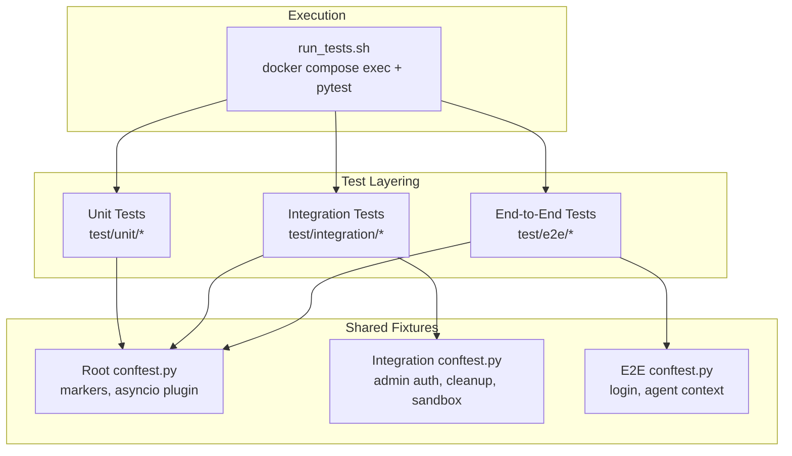
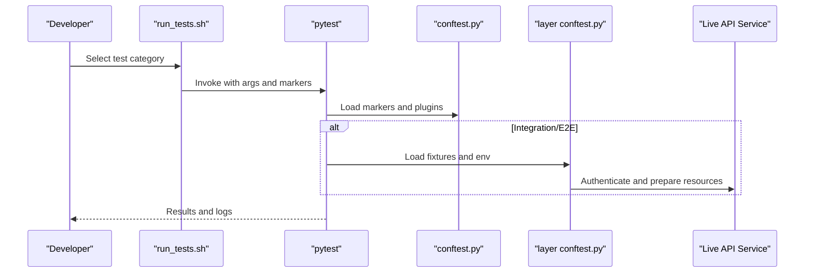
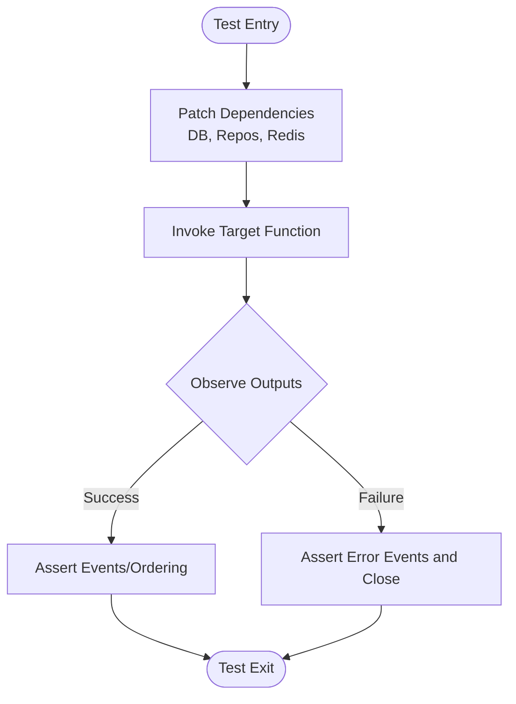
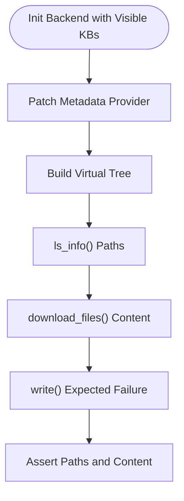
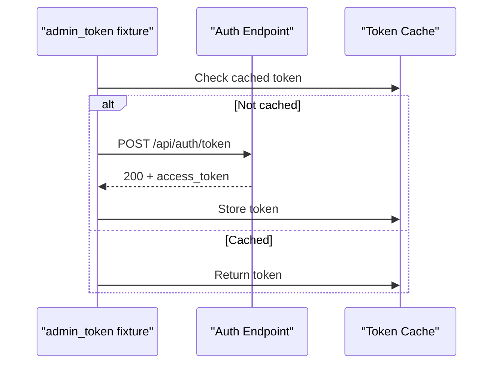
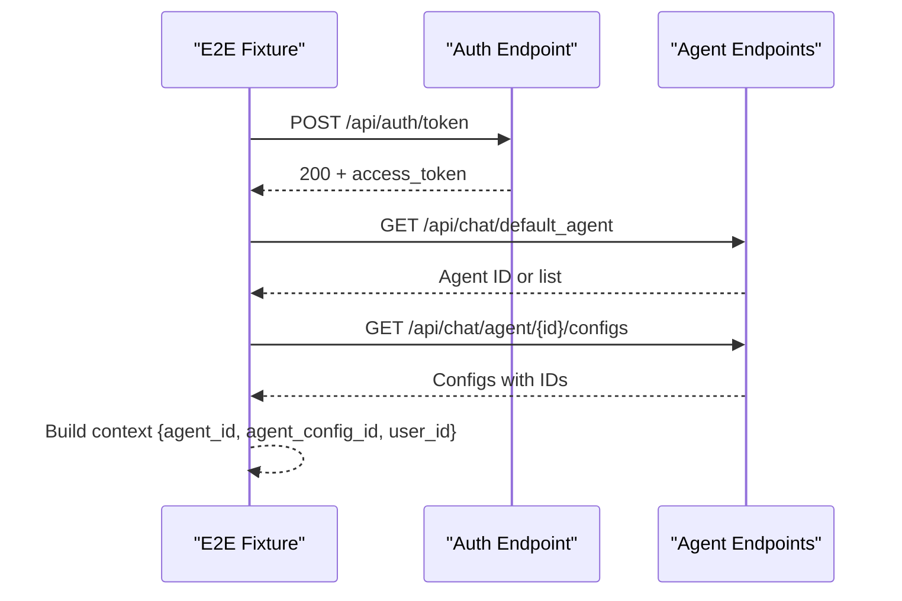
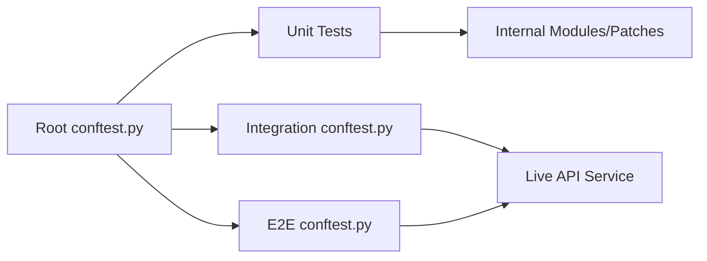

# Testing Strategy

<cite>
**Referenced Files in This Document**
- [conftest.py](file://backend/test/conftest.py)
- [run_tests.sh](file://backend/test/run_tests.sh)
- [e2e/conftest.py](file://backend/test/e2e/conftest.py)
- [integration/conftest.py](file://backend/test/integration/conftest.py)
- [unit/services/test_agent_run_service.py](file://backend/test/unit/services/test_agent_run_service.py)
- [unit/backends/test_knowledge_base_backend.py](file://backend/test/unit/backends/test_knowledge_base_backend.py)
- [data/test_csv_file.csv](file://backend/test/data/test_csv_file.csv)
- [data/A_Dream_of_Red_Mansions_tiny.jsonl](file://backend/test/data/A_Dream_of_Red_Mansions_tiny.jsonl)
</cite>

## Table of Contents
1. [Introduction](#introduction)
2. [Project Structure](#project-structure)
3. [Core Components](#core-components)
4. [Architecture Overview](#architecture-overview)
5. [Detailed Component Analysis](#detailed-component-analysis)
6. [Dependency Analysis](#dependency-analysis)
7. [Performance Considerations](#performance-considerations)
8. [Troubleshooting Guide](#troubleshooting-guide)
9. [Conclusion](#conclusion)
10. [Appendices](#appendices)

## Introduction
This document describes the multi-layered testing strategy for the Yuxi platform. It covers unit tests, integration tests, and end-to-end tests, along with the test organization structure, shared fixtures, and common testing patterns. It also documents the continuous integration testing pipeline, automated test execution, and practical examples for testing agents, services, and API endpoints. Guidance on test coverage, performance testing, debugging failures, and best practices is included to maintain high-quality tests.

## Project Structure
The backend test suite is organized into three layers:
- Unit tests: isolated tests for individual modules and services, focusing on pure logic and deterministic behavior.
- Integration tests: tests that exercise the live API service and interact with external systems such as databases, queues, and sandbox environments.
- End-to-end tests: tests that simulate real user workflows against the live API service.

Shared configuration and fixtures are centralized in per-layer conftest.py files, while a shell script automates test execution and health checks.

**Diagram sources**
- [conftest.py:17-26](file://backend/test/conftest.py#L17-L26)
- [integration/conftest.py:1-298](file://backend/test/integration/conftest.py#L1-L298)
- [e2e/conftest.py:1-100](file://backend/test/e2e/conftest.py#L1-L100)
- [run_tests.sh:1-88](file://backend/test/run_tests.sh#L1-L88)

**Section sources**
- [conftest.py:17-26](file://backend/test/conftest.py#L17-L26)
- [run_tests.sh:1-88](file://backend/test/run_tests.sh#L1-L88)

## Core Components
- Test markers and plugins:
  - Shared markers define categories for filtering tests: unit, auth, integration, e2e, slow.
  - The asyncio plugin enables async fixtures and coroutines.
- Environment isolation:
  - Package path injection ensures modules are importable during test collection.
  - Application initialization is skipped during collection to avoid expensive setup.
- Execution orchestration:
  - A shell script runs pytest inside the API service container, with convenience commands for unit, integration, e2e, and full suites.

Practical usage examples:
- Mark tests with appropriate markers to control execution scope.
- Use fixtures to inject HTTP clients, tokens, and contextual data.
- Run subsets of tests locally or in CI using the runner script.

**Section sources**
- [conftest.py:17-26](file://backend/test/conftest.py#L17-L26)
- [run_tests.sh:22-43](file://backend/test/run_tests.sh#L22-L43)

## Architecture Overview
The testing architecture separates concerns by layer and reuses fixtures to minimize duplication. Integration and E2E layers rely on shared environment configuration and authentication flows.

**Diagram sources**
- [run_tests.sh:8-43](file://backend/test/run_tests.sh#L8-L43)
- [conftest.py:17-26](file://backend/test/conftest.py#L17-L26)
- [integration/conftest.py:43-89](file://backend/test/integration/conftest.py#L43-L89)
- [e2e/conftest.py:34-55](file://backend/test/e2e/conftest.py#L34-L55)

## Detailed Component Analysis

### Unit Tests: Service Logic and Mocking Patterns
Unit tests focus on deterministic behavior and isolate dependencies using monkeypatch and fake repositories. Typical patterns include:
- Patching database managers and repositories to simulate success/failure scenarios.
- Using async context managers and fake queues to validate ordering and side effects.
- Asserting SSE-like event streams and terminal states.

Example patterns observed:
- Event streaming with error propagation and graceful closure on database errors.
- Verifying transaction commit occurs before queue enqueue to ensure consistency.
- Handling integrity errors by deducing existing runs and avoiding redundant work.

**Diagram sources**
- [unit/services/test_agent_run_service.py:20-49](file://backend/test/unit/services/test_agent_run_service.py#L20-L49)
- [unit/services/test_agent_run_service.py:104-177](file://backend/test/unit/services/test_agent_run_service.py#L104-L177)

**Section sources**
- [unit/services/test_agent_run_service.py:20-49](file://backend/test/unit/services/test_agent_run_service.py#L20-L49)
- [unit/services/test_agent_run_service.py:104-177](file://backend/test/unit/services/test_agent_run_service.py#L104-L177)

### Unit Tests: Backend Behavior and Filesystem Simulation
Unit tests for backends validate virtual filesystem construction and read-only behavior. They simulate external storage and metadata resolution to ensure correctness without network dependencies.

Patterns:
- Override module-level functions to supply controlled metadata.
- Use temporary directories as caches to validate traversal and materialization.
- Assert path structures and content retrieval across multiple knowledge bases.

**Diagram sources**
- [unit/backends/test_knowledge_base_backend.py:12-89](file://backend/test/unit/backends/test_knowledge_base_backend.py#L12-L89)

**Section sources**
- [unit/backends/test_knowledge_base_backend.py:12-89](file://backend/test/unit/backends/test_knowledge_base_backend.py#L12-L89)

### Integration Tests: Live API and Resource Management
Integration tests target the live API service and manage test resources:
- Admin authentication with cached tokens to reduce overhead.
- Automatic cleanup of test knowledge databases and sandbox containers.
- Creation and deletion of standard users and knowledge databases.
- Session-scoped fixtures to ensure pre/post conditions.

**Diagram sources**
- [integration/conftest.py:50-84](file://backend/test/integration/conftest.py#L50-L84)

**Section sources**
- [integration/conftest.py:50-84](file://backend/test/integration/conftest.py#L50-L84)
- [integration/conftest.py:92-152](file://backend/test/integration/conftest.py#L92-L152)
- [integration/conftest.py:197-201](file://backend/test/integration/conftest.py#L197-L201)

### End-to-End Tests: Real User Workflows
E2E tests simulate real user sessions:
- Login via credentials and obtain bearer tokens.
- Resolve agent and agent config contexts for subsequent requests.
- Enforce presence of credentials via environment variables.

**Diagram sources**
- [e2e/conftest.py:45-99](file://backend/test/e2e/conftest.py#L45-L99)

**Section sources**
- [e2e/conftest.py:26-31](file://backend/test/e2e/conftest.py#L26-L31)
- [e2e/conftest.py:45-99](file://backend/test/e2e/conftest.py#L45-L99)

### Continuous Integration Testing Pipeline and Automated Execution
The runner script orchestrates test execution:
- Health-checks the API service before running tests.
- Executes unit tests excluding slow markers.
- Runs integration and E2E tests against the live API with explicit markers.
- Uses docker compose exec to run pytest inside the API service container.

Operational guidance:
- Ensure the API service is healthy before invoking integration/E2E suites.
- Use the runner script to select subsets for local development and CI jobs.

**Section sources**
- [run_tests.sh:10-43](file://backend/test/run_tests.sh#L10-L43)

## Dependency Analysis
The test suite exhibits layered dependencies:
- Root conftest.py defines shared markers and plugins.
- Layer-specific conftest.py files depend on environment variables and inject HTTP clients and authentication headers.
- Unit tests depend on patching internal modules and repositories to simulate behavior deterministically.
- Integration and E2E tests depend on the live API service and external systems (e.g., Docker API for sandbox cleanup).

**Diagram sources**
- [conftest.py:17-26](file://backend/test/conftest.py#L17-L26)
- [integration/conftest.py:25-34](file://backend/test/integration/conftest.py#L25-L34)
- [e2e/conftest.py:17-23](file://backend/test/e2e/conftest.py#L17-L23)

**Section sources**
- [conftest.py:17-26](file://backend/test/conftest.py#L17-L26)
- [integration/conftest.py:25-34](file://backend/test/integration/conftest.py#L25-L34)
- [e2e/conftest.py:17-23](file://backend/test/e2e/conftest.py#L17-L23)

## Performance Considerations
- Use the slow marker to exclude long-running tests from unit suites.
- Reuse authenticated tokens via cached fixtures to reduce repeated login overhead.
- Prefer deterministic mocks and small test datasets to keep tests fast.
- For performance-sensitive areas, add targeted benchmarks alongside unit tests.

[No sources needed since this section provides general guidance]

## Troubleshooting Guide
Common issues and resolutions:
- Authentication failures in integration/E2E:
  - Verify admin credentials are set via environment variables.
  - Confirm the super admin account is initialized before running integration tests.
- Sandbox cleanup failures:
  - Ensure Docker socket permissions and API base URL are configured.
  - Review warnings printed during cleanup for actionable messages.
- E2E login failures:
  - Confirm E2E credentials are present; otherwise, tests are skipped.
- Slow tests:
  - Exclude slow tests from unit runs using the slow marker.
- Health checks:
  - Use the runner’s built-in health check to confirm the API service is reachable.

**Section sources**
- [integration/conftest.py:68-74](file://backend/test/integration/conftest.py#L68-L74)
- [integration/conftest.py:154-170](file://backend/test/integration/conftest.py#L154-L170)
- [e2e/conftest.py:26-31](file://backend/test/e2e/conftest.py#L26-L31)
- [run_tests.sh:10-20](file://backend/test/run_tests.sh#L10-L20)

## Conclusion
The Yuxi testing strategy emphasizes clear separation between unit, integration, and end-to-end layers, supported by reusable fixtures and a robust execution pipeline. By leveraging markers, environment-driven configuration, and deterministic mocking, the suite maintains reliability and speed. Adopting the recommended practices will help sustain high-quality tests as the platform evolves.

[No sources needed since this section summarizes without analyzing specific files]

## Appendices

### Practical Examples Index
- Unit tests for agent run service event streaming and transaction ordering:
  - [unit/services/test_agent_run_service.py:20-49](file://backend/test/unit/services/test_agent_run_service.py#L20-L49)
  - [unit/services/test_agent_run_service.py:104-177](file://backend/test/unit/services/test_agent_run_service.py#L104-L177)
- Unit tests for knowledge base backend virtual filesystem:
  - [unit/backends/test_knowledge_base_backend.py:12-89](file://backend/test/unit/backends/test_knowledge_base_backend.py#L12-L89)
- Integration fixtures for admin auth and resource cleanup:
  - [integration/conftest.py:50-84](file://backend/test/integration/conftest.py#L50-L84)
  - [integration/conftest.py:92-152](file://backend/test/integration/conftest.py#L92-L152)
- E2E fixtures for login and agent context:
  - [e2e/conftest.py:45-99](file://backend/test/e2e/conftest.py#L45-L99)
- Test data assets:
  - [data/test_csv_file.csv:1-8](file://backend/test/data/test_csv_file.csv#L1-L8)
  - [data/A_Dream_of_Red_Mansions_tiny.jsonl:1-5](file://backend/test/data/A_Dream_of_Red_Mansions_tiny.jsonl#L1-L5)