# Unit Testing

<cite>
**Referenced Files in This Document**
- [pyproject.toml](file://backend/pyproject.toml)
- [conftest.py](file://backend/test/conftest.py)
- [test_knowledge_base_backend.py](file://backend/test/unit/backends/test_knowledge_base_backend.py)
- [test_skills_backend.py](file://backend/test/unit/backends/test_skills_backend.py)
- [test_agent_run_service.py](file://backend/test/unit/services/test_agent_run_service.py)
- [test_conversation_repository.py](file://backend/test/unit/storage/test_conversation_repository.py)
- [test_auth_utils.py](file://backend/test/unit/test_auth_utils.py)
- [test_parser_facade.py](file://backend/test/unit/plugins/test_parser_facade.py)
- [test_graph_unit.py](file://backend/test/unit/graphs/test_graph_unit.py)
- [test_skill_router.py](file://backend/test/unit/routers/test_skill_router.py)
- [conftest.py](file://backend/test/e2e/conftest.py)
- [conftest.py](file://backend/test/integration/conftest.py)
</cite>

## Table of Contents
1. [Introduction](#introduction)
2. [Project Structure](#project-structure)
3. [Core Components](#core-components)
4. [Architecture Overview](#architecture-overview)
5. [Detailed Component Analysis](#detailed-component-analysis)
6. [Dependency Analysis](#dependency-analysis)
7. [Performance Considerations](#performance-considerations)
8. [Troubleshooting Guide](#troubleshooting-guide)
9. [Conclusion](#conclusion)

## Introduction
This document describes the unit testing implementation in the Yuxi platform. It explains the pytest-based framework setup, test organization patterns, and naming conventions. It covers testing approaches for agents, services, repositories, utilities, and plugins, along with mocking strategies for external dependencies, database connections, and API integrations. It also documents shared fixtures and utilities, provides practical examples for agent backends, skill systems, knowledge base operations, and service-layer functionality, and outlines best practices for asynchronous code, error handling, and edge cases. Finally, it addresses test isolation, dependency injection patterns, and maintaining test reliability.

## Project Structure
The backend test suite is organized into three layers:
- unit: isolated tests for individual components and units of logic
- integration: tests that exercise live API endpoints and services
- e2e: end-to-end tests requiring authenticated sessions and real infrastructure

The pytest configuration defines markers, asyncio mode, and test discovery paths. A global conftest sets up the Python path and environment to avoid heavy initialization during collection.

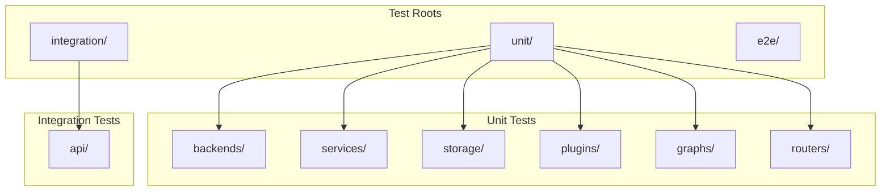

**Diagram sources**
- [pyproject.toml:41-53](file://backend/pyproject.toml#L41-L53)
- [conftest.py:17-26](file://backend/test/conftest.py#L17-L26)

**Section sources**
- [pyproject.toml:41-53](file://backend/pyproject.toml#L41-L53)
- [conftest.py:17-26](file://backend/test/conftest.py#L17-L26)

## Core Components
- Pytest configuration and markers define test categories and asyncio behavior.
- Global conftest injects the project root into sys.path and registers markers.
- Unit tests focus on pure logic, mocks, and deterministic fixtures.
- Integration tests use HTTP clients and shared fixtures to exercise live APIs.
- E2E tests manage authentication and agent contexts for realistic flows.

Key configuration highlights:
- Markers: unit, auth, integration, e2e, slow
- Async mode: auto with function-scoped fixture loop
- Test discovery: testpaths includes unit, integration, e2e
- Python path includes project root and package

**Section sources**
- [pyproject.toml:41-53](file://backend/pyproject.toml#L41-L53)
- [conftest.py:17-26](file://backend/test/conftest.py#L17-L26)

## Architecture Overview
The unit testing architecture centers on pytest with explicit fixtures and monkeypatching to isolate components. Shared fixtures enable consistent setup across tests, while monkeypatch replaces external dependencies to keep tests deterministic and fast.

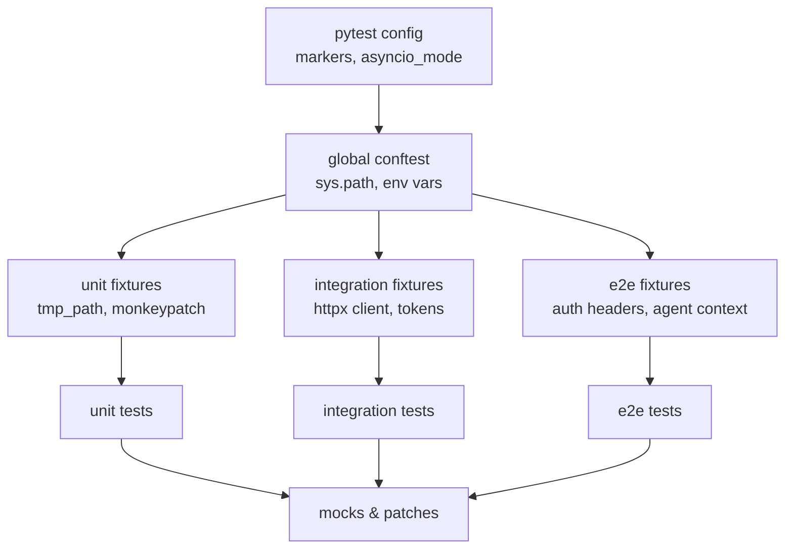

**Diagram sources**
- [pyproject.toml:41-53](file://backend/pyproject.toml#L41-L53)
- [conftest.py:17-26](file://backend/test/conftest.py#L17-L26)
- [conftest.py:34-55](file://backend/test/e2e/conftest.py#L34-L55)
- [conftest.py:43-89](file://backend/test/integration/conftest.py#L43-L89)

## Detailed Component Analysis

### Knowledge Base Backend Tests
These tests validate virtual tree construction, file materialization, read-only access, and filtering of visible knowledge bases by context.

- Virtual tree and materialization: builds a synthetic file tree across multiple databases and verifies listing and download behaviors.
- Read-only enforcement: ensures write/edit operations fail appropriately.
- Async visibility resolution: filters visible databases based on enabled names and attaches results to context.

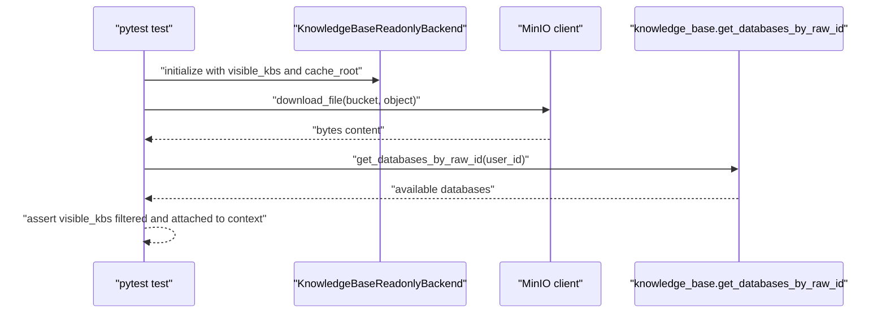

**Diagram sources**
- [test_knowledge_base_backend.py:12-89](file://backend/test/unit/backends/test_knowledge_base_backend.py#L12-L89)
- [test_knowledge_base_backend.py:91-107](file://backend/test/unit/backends/test_knowledge_base_backend.py#L91-L107)

**Section sources**
- [test_knowledge_base_backend.py:12-107](file://backend/test/unit/backends/test_knowledge_base_backend.py#L12-L107)

### Skills Backend Tests
These tests validate a selected skills backend that enforces read-only access and restricts visibility to selected slugs.

- Directory preparation: creates two skill directories with metadata files.
- Listing and filtering: only selected skills are visible at root.
- Access control: denies reads/writes outside selected slugs and enforces read-only semantics.

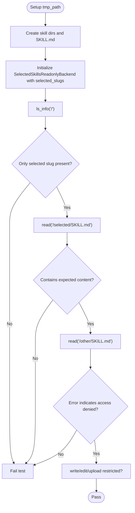

**Diagram sources**
- [test_skills_backend.py:21-46](file://backend/test/unit/backends/test_skills_backend.py#L21-L46)

**Section sources**
- [test_skills_backend.py:21-46](file://backend/test/unit/backends/test_skills_backend.py#L21-L46)

### Agent Run Service Tests
These tests validate event streaming, transactional creation, and error handling paths for agent runs.

- Event streaming: emits SSE events and closes stream upon DB errors or completion.
- Transaction ordering: commits before enqueueing to maintain consistency.
- Integrity error handling: deduplicates by request_id and handles cross-user conflicts.

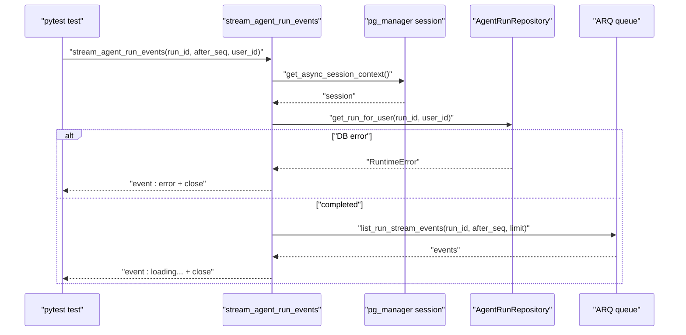

**Diagram sources**
- [test_agent_run_service.py:20-101](file://backend/test/unit/services/test_agent_run_service.py#L20-L101)

**Section sources**
- [test_agent_run_service.py:20-101](file://backend/test/unit/services/test_agent_run_service.py#L20-L101)

### Conversation Repository Tests
These tests validate normalization logic for conversation titles and IDs.

- Title truncation: enforces maximum length and trims whitespace.
- ID casting: converts numeric strings to integers safely.
- None handling: allows optional fields to remain None.

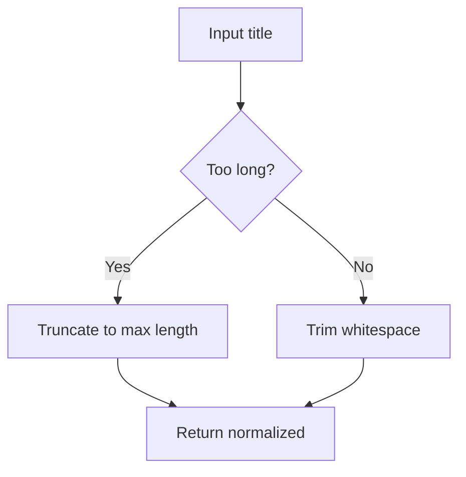

**Diagram sources**
- [test_conversation_repository.py:6-14](file://backend/test/unit/storage/test_conversation_repository.py#L6-L14)

**Section sources**
- [test_conversation_repository.py:6-39](file://backend/test/unit/storage/test_conversation_repository.py#L6-L39)

### Authentication Utilities Tests
These tests validate password hashing and verification, including legacy SHA-256 support.

- Hashing: ensures Argon2 hashes are generated and verified.
- Legacy verification: accepts legacy hash:salt format.

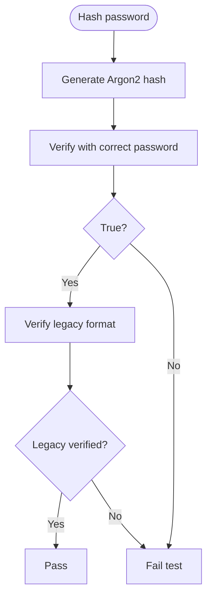

**Diagram sources**
- [test_auth_utils.py:8-21](file://backend/test/unit/test_auth_utils.py#L8-L21)

**Section sources**
- [test_auth_utils.py:8-21](file://backend/test/unit/test_auth_utils.py#L8-L21)

### Parser Facade Tests
These tests validate parsing of PDF, DOCX, and PNG files, including OCR fallbacks and async flows.

- PDF parsing: generates markdown from PDF content.
- DOCX fallback: mocks docling failure and uses python-docx.
- OCR mock: substitutes image parsing with a deterministic async function.
- Async parsing: validates async entry points and optional OCR backends.

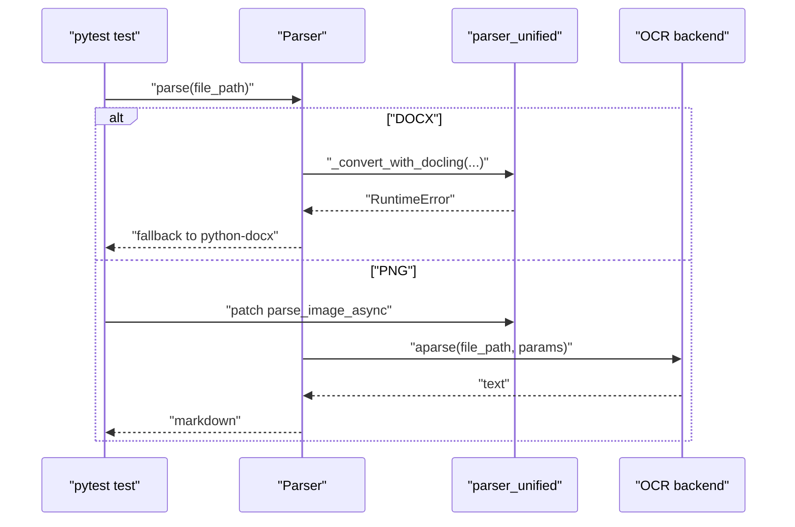

**Diagram sources**
- [test_parser_facade.py:37-83](file://backend/test/unit/plugins/test_parser_facade.py#L37-L83)
- [test_parser_facade.py:85-115](file://backend/test/unit/plugins/test_parser_facade.py#L85-L115)

**Section sources**
- [test_parser_facade.py:37-115](file://backend/test/unit/plugins/test_parser_facade.py#L37-L115)

### Graph Service Tests
These tests validate vector entity insertion and property handling for mixed legacy and extended triple formats.

- Neo4j driver/session mocking: simulates transactions and read/write execution.
- Embedding model selection: patches model selection for deterministic dimensionality.
- Query verification: asserts MERGE calls with expected properties for both legacy and extended formats.

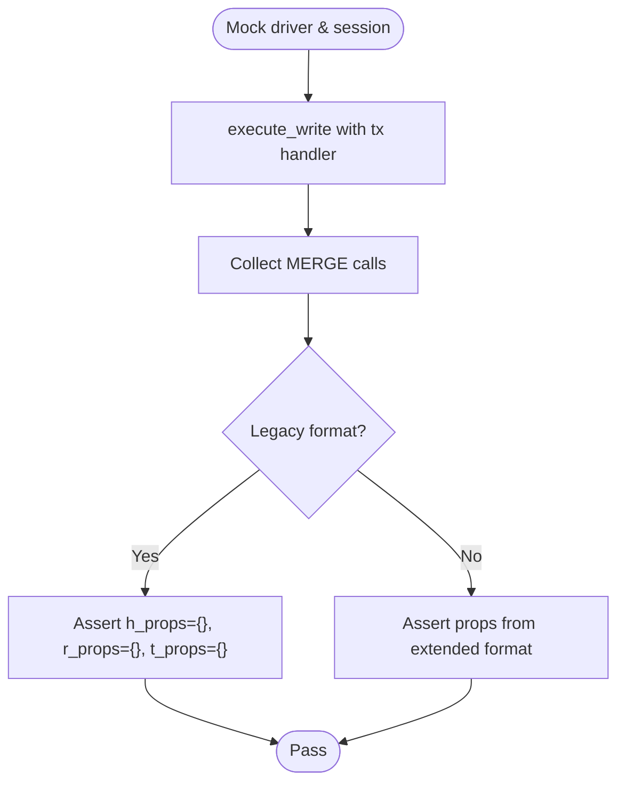

**Diagram sources**
- [test_graph_unit.py:15-108](file://backend/test/unit/graphs/test_graph_unit.py#L15-L108)

**Section sources**
- [test_graph_unit.py:15-108](file://backend/test/unit/graphs/test_graph_unit.py#L15-L108)

### Skill Router Tests
These tests validate FastAPI router endpoints for skills, including dependency overrides for authentication and service functions.

- Route coverage: lists skills, imports skills (ZIP and MD), updates files, manages dependencies, and installs remote skills.
- Authentication: requires superadmin for sensitive routes; uses dependency overrides to simulate roles.
- Payload assertions: captures and validates parameters passed to service functions.

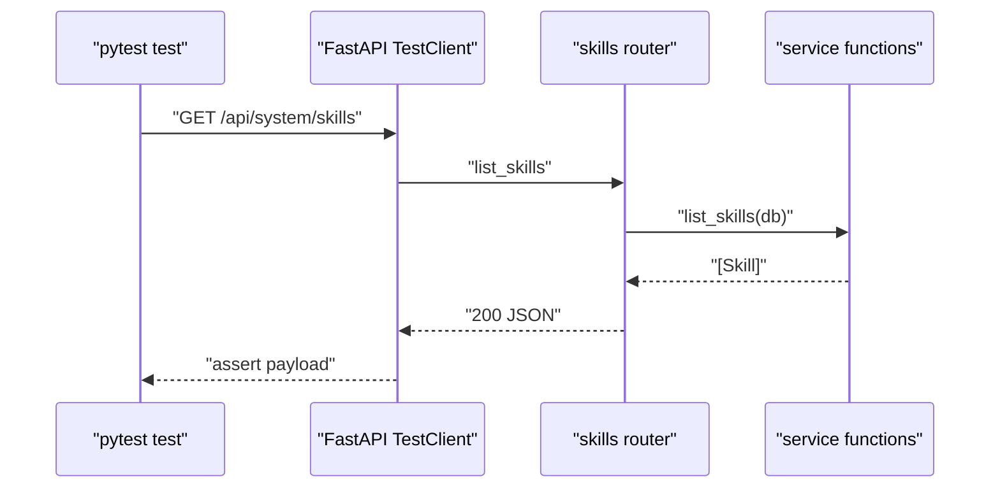

**Diagram sources**
- [test_skill_router.py:42-62](file://backend/test/unit/routers/test_skill_router.py#L42-L62)
- [test_skill_router.py:106-131](file://backend/test/unit/routers/test_skill_router.py#L106-L131)

**Section sources**
- [test_skill_router.py:42-246](file://backend/test/unit/routers/test_skill_router.py#L42-L246)

## Dependency Analysis
The testing stack relies on:
- pytest with asyncio mode for async tests
- monkeypatch for replacing module-level functions and singletons
- httpx AsyncClient for integration and e2e tests
- FastAPI TestClient for router-level tests
- Shared fixtures for database and user lifecycles

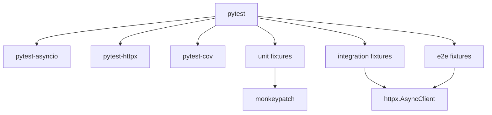

**Diagram sources**
- [pyproject.toml:60-65](file://backend/pyproject.toml#L60-L65)
- [conftest.py:34-55](file://backend/test/e2e/conftest.py#L34-L55)
- [conftest.py:43-89](file://backend/test/integration/conftest.py#L43-L89)

**Section sources**
- [pyproject.toml:60-65](file://backend/pyproject.toml#L60-L65)
- [conftest.py:34-55](file://backend/test/e2e/conftest.py#L34-L55)
- [conftest.py:43-89](file://backend/test/integration/conftest.py#L43-L89)

## Performance Considerations
- Prefer unit tests for hot-path logic to minimize overhead.
- Use tmp_path and deterministic mocks to avoid I/O bottlenecks.
- Keep async fixtures scoped to function level to reduce contention.
- Skip optional OCR backends when unavailable to avoid flaky waits.

## Troubleshooting Guide
Common issues and remedies:
- Missing credentials for integration/e2e tests: configure TEST_USERNAME/TEST_PASSWORD or E2E_USERNAME/E2E_PASSWORD; tests will skip if not set.
- Docker sandbox cleanup failures: ensure permissions and socket access; warnings are printed but tests continue.
- Knowledge database conflicts: clean up stale databases with pytest_ or py_test prefixes before running integration tests.
- Async fixtures timing out: adjust timeouts in conftest if local environments are slow.

**Section sources**
- [conftest.py:26-31](file://backend/test/e2e/conftest.py#L26-L31)
- [conftest.py:92-152](file://backend/test/integration/conftest.py#L92-L152)
- [conftest.py:173-201](file://backend/test/integration/conftest.py#L173-L201)

## Conclusion
The Yuxi platform’s unit testing framework leverages pytest with clear organization, robust fixtures, and extensive mocking to isolate components and external dependencies. The suite covers critical areas including agent backends, services, repositories, utilities, plugins, and routers. By adhering to the documented patterns—use of monkeypatch, dependency overrides, and shared fixtures—developers can reliably test asynchronous logic, error handling, and edge cases while maintaining test isolation and performance.