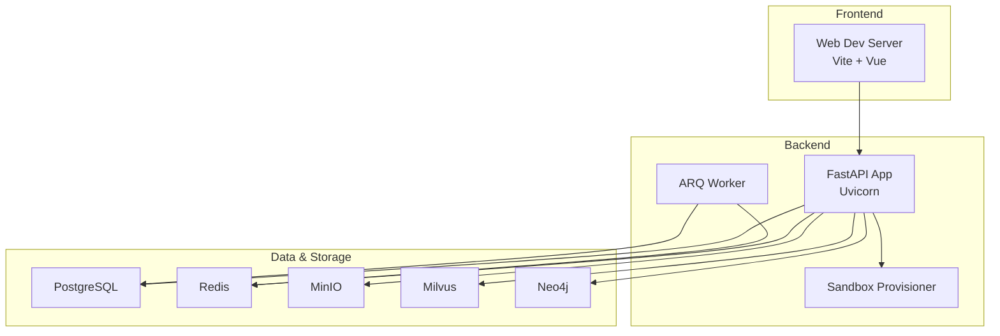
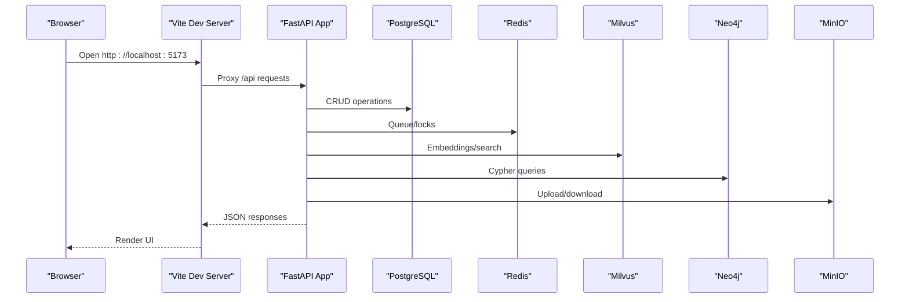
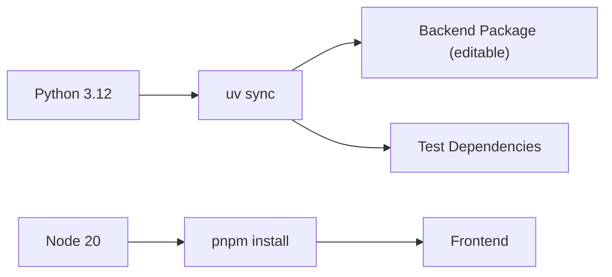

# Common Issues & Solutions

<cite>
**Referenced Files in This Document**
- [README.md](file://README.md)
- [docker-compose.yml](file://docker-compose.yml)
- [docker/api.Dockerfile](file://docker/api.Dockerfile)
- [docker/web.Dockerfile](file://docker/web.Dockerfile)
- [backend/pyproject.toml](file://backend/pyproject.toml)
- [web/package.json](file://web/package.json)
- [backend/package/yuxi/utils/logging_config.py](file://backend/package/yuxi/utils/logging_config.py)
- [backend/server/utils/access_log_middleware.py](file://backend/server/utils/access_log_middleware.py)
- [backend/package/yuxi/config/app.py](file://backend/package/yuxi/config/app.py)
- [backend/package/yuxi/agents/backends/sandbox/backend.py](file://backend/package/yuxi/agents/backends/sandbox/backend.py)
- [backend/package/yuxi/knowledge/chunking/ragflow_like/nlp.py](file://backend/package/yuxi/knowledge/chunking/ragflow_like/nlp.py)
- [web/src/utils/errorHandler.js](file://web/src/utils/errorHandler.js)
- [web/src/stores/agent.js](file://web/src/stores/agent.js)
- [web/vite.config.js](file://web/vite.config.js)
- [scripts/init.sh](file://scripts/init.sh)
- [scripts/init.ps1](file://scripts/init.ps1)
- [backend/test/unit/backends/test_sandbox_backends.py](file://backend/test/unit/backends/test_sandbox_backends.py)
- [backend/test/unit/test_package_import.py](file://backend/test/unit/test_package_import.py)
</cite>

## Table of Contents
1. [Introduction](#introduction)
2. [Project Structure](#project-structure)
3. [Core Components](#core-components)
4. [Architecture Overview](#architecture-overview)
5. [Detailed Component Analysis](#detailed-component-analysis)
6. [Dependency Analysis](#dependency-analysis)
7. [Performance Considerations](#performance-considerations)
8. [Troubleshooting Guide](#troubleshooting-guide)
9. [Conclusion](#conclusion)
10. [Appendices](#appendices)

## Introduction
This document provides a comprehensive guide to diagnosing and resolving common issues encountered when installing, configuring, and operating the Yuxi platform. It covers installation problems (dependency conflicts, Docker container startup failures, environment configuration errors), runtime issues (agent execution failures, knowledge processing errors, API connectivity problems), and frontend issues (component rendering errors, state management problems, browser compatibility issues). Each section includes step-by-step solutions, configuration fixes, and references to relevant source files for verification.

## Project Structure
The Yuxi platform consists of:
- Backend services built with FastAPI and uvicorn, orchestrated via Docker Compose
- Frontend built with Vue 3 and Pinia, served by Vite in development and Nginx in production
- Supporting services: PostgreSQL, Redis, Neo4j, Milvus, MinIO, and specialized workers for sandbox and OCR

**Diagram sources**
- [docker-compose.yml:37-436](file://docker-compose.yml#L37-L436)
- [docker/api.Dockerfile:1-59](file://docker/api.Dockerfile#L1-L59)
- [docker/web.Dockerfile:1-49](file://docker/web.Dockerfile#L1-L49)

**Section sources**
- [README.md:97-118](file://README.md#L97-L118)
- [docker-compose.yml:37-436](file://docker-compose.yml#L37-L436)

## Core Components
- Logging and observability: centralized logging via loguru with bridging for third-party libraries and access logs middleware
- Configuration management: Pydantic-based configuration with environment overrides and persistence
- Sandbox backend: secure file operations and command execution with strict path validation
- Knowledge chunking: robust text segmentation and hierarchical merging for RAG
- Frontend error handling: unified error reporting and user messaging utilities
- State management: Pinia stores for agent configuration and UI state

**Section sources**
- [backend/package/yuxi/utils/logging_config.py:1-99](file://backend/package/yuxi/utils/logging_config.py#L1-L99)
- [backend/server/utils/access_log_middleware.py:1-68](file://backend/server/utils/access_log_middleware.py#L1-L68)
- [backend/package/yuxi/config/app.py:31-274](file://backend/package/yuxi/config/app.py#L31-L274)
- [backend/package/yuxi/agents/backends/sandbox/backend.py:64-402](file://backend/package/yuxi/agents/backends/sandbox/backend.py#L64-L402)
- [backend/package/yuxi/knowledge/chunking/ragflow_like/nlp.py:411-482](file://backend/package/yuxi/knowledge/chunking/ragflow_like/nlp.py#L411-L482)
- [web/src/utils/errorHandler.js:1-148](file://web/src/utils/errorHandler.js#L1-L148)
- [web/src/stores/agent.js:1-567](file://web/src/stores/agent.js#L1-L567)

## Architecture Overview
The platform uses a microservice-style architecture with Docker Compose. The frontend communicates with the backend API, which interacts with external services for persistence, vector storage, graph storage, and object storage. Workers handle asynchronous tasks.

**Diagram sources**
- [docker-compose.yml:176-200](file://docker-compose.yml#L176-L200)
- [web/vite.config.js:15-27](file://web/vite.config.js#L15-L27)

## Detailed Component Analysis

### Installation and Environment Setup
Common issues:
- Missing or invalid environment variables
- Docker image pull failures
- Python/Node dependency resolution conflicts
- Port conflicts or network misconfiguration

Recommended steps:
- Run the initialization scripts to generate the .env file and pull required images
- Verify environment variables for model providers and sandbox settings
- Ensure ports 5050 (API), 5173 (Web), 6379 (Redis), 5432 (Postgres), 9000/9001 (MinIO), 19530 (Milvus), 7474/7687 (Neo4j) are free
- Confirm Docker networking and health checks succeed

**Section sources**
- [scripts/init.sh:11-50](file://scripts/init.sh#L11-L50)
- [scripts/init.ps1:8-53](file://scripts/init.ps1#L8-L53)
- [docker-compose.yml:1-36](file://docker-compose.yml#L1-L36)
- [docker-compose.yml:37-123](file://docker-compose.yml#L37-L123)
- [backend/pyproject.toml:6-12](file://backend/pyproject.toml#L6-L12)
- [web/package.json:14-39](file://web/package.json#L14-L39)

### Docker Container Startup Failures
Symptoms:
- Health checks failing for Postgres, Redis, Milvus, Neo4j, MinIO
- API or Web containers not reachable
- Sandbox provisioner failing to start

Diagnosis checklist:
- Review container logs for permission errors, missing credentials, or port binding issues
- Validate environment variables passed to each service
- Confirm persistent volumes exist and are writable
- Check NO_PROXY/no_proxy settings for internal service names

Fixes:
- Correct environment variables in .env and docker-compose.yml
- Adjust volume mounts and permissions
- Increase healthcheck timeouts for resource-constrained environments
- Verify internal DNS resolution (e.g., api resolves to service name)

**Section sources**
- [docker-compose.yml:69-84](file://docker-compose.yml#L69-L84)
- [docker-compose.yml:212-225](file://docker-compose.yml#L212-L225)
- [docker-compose.yml:328-337](file://docker-compose.yml#L328-L337)
- [docker-compose.yml:285-291](file://docker-compose.yml#L285-L291)
- [docker-compose.yml:259-264](file://docker-compose.yml#L259-L264)

### Environment Configuration Errors
Symptoms:
- No model providers available
- Sandbox provider misconfiguration
- Model directory not recognized

Resolution:
- Set required API keys in .env (e.g., SiliconFlow)
- Ensure SANDBOX_PROVIDER is provisioner and SANDBOX_PROVISIONER_URL is set
- Verify MODEL_DIR path exists and is readable
- Confirm TAVILY_API_KEY for web search if needed

**Section sources**
- [backend/package/yuxi/config/app.py:216-273](file://backend/package/yuxi/config/app.py#L216-L273)
- [docker-compose.yml:1-36](file://docker-compose.yml#L1-L36)

### Runtime Issues: Agent Execution Failures
Symptoms:
- Commands fail in sandbox with “Error:”
- File read/write/edit operations return errors
- Path traversal or invalid path errors

Root causes:
- Invalid or out-of-prefix paths
- Permission denials or missing files
- Sandbox client failures or timeouts

Resolution:
- Use normalized paths within virtual prefix
- Ensure files exist before editing
- Increase SANDBOX_EXEC_TIMEOUT_SECONDS and SANDBOX_MAX_OUTPUT_BYTES if needed
- Inspect sandbox provisioner logs

**Section sources**
- [backend/package/yuxi/agents/backends/sandbox/backend.py:171-200](file://backend/package/yuxi/agents/backends/sandbox/backend.py#L171-L200)
- [backend/package/yuxi/agents/backends/sandbox/backend.py:136-170](file://backend/package/yuxi/agents/backends/sandbox/backend.py#L136-L170)
- [backend/package/yuxi/agents/backends/sandbox/backend.py:340-402](file://backend/package/yuxi/agents/backends/sandbox/backend.py#L340-L402)
- [backend/test/unit/backends/test_sandbox_backends.py:75-97](file://backend/test/unit/backends/test_sandbox_backends.py#L75-L97)

### Runtime Issues: Knowledge Processing Errors
Symptoms:
- Chunking fails or produces unexpected segments
- Token estimation mismatches
- Hierarchical merge issues

Resolution:
- Adjust chunk_token_num and overlapped_percent
- Validate input text encoding and delimiters
- Use naive_merge with appropriate delimiters for custom documents
- Review logs for warnings about third-party libraries

**Section sources**
- [backend/package/yuxi/knowledge/chunking/ragflow_like/nlp.py:411-482](file://backend/package/yuxi/knowledge/chunking/ragflow_like/nlp.py#L411-L482)
- [backend/package/yuxi/utils/logging_config.py:47-52](file://backend/package/yuxi/utils/logging_config.py#L47-L52)

### Runtime Issues: API Connectivity Problems
Symptoms:
- 401/403/404/5xx responses
- Network timeouts or proxy misconfiguration
- CORS or proxy mismatch

Resolution:
- Verify VITE_API_URL in frontend matches backend service name/port
- Ensure proxy rules in Vite match backend routes
- Check NO_PROXY/no_proxy lists for internal services
- Confirm access logs show expected request patterns

**Section sources**
- [web/vite.config.js:15-27](file://web/vite.config.js#L15-L27)
- [docker-compose.yml:194-199](file://docker-compose.yml#L194-L199)
- [backend/server/utils/access_log_middleware.py:34-67](file://backend/server/utils/access_log_middleware.py#L34-L67)

### Frontend Issues: Component Rendering Errors
Symptoms:
- Components not updating after state changes
- UI flickering or stale data
- Persistent store not restoring selections

Resolution:
- Ensure reactive refs and computed properties are used correctly
- Clear loading flags after async operations
- Persist essential selections (agentId, configId) in localStorage

**Section sources**
- [web/src/stores/agent.js:506-556](file://web/src/stores/agent.js#L506-L556)

### Frontend Issues: State Management Problems
Symptoms:
- Config changes not applied
- Default agent not selected
- Error state not cleared

Resolution:
- Use updateConfigItem/updateAgentConfig for incremental updates
- Reset error state after successful operations
- Initialize stores with proper fallbacks

**Section sources**
- [web/src/stores/agent.js:457-481](file://web/src/stores/agent.js#L457-L481)
- [web/src/stores/agent.js:537-556](file://web/src/stores/agent.js#L537-L556)

### Frontend Issues: Browser Compatibility and Proxy Misconfiguration
Symptoms:
- Hot reload not triggering
- API calls failing with CORS/proxy errors

Resolution:
- Enable host: '0.0.0.0' and polling for file watching
- Configure proxy target to backend service name
- Use absolute URLs for Vite proxy targets

**Section sources**
- [web/vite.config.js:22-27](file://web/vite.config.js#L22-L27)

## Dependency Analysis
The backend uses uv with editable installs and pinned indices. The frontend uses pnpm. Conflicts often arise from incompatible Node or Python versions, missing native dependencies, or incorrect mirror configurations.

**Diagram sources**
- [backend/pyproject.toml:6-12](file://backend/pyproject.toml#L6-L12)
- [backend/pyproject.toml:35-39](file://backend/pyproject.toml#L35-L39)
- [web/package.json:14-39](file://web/package.json#L14-L39)

**Section sources**
- [backend/pyproject.toml:22-39](file://backend/pyproject.toml#L22-L39)
- [web/package.json:14-39](file://web/package.json#L14-L39)

## Performance Considerations
- Reduce embedding and LLM timeouts if resources are constrained
- Tune sandbox output limits and execution timeouts
- Use LITE mode to skip heavy modules during development
- Monitor access logs for slow endpoints and optimize queries

[No sources needed since this section provides general guidance]

## Troubleshooting Guide

### Step-by-Step Troubleshooting Workflows

#### Installation and Environment
1. Generate .env via initialization scripts
   - [scripts/init.sh:11-50](file://scripts/init.sh#L11-L50)
   - [scripts/init.ps1:8-53](file://scripts/init.ps1#L8-L53)
2. Pull required Docker images
   - [scripts/init.sh:56-80](file://scripts/init.sh#L56-L80)
   - [scripts/init.ps1:59-89](file://scripts/init.ps1#L59-L89)
3. Start services with compose
   - [docker-compose.yml:113-123](file://docker-compose.yml#L113-L123)

#### Docker Health Checks
- Inspect failing service logs and adjust healthcheck thresholds
  - [docker-compose.yml:69-84](file://docker-compose.yml#L69-L84)
  - [docker-compose.yml:212-225](file://docker-compose.yml#L212-L225)
  - [docker-compose.yml:328-337](file://docker-compose.yml#L328-L337)
  - [docker-compose.yml:285-291](file://docker-compose.yml#L285-L291)
  - [docker-compose.yml:259-264](file://docker-compose.yml#L259-L264)

#### Sandbox Execution Failures
- Validate path normalization and virtual path prefix
  - [backend/package/yuxi/agents/backends/sandbox/backend.py:26-34](file://backend/package/yuxi/agents/backends/sandbox/backend.py#L26-L34)
  - [backend/package/yuxi/agents/backends/sandbox/backend.py:171-200](file://backend/package/yuxi/agents/backends/sandbox/backend.py#L171-L200)
- Increase timeouts and output limits if needed
  - [backend/package/yuxi/config/app.py:83-85](file://backend/package/yuxi/config/app.py#L83-L85)

#### Knowledge Processing Errors
- Adjust chunking parameters and delimiters
  - [backend/package/yuxi/knowledge/chunking/ragflow_like/nlp.py:411-482](file://backend/package/yuxi/knowledge/chunking/ragflow_like/nlp.py#L411-L482)
- Review logs for third-party library warnings
  - [backend/package/yuxi/utils/logging_config.py:47-52](file://backend/package/yuxi/utils/logging_config.py#L47-L52)

#### API Connectivity
- Verify proxy and API URL
  - [web/vite.config.js:15-27](file://web/vite.config.js#L15-L27)
  - [docker-compose.yml:194-199](file://docker-compose.yml#L194-L199)
- Check access logs for request patterns
  - [backend/server/utils/access_log_middleware.py:34-67](file://backend/server/utils/access_log_middleware.py#L34-L67)

#### Frontend State and Rendering
- Ensure reactive updates and persisted selections
  - [web/src/stores/agent.js:506-556](file://web/src/stores/agent.js#L506-L556)
- Clear error state after operations
  - [web/src/stores/agent.js:478-481](file://web/src/stores/agent.js#L478-L481)

### Escalation Procedures
- Collect logs from failing containers and review centralized logs
  - [backend/package/yuxi/utils/logging_config.py:55-98](file://backend/package/yuxi/utils/logging_config.py#L55-L98)
- Validate configuration persistence and environment overrides
  - [backend/package/yuxi/config/app.py:274-344](file://backend/package/yuxi/config/app.py#L274-L344)
- Confirm dependency isolation and environment constraints
  - [backend/pyproject.toml:6-12](file://backend/pyproject.toml#L6-L12)
  - [web/package.json:14-39](file://web/package.json#L14-L39)

**Section sources**
- [backend/package/yuxi/utils/logging_config.py:55-98](file://backend/package/yuxi/utils/logging_config.py#L55-L98)
- [backend/package/yuxi/config/app.py:274-344](file://backend/package/yuxi/config/app.py#L274-L344)
- [backend/pyproject.toml:6-12](file://backend/pyproject.toml#L6-L12)
- [web/package.json:14-39](file://web/package.json#L14-L39)

## Conclusion
By following the structured troubleshooting workflows and applying the targeted fixes outlined above, most installation, runtime, and frontend issues in the Yuxi platform can be resolved efficiently. Consistent environment configuration, careful sandbox path handling, and robust error handling patterns are key to maintaining a stable deployment.

[No sources needed since this section summarizes without analyzing specific files]

## Appendices

### Frequently Asked Questions (FAQ)

- Q: Why does the API container fail health checks?
  - A: Check Postgres/Redis/MinIO health and ensure NO_PROXY includes internal service names
    - [docker-compose.yml:69-84](file://docker-compose.yml#L69-L84)

- Q: How do I fix sandbox path traversal errors?
  - A: Use paths within the virtual prefix and avoid parent directory navigation
    - [backend/package/yuxi/agents/backends/sandbox/backend.py:26-34](file://backend/package/yuxi/agents/backends/sandbox/backend.py#L26-L34)

- Q: How can I reduce chunking overhead?
  - A: Tune chunk_token_num and overlapped_percent; use custom delimiters for domain-specific content
    - [backend/package/yuxi/knowledge/chunking/ragflow_like/nlp.py:411-482](file://backend/package/yuxi/knowledge/chunking/ragflow_like/nlp.py#L411-L482)

- Q: How do I configure the frontend to talk to the backend?
  - A: Set VITE_API_URL to the backend service name and enable proxy in Vite
    - [docker-compose.yml:194-199](file://docker-compose.yml#L194-L199)
    - [web/vite.config.js:15-27](file://web/vite.config.js#L15-L27)

- Q: How do I enable LITE mode for faster startup?
  - A: Set LITE_MODE environment variable and use the lite compose profile
    - [README.md:47-56](file://README.md#L47-L56)

**Section sources**
- [docker-compose.yml:69-84](file://docker-compose.yml#L69-L84)
- [backend/package/yuxi/agents/backends/sandbox/backend.py:26-34](file://backend/package/yuxi/agents/backends/sandbox/backend.py#L26-L34)
- [backend/package/yuxi/knowledge/chunking/ragflow_like/nlp.py:411-482](file://backend/package/yuxi/knowledge/chunking/ragflow_like/nlp.py#L411-L482)
- [docker-compose.yml:194-199](file://docker-compose.yml#L194-L199)
- [web/vite.config.js:15-27](file://web/vite.config.js#L15-L27)
- [README.md:47-56](file://README.md#L47-L56)