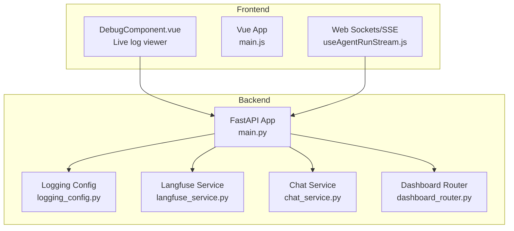
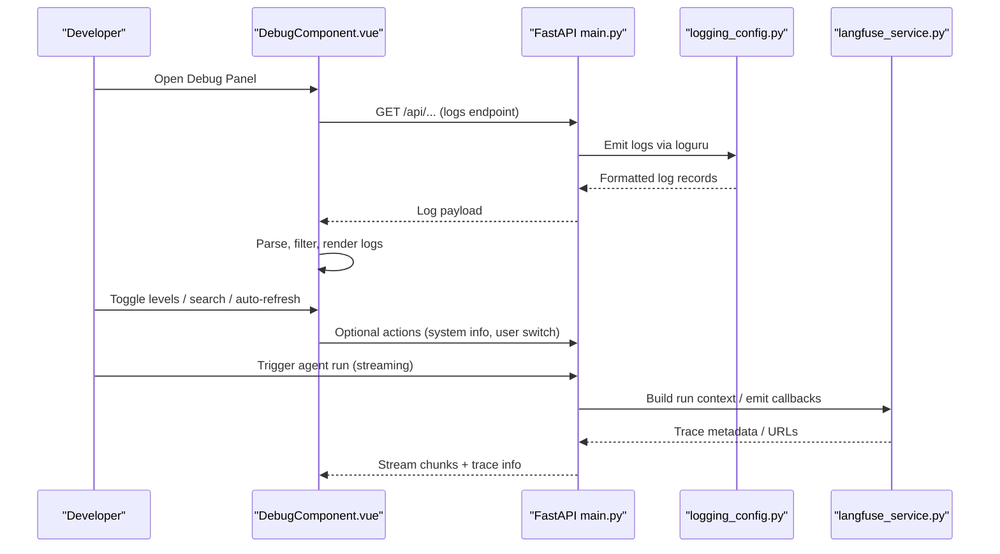
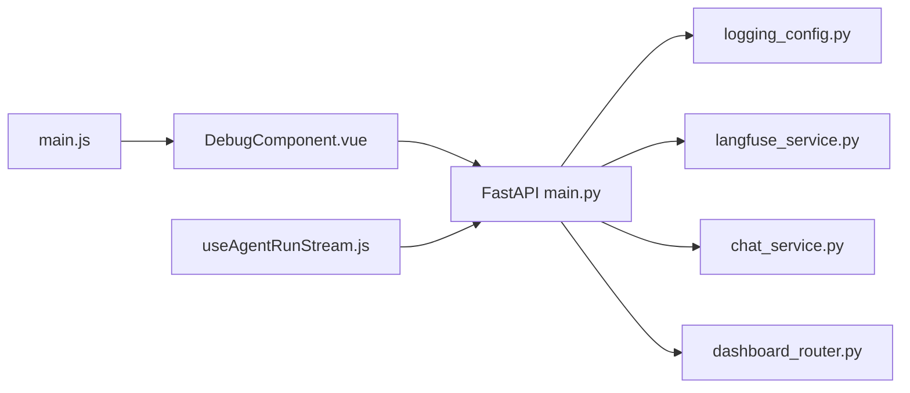

# Debugging Tools & Techniques

<cite>
**Referenced Files in This Document**
- [logging_config.py](file://backend/package/yuxi/utils/logging_config.py)
- [main.py](file://backend/server/main.py)
- [DebugComponent.vue](file://web/src/components/DebugComponent.vue)
- [langfuse_service.py](file://backend/package/yuxi/services/langfuse_service.py)
- [chat_service.py](file://backend/package/yuxi/services/chat_service.py)
- [dashboard_router.py](file://backend/server/routers/dashboard_router.py)
- [useAgentRunStream.js](file://web/src/composables/useAgentRunStream.js)
- [useGraph.js](file://web/src/composables/useGraph.js)
- [main.js](file://web/src/main.js)
</cite>

## Table of Contents
1. [Introduction](#introduction)
2. [Project Structure](#project-structure)
3. [Core Components](#core-components)
4. [Architecture Overview](#architecture-overview)
5. [Detailed Component Analysis](#detailed-component-analysis)
6. [Dependency Analysis](#dependency-analysis)
7. [Performance Considerations](#performance-considerations)
8. [Troubleshooting Guide](#troubleshooting-guide)
9. [Conclusion](#conclusion)
10. [Appendices](#appendices)

## Introduction
This document explains the debugging tools and techniques available in the Yuxi platform. It covers the logging system configuration (levels, formatting, destinations), frontend debugging with browser devtools and Vue.js devtools, backend debugging with FastAPI and agent execution tracing, and the Langfuse integration for agent performance monitoring. Practical examples demonstrate how to use the built-in debugging UI, set breakpoints, and analyze execution flows. Remote debugging, production-safe debugging, and collaborative workflows are also included.

## Project Structure
The debugging ecosystem spans three layers:
- Frontend: Vue 3 SPA with a dedicated Debug panel for live log viewing and system introspection.
- Backend: FastAPI server with structured logging, access logs, and optional tracing via Langfuse.
- Observability: Dashboard endpoints for analytics and conversation insights.

**Diagram sources**
- [main.js:1-26](file://web/src/main.js#L1-L26)
- [DebugComponent.vue:1-135](file://web/src/components/DebugComponent.vue#L1-L135)
- [main.py:1-150](file://backend/server/main.py#L1-L150)
- [logging_config.py:1-99](file://backend/package/yuxi/utils/logging_config.py#L1-L99)
- [langfuse_service.py:1-211](file://backend/package/yuxi/services/langfuse_service.py#L1-L211)
- [chat_service.py:38-970](file://backend/package/yuxi/services/chat_service.py#L38-L970)
- [dashboard_router.py:1-200](file://backend/server/routers/dashboard_router.py#L1-L200)

**Section sources**
- [main.js:1-26](file://web/src/main.js#L1-L26)
- [main.py:1-150](file://backend/server/main.py#L1-L150)

## Core Components
- Logging system: Centralized configuration via loguru with file and console handlers, plus a bridge for third-party libraries.
- Debug panel: A Vue modal that fetches and displays server logs, supports filtering by level and search, and exposes system introspection actions.
- Langfuse tracing: Optional tracing for agent runs with metadata propagation and asynchronous trace URL retrieval.
- SSE streaming: Frontend utilities to parse and process server-sent events for agent run streams.
- Dashboard endpoints: Backend routes for analytics and conversation inspection.

**Section sources**
- [logging_config.py:55-99](file://backend/package/yuxi/utils/logging_config.py#L55-L99)
- [DebugComponent.vue:201-351](file://web/src/components/DebugComponent.vue#L201-L351)
- [langfuse_service.py:109-211](file://backend/package/yuxi/services/langfuse_service.py#L109-L211)
- [useAgentRunStream.js:59-84](file://web/src/composables/useAgentRunStream.js#L59-L84)
- [dashboard_router.py:128-200](file://backend/server/routers/dashboard_router.py#L128-L200)

## Architecture Overview
The debugging architecture integrates frontend and backend components to provide a cohesive experience:
- The frontend Debug panel requests logs from backend endpoints and renders them with filtering and auto-refresh.
- Backend logging is configured centrally and bridges third-party library logs.
- Agent execution tracing integrates with Langfuse for performance monitoring and debugging.
- Dashboard endpoints support analytics and conversation inspection for deeper diagnostics.

**Diagram sources**
- [DebugComponent.vue:276-300](file://web/src/components/DebugComponent.vue#L276-L300)
- [main.py:29-31](file://backend/server/main.py#L29-L31)
- [logging_config.py:55-99](file://backend/package/yuxi/utils/logging_config.py#L55-L99)
- [langfuse_service.py:109-143](file://backend/package/yuxi/services/langfuse_service.py#L109-L143)

## Detailed Component Analysis

### Logging System Configuration
The backend uses loguru for structured logging with:
- File handler: Rotating logs with UTF-8 encoding, retention, and compression.
- Console handler: Colored terminal output for development.
- Bridge for third-party libraries: Captures logs from libraries like LightRAG, httpx, openai, neo4j, urllib3.

Key behaviors:
- Levels: DEBUG, INFO, WARNING, ERROR, CRITICAL.
- Formatting: Consistent timestamp, level, file:line, and message.
- Destinations: File in saves/logs with rotation and retention; stderr with colorization.
- Bridge: Adds a logging.Handler that forwards records to loguru, enabling capture of external library logs.

Practical tips:
- Adjust SAVE_DIR via environment variable to control log location.
- Use console=False to disable terminal output in production.
- Third-party noise is reduced by elevating their minimum level.

**Section sources**
- [logging_config.py:14-99](file://backend/package/yuxi/utils/logging_config.py#L14-L99)

### Frontend Debug Panel (Vue)
The Debug panel provides:
- Live log viewing with parsing/formatting.
- Filtering by log level and free-text search.
- Auto-refresh toggle and full-screen mode.
- Actions to print system config, user info, knowledge base info, agent config, and toggle debug mode.
- User impersonation for testing with different identities.

How it works:
- Parses server logs using a regex that expects timestamp-level-module-message format.
- Normalizes timestamps and formats them for readability.
- Computes filtered logs reactively based on search and selected levels.
- Requests logs via an API and scrolls to bottom after updates.

Security note:
- Certain actions require super admin permission checks before execution.

**Section sources**
- [DebugComponent.vue:228-351](file://web/src/components/DebugComponent.vue#L228-L351)
- [DebugComponent.vue:411-539](file://web/src/components/DebugComponent.vue#L411-L539)

### Backend FastAPI Debugging
FastAPI app configuration supports debugging-friendly behavior:
- Event loop policy adjustment on Windows for async compatibility.
- Centralized logging setup invocation.
- Access log middleware for request timing.
- Authentication and rate-limit middlewares for safer debugging sessions.

Recommendations:
- Use reload mode during development to pick up code changes.
- Enable colored console logs via the logging configuration.
- Inspect access logs to correlate request timings with errors.

**Section sources**
- [main.py:9-31](file://backend/server/main.py#L9-L31)
- [main.py:132-137](file://backend/server/main.py#L132-L137)

### Agent Execution Tracing with Langfuse
Langfuse integration enables:
- Conditional enablement via environment variables and optional dependency checks.
- Run context creation with metadata and tags for agent runs.
- Asynchronous trace URL retrieval to avoid blocking the request path.
- Flush mechanism to ensure events are sent.

Usage patterns:
- Build run context at the start of agent operations.
- Attach trace metadata to messages for downstream correlation.
- Retrieve trace URL asynchronously and patch message metadata later.

**Section sources**
- [langfuse_service.py:30-62](file://backend/package/yuxi/services/langfuse_service.py#L30-L62)
- [langfuse_service.py:109-143](file://backend/package/yuxi/services/langfuse_service.py#L109-L143)
- [langfuse_service.py:172-211](file://backend/package/yuxi/services/langfuse_service.py#L172-L211)

### Streaming Agent Runs (Frontend)
The frontend composes a function to process SSE responses:
- Reads the response body stream, decodes chunks, and buffers partial lines.
- Emits parsed JSON events to the caller.
- Includes robust error handling for malformed data.

Practical debugging:
- Add console logs around event emission to inspect message structure.
- Validate event ordering and deduplicate based on sequence numbers.

**Section sources**
- [useAgentRunStream.js:59-84](file://web/src/composables/useAgentRunStream.js#L59-L84)

### Graph Visualization Debugging (Frontend)
The graph composable supports:
- Click handlers for nodes and edges to open detail drawers.
- Clearing selection and refreshing the graph after data updates.
- Logging click events for quick inspection.

Use cases:
- Inspect node/edge properties during interactive debugging.
- Verify data updates by triggering refresh after mutations.

**Section sources**
- [useGraph.js:14-52](file://web/src/composables/useGraph.js#L14-L52)

### Dashboard Analytics for Debugging
The dashboard router provides:
- Conversation listing and details for admin users.
- Structured response models for analytics and stats.
- Error logging and stack traces for troubleshooting.

How to use:
- Fetch conversations and inspect message counts and statuses.
- Use time grouping helpers to analyze trends.

**Section sources**
- [dashboard_router.py:128-200](file://backend/server/routers/dashboard_router.py#L128-L200)
- [dashboard_router.py:29-46](file://backend/server/routers/dashboard_router.py#L29-L46)

## Dependency Analysis
The following diagram shows how debugging-related components depend on each other:

**Diagram sources**
- [DebugComponent.vue:1-135](file://web/src/components/DebugComponent.vue#L1-L135)
- [main.py:29-31](file://backend/server/main.py#L29-L31)
- [logging_config.py:55-99](file://backend/package/yuxi/utils/logging_config.py#L55-L99)
- [langfuse_service.py:109-143](file://backend/package/yuxi/services/langfuse_service.py#L109-L143)
- [chat_service.py:38-970](file://backend/package/yuxi/services/chat_service.py#L38-L970)
- [dashboard_router.py:128-200](file://backend/server/routers/dashboard_router.py#L128-L200)
- [useAgentRunStream.js:59-84](file://web/src/composables/useAgentRunStream.js#L59-L84)
- [main.js:1-26](file://web/src/main.js#L1-L26)

**Section sources**
- [DebugComponent.vue:1-135](file://web/src/components/DebugComponent.vue#L1-L135)
- [main.py:29-31](file://backend/server/main.py#L29-L31)
- [logging_config.py:55-99](file://backend/package/yuxi/utils/logging_config.py#L55-L99)
- [langfuse_service.py:109-143](file://backend/package/yuxi/services/langfuse_service.py#L109-L143)
- [chat_service.py:38-970](file://backend/package/yuxi/services/chat_service.py#L38-L970)
- [dashboard_router.py:128-200](file://backend/server/routers/dashboard_router.py#L128-L200)
- [useAgentRunStream.js:59-84](file://web/src/composables/useAgentRunStream.js#L59-L84)
- [main.js:1-26](file://web/src/main.js#L1-L26)

## Performance Considerations
- Logging:
  - File rotation and compression reduce disk usage; adjust retention and rotation policies for long-running deployments.
  - Console output is colorized and enqueued; disable console logs in production to minimize overhead.
- SSE streaming:
  - Buffering and decoding occur incrementally; ensure the frontend handles partial lines and malformed JSON gracefully.
- Langfuse:
  - Avoid fetching trace URLs on the critical path; use asynchronous retrieval to prevent latency spikes.
  - Flush events periodically to ensure timely visibility in production.

[No sources needed since this section provides general guidance]

## Troubleshooting Guide
Common scenarios and remedies:
- No logs in the Debug panel:
  - Verify the backend logging configuration and that logs are being emitted.
  - Confirm the frontend has super admin permissions and the endpoint returns data.
- Excessive third-party noise:
  - Adjust the bridge minimum levels for libraries to suppress verbose logs.
- Slow trace URL retrieval:
  - Use asynchronous trace URL fetching and avoid blocking the request lifecycle.
- Streaming issues:
  - Inspect SSE parsing logic for malformed lines and ensure event types are handled consistently.
- Production debugging:
  - Keep the Debug panel restricted to super admin roles.
  - Prefer file logs and avoid enabling console logs in production.
  - Use dashboard endpoints to analyze system-wide metrics and conversation health.

**Section sources**
- [DebugComponent.vue:276-300](file://web/src/components/DebugComponent.vue#L276-L300)
- [logging_config.py:33-53](file://backend/package/yuxi/utils/logging_config.py#L33-L53)
- [langfuse_service.py:172-211](file://backend/package/yuxi/services/langfuse_service.py#L172-L211)
- [useAgentRunStream.js:59-84](file://web/src/composables/useAgentRunStream.js#L59-L84)
- [dashboard_router.py:174-178](file://backend/server/routers/dashboard_router.py#L174-L178)

## Conclusion
The Yuxi platform offers a comprehensive debugging toolkit spanning frontend and backend:
- A Vue-powered Debug panel for live log inspection and system introspection.
- A centralized logging configuration with file/console outputs and a bridge for third-party libraries.
- Langfuse integration for agent performance monitoring and traceability.
- SSE streaming utilities for real-time agent run debugging.
- Dashboard endpoints for analytics and conversation diagnostics.

By combining these tools, teams can efficiently diagnose issues, collaborate on fixes, and maintain observability in both development and production environments.

[No sources needed since this section summarizes without analyzing specific files]

## Appendices

### Practical Examples

- Using the Debug panel:
  - Open the Debug panel and click “Fetch Logs” to load recent entries.
  - Filter by log level (INFO, ERROR, DEBUG, WARNING) and search for keywords.
  - Enable auto-refresh to monitor live activity; use full-screen mode for extended sessions.
  - Print system config, user info, knowledge base info, and agent config for contextual debugging.
  - Switch users to reproduce issues under different identities.

- Setting breakpoints:
  - Frontend: Set breakpoints in Vue components and composables (e.g., graph click handlers, stream processors).
  - Backend: Use FastAPI’s reload mode and set breakpoints in route handlers and service functions.

- Analyzing execution flows:
  - Observe SSE chunks in the browser console to understand agent run progression.
  - Correlate logs with Langfuse trace IDs to trace end-to-end performance.

- Remote debugging:
  - Enable file logs and disable console logs in staging/prod.
  - Use dashboard endpoints to gather system metrics and conversation details.
  - Collaborate by sharing trace URLs and log excerpts with team members.

[No sources needed since this section provides general guidance]