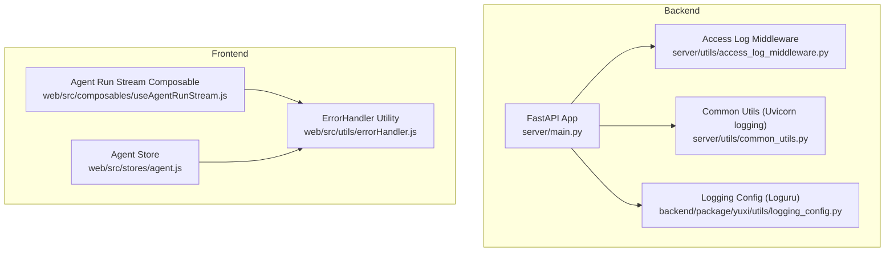
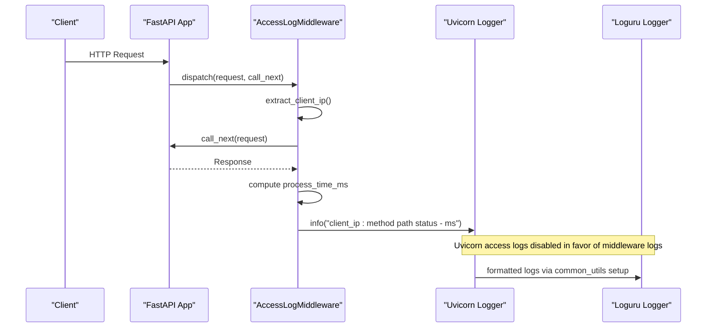
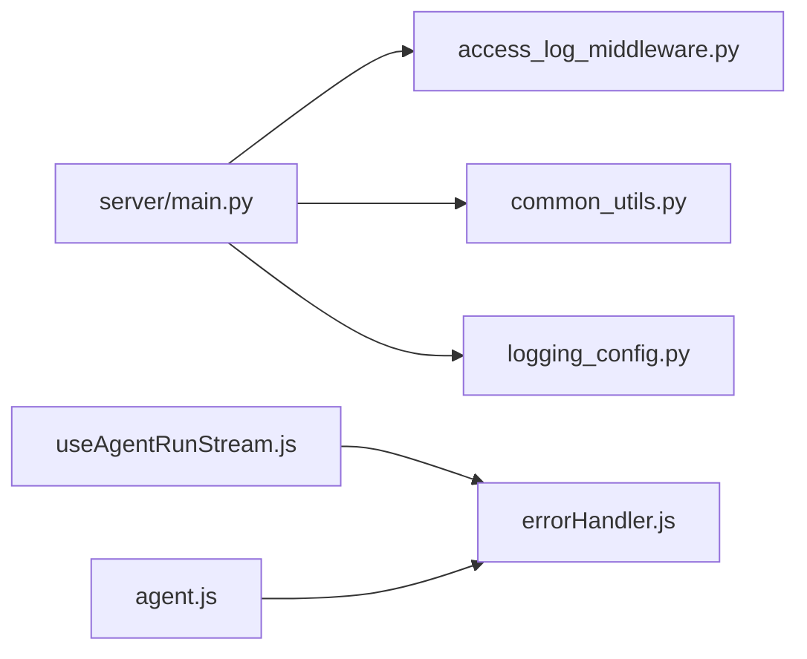

# Log Analysis & Error Tracking

<cite>
**Referenced Files in This Document**
- [access_log_middleware.py](file://backend/server/utils/access_log_middleware.py)
- [common_utils.py](file://backend/server/utils/common_utils.py)
- [logging_config.py](file://backend/package/yuxi/utils/logging_config.py)
- [main.py](file://backend/server/main.py)
- [errorHandler.js](file://web/src/utils/errorHandler.js)
- [useAgentRunStream.js](file://web/src/composables/useAgentRunStream.js)
- [agent.js](file://web/src/stores/agent.js)
</cite>

## Table of Contents
1. [Introduction](#introduction)
2. [Project Structure](#project-structure)
3. [Core Components](#core-components)
4. [Architecture Overview](#architecture-overview)
5. [Detailed Component Analysis](#detailed-component-analysis)
6. [Dependency Analysis](#dependency-analysis)
7. [Performance Considerations](#performance-considerations)
8. [Troubleshooting Guide](#troubleshooting-guide)
9. [Conclusion](#conclusion)
10. [Appendices](#appendices)

## Introduction
This document provides comprehensive guidance for log analysis and error tracking in the Yuxi platform. It covers backend logging configuration (including log levels, structured formats, and rotation), frontend error handling and user action tracking, and practical approaches for analyzing logs, correlating errors, and establishing alerting and incident response procedures. It also outlines integration points with external monitoring tools and error reporting services.

## Project Structure
The Yuxi platform consists of:
- Backend: FastAPI application with middleware for access logging, rate limiting, and authentication. Logging is configured via a dedicated module and a bridge to third-party libraries.
- Frontend: Vue.js SPA with centralized error handling utilities and composables for streaming agent runs and user actions.

**Diagram sources**
- [main.py:132-137](file://backend/server/main.py#L132-L137)
- [access_log_middleware.py:34-67](file://backend/server/utils/access_log_middleware.py#L34-L67)
- [common_utils.py:11-31](file://backend/server/utils/common_utils.py#L11-L31)
- [logging_config.py:55-89](file://backend/package/yuxi/utils/logging_config.py#L55-L89)
- [errorHandler.js:6-137](file://web/src/utils/errorHandler.js#L6-L137)
- [useAgentRunStream.js:1-349](file://web/src/composables/useAgentRunStream.js#L1-L349)
- [agent.js:1-567](file://web/src/stores/agent.js#L1-L567)

**Section sources**
- [main.py:1-150](file://backend/server/main.py#L1-L150)
- [access_log_middleware.py:1-68](file://backend/server/utils/access_log_middleware.py#L1-L68)
- [common_utils.py:1-62](file://backend/server/utils/common_utils.py#L1-L62)
- [logging_config.py:1-99](file://backend/package/yuxi/utils/logging_config.py#L1-L99)
- [errorHandler.js:1-148](file://web/src/utils/errorHandler.js#L1-L148)
- [useAgentRunStream.js:1-349](file://web/src/composables/useAgentRunStream.js#L1-L349)
- [agent.js:1-567](file://web/src/stores/agent.js#L1-L567)

## Core Components
- Backend access logging middleware records request method, path, status code, and processing time with client IP extraction.
- Uvicorn logging is standardized to match application log format.
- Centralized logging configuration uses Loguru with file rotation and compression, and bridges selected third-party libraries.
- Frontend error handling utility provides consistent error messaging, severity handling, and network-specific error mapping.
- Streaming agent run composable handles SSE events, retryable errors, and integrates error reporting.
- Agent store coordinates asynchronous operations and delegates error handling to the shared utility.

**Section sources**
- [access_log_middleware.py:34-67](file://backend/server/utils/access_log_middleware.py#L34-L67)
- [common_utils.py:11-31](file://backend/server/utils/common_utils.py#L11-L31)
- [logging_config.py:55-89](file://backend/package/yuxi/utils/logging_config.py#L55-L89)
- [errorHandler.js:6-137](file://web/src/utils/errorHandler.js#L6-L137)
- [useAgentRunStream.js:168-299](file://web/src/composables/useAgentRunStream.js#L168-L299)
- [agent.js:120-176](file://web/src/stores/agent.js#L120-L176)

## Architecture Overview
The logging and error tracking architecture combines backend middleware and centralized logging with frontend error handling and user action telemetry.

**Diagram sources**
- [main.py:132-137](file://backend/server/main.py#L132-L137)
- [access_log_middleware.py:41-65](file://backend/server/utils/access_log_middleware.py#L41-L65)
- [common_utils.py:18-31](file://backend/server/utils/common_utils.py#L18-L31)

## Detailed Component Analysis

### Backend Logging Configuration (Loguru)
- File logging:
  - Output location: daily log files under a saves/logs directory.
  - Format: timestamp, level, file and line, message.
  - Rotation: 10 MB per file.
  - Retention: 30 days.
  - Compression: zip.
  - Enqueue: enabled for thread-safe writes.
- Console logging:
  - Colored output with concise format.
  - Enqueue enabled.
- Bridge to third-party libraries:
  - Bridges logging from libraries such as LightRAG, httpx, openai, neo4j, urllib3.
  - Third-party libraries are set to WARNING to reduce noise.
  - LightRAG is bridged at DEBUG level.

Operational implications:
- High-volume environments should monitor disk usage against rotation and retention policies.
- Third-party library noise is mitigated by elevated minimum levels.

**Section sources**
- [logging_config.py:55-89](file://backend/package/yuxi/utils/logging_config.py#L55-L89)
- [logging_config.py:33-53](file://backend/package/yuxi/utils/logging_config.py#L33-L53)

### Access Log Middleware
- Creates a dedicated access logger with a custom formatter.
- Extracts client IP from x-forwarded-for or request client host.
- Computes processing time using high-resolution timing.
- Logs a single line containing client IP, method, path, query string, HTTP version, status code, and processing time in milliseconds.
- Prevents propagation to root logger to avoid duplication.

Operational implications:
- Ideal for detecting slow endpoints, frequent 4xx/5xx errors, and unusual request patterns.
- Combine with backend request tracing for deeper correlation.

**Section sources**
- [access_log_middleware.py:10-21](file://backend/server/utils/access_log_middleware.py#L10-L21)
- [access_log_middleware.py:24-31](file://backend/server/utils/access_log_middleware.py#L24-L31)
- [access_log_middleware.py:41-67](file://backend/server/utils/access_log_middleware.py#L41-L67)

### Uvicorn Logging Standardization
- Disables default uvicorn access handler to prevent duplicate logs.
- Applies a consistent format across uvicorn main logger and access logger.
- Ensures all server-side logs share the same timestamp and level format.

Operational implications:
- Simplifies log aggregation and parsing.
- Avoids redundant entries in centralized logging systems.

**Section sources**
- [common_utils.py:18-31](file://backend/server/utils/common_utils.py#L18-L31)

### Frontend Error Handling Utility
- Centralized error handling with options for console logging, user notifications, and severity selection.
- Network error mapping:
  - NETWORK_ERROR mapped to a user-friendly message.
  - Status 401, 403, 404, and 5xx mapped to specific messages.
- Specialized handlers:
  - Chat-related operations mapped to semantic contexts (send, create, delete, rename, load, export, stream).
  - Validation errors surfaced with warning severity.
  - Async wrapper and decorator helpers for consistent error behavior.

Operational implications:
- Provides uniform UX for error communication.
- Enables operators to correlate frontend failures with backend logs via shared context.

**Section sources**
- [errorHandler.js:6-45](file://web/src/utils/errorHandler.js#L6-L45)
- [errorHandler.js:65-81](file://web/src/utils/errorHandler.js#L65-L81)
- [errorHandler.js:88-101](file://web/src/utils/errorHandler.js#L88-L101)
- [errorHandler.js:107-112](file://web/src/utils/errorHandler.js#L107-L112)
- [errorHandler.js:120-127](file://web/src/utils/errorHandler.js#L120-L127)
- [errorHandler.js:134-136](file://web/src/utils/errorHandler.js#L134-L136)

### Agent Run Streaming and Retryable Errors
- Streams server-sent events for agent runs with robust parsing and sequencing.
- Detects retryable errors and suppresses repeated warnings for the same job attempt.
- On non-abort errors, logs to console and delegates to the shared error handler, then attempts to resume the stream.
- Persists active run snapshots to local storage with TTL to support resumption.

Operational implications:
- Facilitates detection of transient tool failures and worker retries.
- Improves resilience by auto-recovering from transient network or tool errors.

**Section sources**
- [useAgentRunStream.js:59-116](file://web/src/composables/useAgentRunStream.js#L59-L116)
- [useAgentRunStream.js:168-299](file://web/src/composables/useAgentRunStream.js#L168-L299)
- [useAgentRunStream.js:302-341](file://web/src/composables/useAgentRunStream.js#L302-L341)

### Agent Store Error Handling
- Wraps initialization and data-fetching operations with centralized error handling.
- Surfaces errors to the UI and persists error state for diagnostics.
- Uses the shared error handler with appropriate operation contexts.

Operational implications:
- Ensures consistent error reporting across store operations.
- Supports incident triage by associating errors with specific operations.

**Section sources**
- [agent.js:120-176](file://web/src/stores/agent.js#L120-L176)
- [agent.js:181-195](file://web/src/stores/agent.js#L181-L195)
- [agent.js:202-226](file://web/src/stores/agent.js#L202-L226)
- [agent.js:297-315](file://web/src/stores/agent.js#L297-L315)

## Dependency Analysis
- Backend:
  - server/main.py registers middleware and sets up logging.
  - access_log_middleware.py depends on logging and FastAPI request/response objects.
  - common_utils.py configures uvicorn loggers.
  - logging_config.py defines Loguru configuration and bridges third-party libraries.
- Frontend:
  - useAgentRunStream.js imports and uses ErrorHandler for stream errors.
  - agent.js imports ErrorHandler for store-level operations.

**Diagram sources**
- [main.py:132-137](file://backend/server/main.py#L132-L137)
- [access_log_middleware.py:34-67](file://backend/server/utils/access_log_middleware.py#L34-L67)
- [common_utils.py:11-31](file://backend/server/utils/common_utils.py#L11-L31)
- [logging_config.py:55-89](file://backend/package/yuxi/utils/logging_config.py#L55-L89)
- [useAgentRunStream.js:1-349](file://web/src/composables/useAgentRunStream.js#L1-L349)
- [agent.js:1-567](file://web/src/stores/agent.js#L1-L567)
- [errorHandler.js:1-148](file://web/src/utils/errorHandler.js#L1-L148)

**Section sources**
- [main.py:132-137](file://backend/server/main.py#L132-L137)
- [access_log_middleware.py:34-67](file://backend/server/utils/access_log_middleware.py#L34-L67)
- [common_utils.py:11-31](file://backend/server/utils/common_utils.py#L11-L31)
- [logging_config.py:55-89](file://backend/package/yuxi/utils/logging_config.py#L55-L89)
- [useAgentRunStream.js:1-349](file://web/src/composables/useAgentRunStream.js#L1-L349)
- [agent.js:1-567](file://web/src/stores/agent.js#L1-L567)
- [errorHandler.js:1-148](file://web/src/utils/errorHandler.js#L1-L148)

## Performance Considerations
- Access log processing:
  - Middleware computes processing time using high-resolution timers; ensure sampling and filtering in production if throughput is very high.
- Logging volume:
  - Log rotation at 10 MB and 30-day retention help manage disk usage; monitor free space and adjust based on traffic.
  - Third-party library bridging reduces noise by elevating minimum levels; keep this balance to avoid missing actionable errors.
- Frontend streaming:
  - Retryable error suppression prevents log storms during transient failures.
  - Local storage snapshots enable quick recovery from interruptions without re-execution.

[No sources needed since this section provides general guidance]

## Troubleshooting Guide
- Backend slow endpoints:
  - Inspect access logs for high processing times and frequent 5xx statuses.
  - Correlate with request paths and query parameters.
- Network errors:
  - Use ErrorHandler’s network mapper to identify 401, 403, 404, and 5xx occurrences.
  - Cross-reference with backend access logs for request context.
- Transient tool failures:
  - Monitor frontend logs for retryable error warnings; confirm worker retries and eventual success.
- Authentication and rate limiting:
  - Review rate limit middleware behavior and login attempt history patterns.
- Logging configuration issues:
  - Verify Loguru file path creation and rotation settings.
  - Confirm uvicorn logger formatting alignment with application logs.

**Section sources**
- [access_log_middleware.py:41-67](file://backend/server/utils/access_log_middleware.py#L41-L67)
- [errorHandler.js:65-81](file://web/src/utils/errorHandler.js#L65-L81)
- [useAgentRunStream.js:204-218](file://web/src/composables/useAgentRunStream.js#L204-L218)
- [main.py:63-96](file://backend/server/main.py#L63-L96)
- [logging_config.py:55-89](file://backend/package/yuxi/utils/logging_config.py#L55-L89)
- [common_utils.py:18-31](file://backend/server/utils/common_utils.py#L18-L31)

## Conclusion
The Yuxi platform implements a robust logging and error tracking foundation combining backend access logs, centralized Loguru configuration, and frontend error handling. Operators can leverage structured logs, standardized formats, and resilient streaming to detect and resolve errors efficiently. Integrating with external monitoring tools and establishing alerting rules around critical error patterns and performance thresholds will further strengthen operational visibility and response capabilities.

[No sources needed since this section summarizes without analyzing specific files]

## Appendices

### Practical Examples

- Log parsing and error correlation
  - Parse backend access logs to extract client IP, method, path, status code, and processing time.
  - Correlate with frontend error messages using shared operation contexts (e.g., “stream”, “fetch”, “load”).
  - Example paths:
    - [access_log_middleware.py:57-62](file://backend/server/utils/access_log_middleware.py#L57-L62)
    - [errorHandler.js:88-101](file://web/src/utils/errorHandler.js#L88-L101)

- Trend analysis
  - Aggregate daily log files by level and endpoint to identify trends.
  - Track retryable error counts in frontend streams to assess tool stability.
  - Example paths:
    - [logging_config.py:63-72](file://backend/package/yuxi/utils/logging_config.py#L63-L72)
    - [useAgentRunStream.js:204-218](file://web/src/composables/useAgentRunStream.js#L204-L218)

- Alerting setup
  - Alert on sustained increases in 5xx status codes in access logs.
  - Alert on spikes in retryable errors exceeding a threshold within a window.
  - Alert on repeated validation or authentication errors indicating potential misconfiguration or attacks.
  - Example paths:
    - [access_log_middleware.py:41-67](file://backend/server/utils/access_log_middleware.py#L41-L67)
    - [errorHandler.js:65-81](file://web/src/utils/errorHandler.js#L65-L81)

- Incident response procedures
  - Collect backend logs for the affected time window and rotate/compress archives.
  - Gather frontend console logs and user action snapshots (local storage keys).
  - Coordinate with backend and frontend teams to reproduce and remediate.
  - Example paths:
    - [logging_config.py:68-72](file://backend/package/yuxi/utils/logging_config.py#L68-L72)
    - [useAgentRunStream.js:130-151](file://web/src/composables/useAgentRunStream.js#L130-L151)