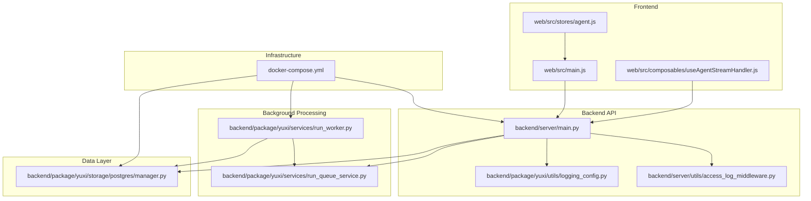
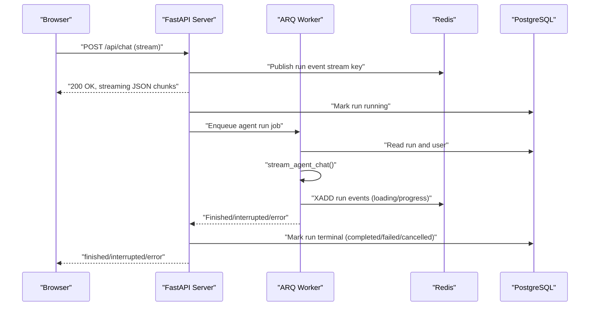
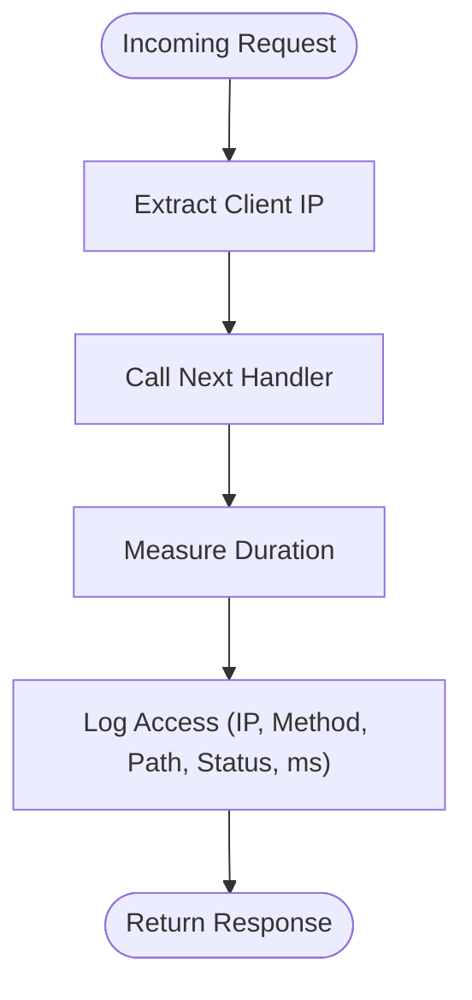
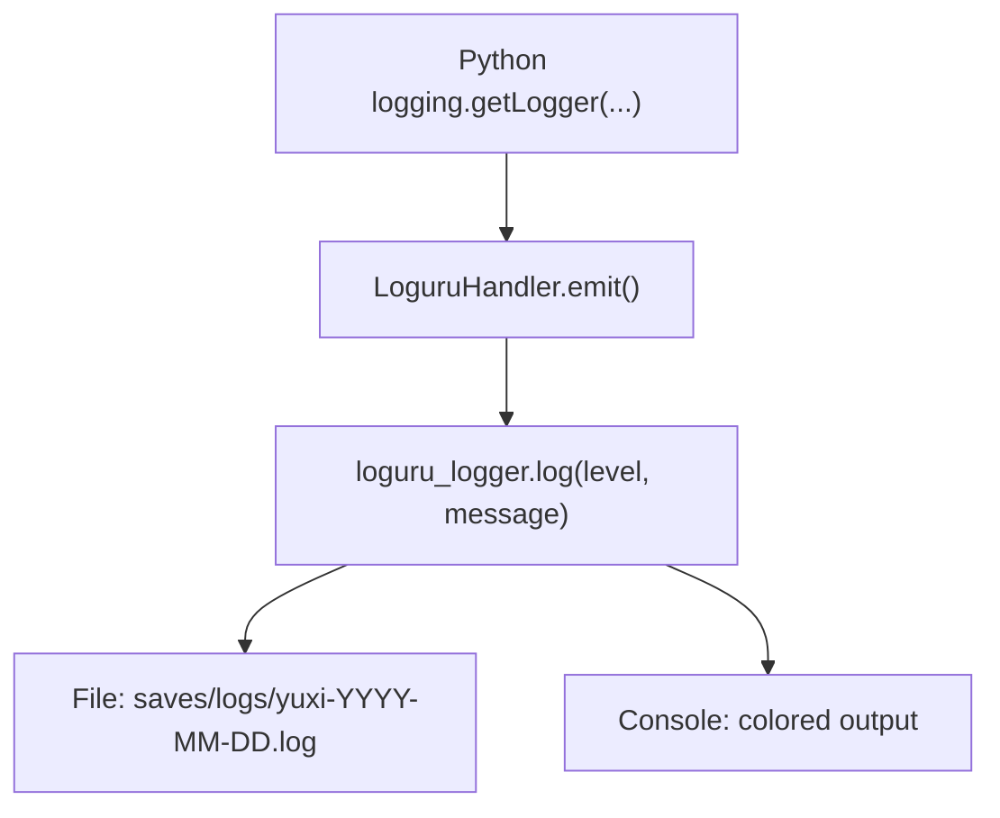
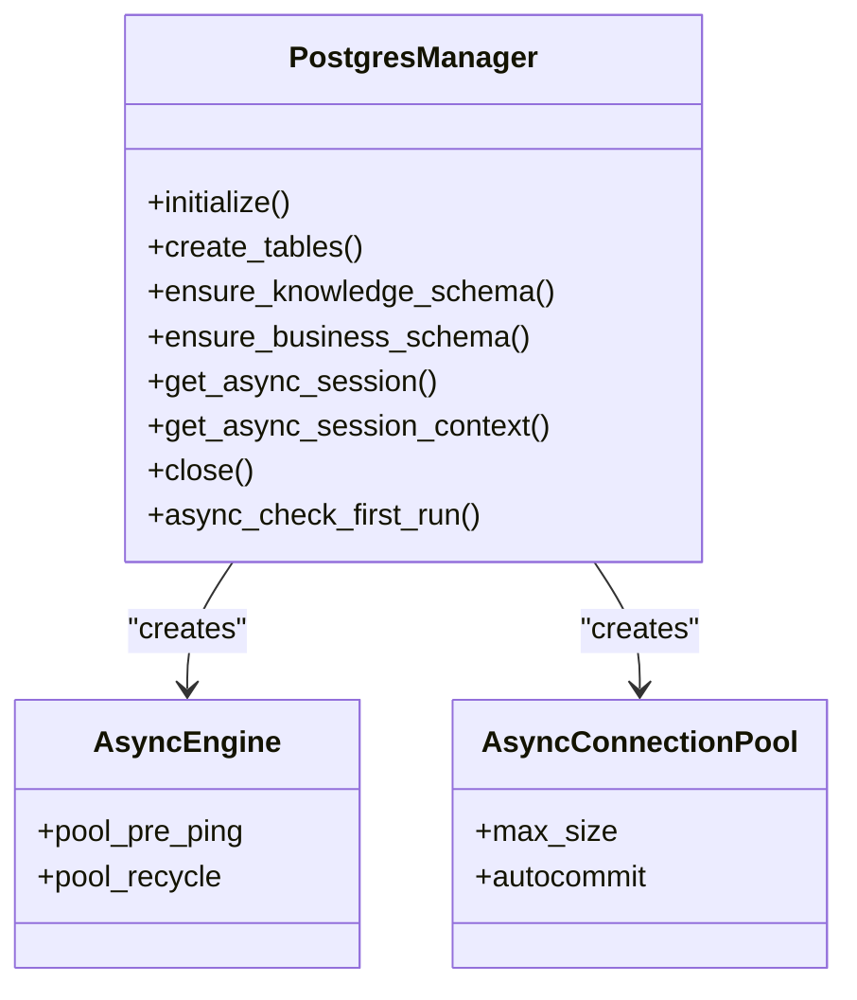
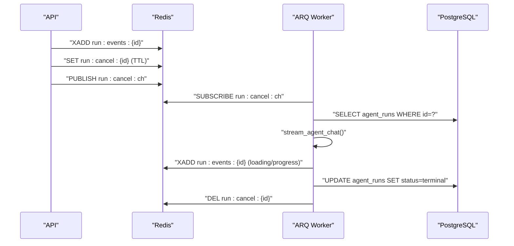
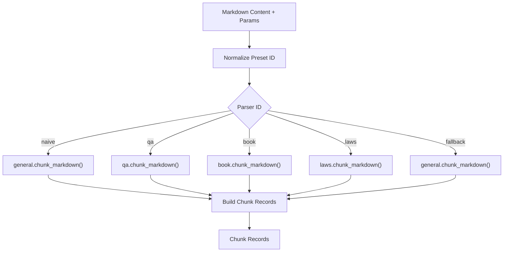
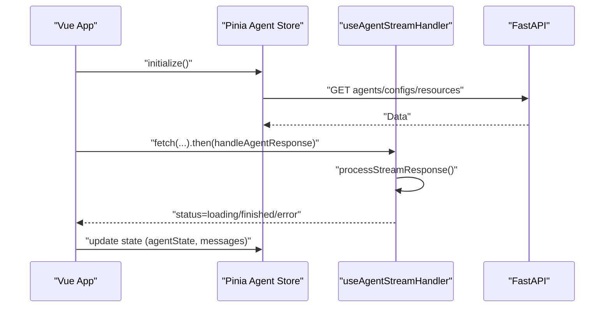
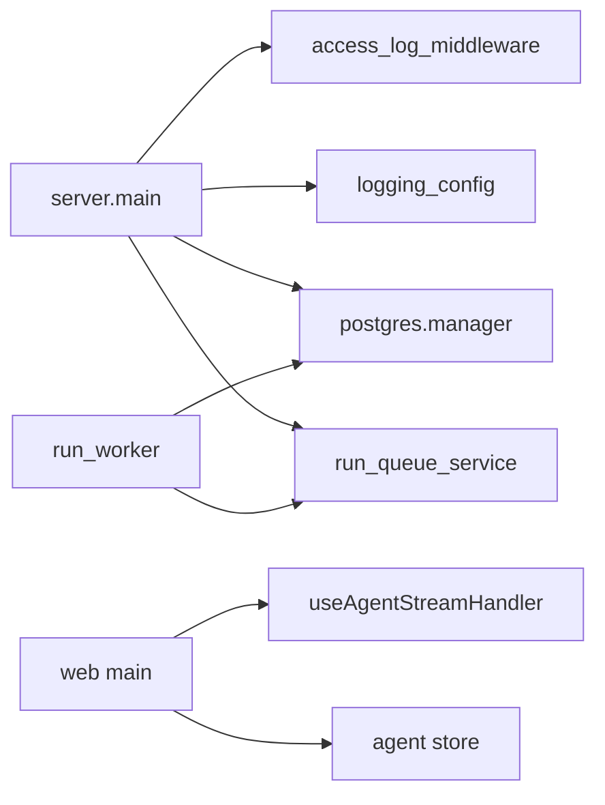

# Performance Troubleshooting

<cite>
**Referenced Files in This Document**
- [backend/server/main.py](file://backend/server/main.py)
- [backend/server/utils/access_log_middleware.py](file://backend/server/utils/access_log_middleware.py)
- [backend/package/yuxi/utils/logging_config.py](file://backend/package/yuxi/utils/logging_config.py)
- [backend/package/yuxi/storage/postgres/manager.py](file://backend/package/yuxi/storage/postgres/manager.py)
- [backend/package/yuxi/services/run_queue_service.py](file://backend/package/yuxi/services/run_queue_service.py)
- [backend/package/yuxi/services/run_worker.py](file://backend/package/yuxi/services/run_worker.py)
- [backend/package/yuxi/knowledge/chunking/ragflow_like/dispatcher.py](file://backend/package/yuxi/knowledge/chunking/ragflow_like/dispatcher.py)
- [web/src/main.js](file://web/src/main.js)
- [web/vite.config.js](file://web/vite.config.js)
- [web/src/composables/useAgentStreamHandler.js](file://web/src/composables/useAgentStreamHandler.js)
- [web/src/stores/agent.js](file://web/src/stores/agent.js)
- [docker-compose.yml](file://docker-compose.yml)
</cite>

## Table of Contents
1. [Introduction](#introduction)
2. [Project Structure](#project-structure)
3. [Core Components](#core-components)
4. [Architecture Overview](#architecture-overview)
5. [Detailed Component Analysis](#detailed-component-analysis)
6. [Dependency Analysis](#dependency-analysis)
7. [Performance Considerations](#performance-considerations)
8. [Troubleshooting Guide](#troubleshooting-guide)
9. [Conclusion](#conclusion)
10. [Appendices](#appendices)

## Introduction
This document provides a comprehensive guide to performance troubleshooting in the Yuxi platform. It focuses on identifying and resolving bottlenecks in agent execution, knowledge processing, and API response times. It also covers database performance optimization (query analysis, indexing strategies, connection pooling), frontend performance (bundle size, rendering, memory), system resource monitoring (CPU, memory, disk I/O, network), and practical examples of profiling tools and optimization strategies. Scaling and capacity planning for high-load scenarios are included to help maintain responsiveness under stress.

## Project Structure
The Yuxi platform consists of:
- Backend API server built with FastAPI and Uvicorn, with middleware for access logging and rate limiting.
- Asynchronous PostgreSQL management with SQLAlchemy and psycopg_pool for LangGraph checkpoints.
- Redis-backed ARQ worker for asynchronous agent run processing with streaming events and cancellation support.
- Frontend built with Vue 3, Pinia, and Ant Design Vue, with streaming response handling and state management.
- Docker Compose orchestration for local development and testing, including PostgreSQL, Redis, Milvus, Neo4j, MinIO, and sandbox services.

**Diagram sources**
- [backend/server/main.py:1-150](file://backend/server/main.py#L1-L150)
- [backend/server/utils/access_log_middleware.py:1-68](file://backend/server/utils/access_log_middleware.py#L1-L68)
- [backend/package/yuxi/utils/logging_config.py:1-99](file://backend/package/yuxi/utils/logging_config.py#L1-L99)
- [backend/package/yuxi/storage/postgres/manager.py:1-291](file://backend/package/yuxi/storage/postgres/manager.py#L1-L291)
- [backend/package/yuxi/services/run_queue_service.py:1-240](file://backend/package/yuxi/services/run_queue_service.py#L1-L240)
- [backend/package/yuxi/services/run_worker.py:1-388](file://backend/package/yuxi/services/run_worker.py#L1-L388)
- [web/src/main.js:1-26](file://web/src/main.js#L1-L26)
- [web/src/composables/useAgentStreamHandler.js:1-236](file://web/src/composables/useAgentStreamHandler.js#L1-L236)
- [web/src/stores/agent.js:1-567](file://web/src/stores/agent.js#L1-L567)
- [docker-compose.yml:1-436](file://docker-compose.yml#L1-L436)

**Section sources**
- [backend/server/main.py:1-150](file://backend/server/main.py#L1-L150)
- [backend/server/utils/access_log_middleware.py:1-68](file://backend/server/utils/access_log_middleware.py#L1-L68)
- [backend/package/yuxi/utils/logging_config.py:1-99](file://backend/package/yuxi/utils/logging_config.py#L1-L99)
- [backend/package/yuxi/storage/postgres/manager.py:1-291](file://backend/package/yuxi/storage/postgres/manager.py#L1-L291)
- [backend/package/yuxi/services/run_queue_service.py:1-240](file://backend/package/yuxi/services/run_queue_service.py#L1-L240)
- [backend/package/yuxi/services/run_worker.py:1-388](file://backend/package/yuxi/services/run_worker.py#L1-L388)
- [web/src/main.js:1-26](file://web/src/main.js#L1-L26)
- [web/vite.config.js:1-30](file://web/vite.config.js#L1-L30)
- [web/src/composables/useAgentStreamHandler.js:1-236](file://web/src/composables/useAgentStreamHandler.js#L1-L236)
- [web/src/stores/agent.js:1-567](file://web/src/stores/agent.js#L1-L567)
- [docker-compose.yml:1-436](file://docker-compose.yml#L1-L436)

## Core Components
- API server with access logging middleware and rate-limiting for sensitive endpoints.
- Centralized logging configuration bridging Python logging to loguru for structured logs.
- PostgreSQL manager with SQLAlchemy async engine and dedicated psycopg_pool for LangGraph checkpoints, including schema migration and indexing.
- Redis-backed ARQ worker for asynchronous agent runs with streaming event publishing, cancellation signaling, and retry policies.
- Knowledge chunking pipeline optimized for markdown parsing and chunk generation.
- Frontend initialization, streaming response handling, and Pinia store for agent state and configuration.

**Section sources**
- [backend/server/main.py:1-150](file://backend/server/main.py#L1-L150)
- [backend/server/utils/access_log_middleware.py:1-68](file://backend/server/utils/access_log_middleware.py#L1-L68)
- [backend/package/yuxi/utils/logging_config.py:1-99](file://backend/package/yuxi/utils/logging_config.py#L1-L99)
- [backend/package/yuxi/storage/postgres/manager.py:1-291](file://backend/package/yuxi/storage/postgres/manager.py#L1-L291)
- [backend/package/yuxi/services/run_queue_service.py:1-240](file://backend/package/yuxi/services/run_queue_service.py#L1-L240)
- [backend/package/yuxi/services/run_worker.py:1-388](file://backend/package/yuxi/services/run_worker.py#L1-L388)
- [backend/package/yuxi/knowledge/chunking/ragflow_like/dispatcher.py:1-65](file://backend/package/yuxi/knowledge/chunking/ragflow_like/dispatcher.py#L1-L65)
- [web/src/main.js:1-26](file://web/src/main.js#L1-L26)
- [web/src/composables/useAgentStreamHandler.js:1-236](file://web/src/composables/useAgentStreamHandler.js#L1-L236)
- [web/src/stores/agent.js:1-567](file://web/src/stores/agent.js#L1-L567)

## Architecture Overview
The platform follows a streaming-first architecture:
- Clients connect via the frontend to the API server.
- API routes stream agent responses using chunked JSON lines.
- Background processing offloads long-running tasks to ARQ workers backed by Redis.
- PostgreSQL persists agent runs and business data; specialized pool supports LangGraph checkpoints.
- Logging and access timing are captured centrally for observability.

**Diagram sources**
- [backend/server/main.py:1-150](file://backend/server/main.py#L1-L150)
- [backend/package/yuxi/services/run_worker.py:189-362](file://backend/package/yuxi/services/run_worker.py#L189-L362)
- [backend/package/yuxi/services/run_queue_service.py:165-224](file://backend/package/yuxi/services/run_queue_service.py#L165-L224)
- [backend/package/yuxi/storage/postgres/manager.py:230-248](file://backend/package/yuxi/storage/postgres/manager.py#L230-L248)

## Detailed Component Analysis

### API Server and Middleware
- Access logging middleware measures request duration and logs client IP, method, path, status, and latency.
- Rate-limiting middleware guards sensitive endpoints with sliding window tracking in memory.
- Authentication middleware allows public paths and forwards requests otherwise.

**Diagram sources**
- [backend/server/utils/access_log_middleware.py:41-67](file://backend/server/utils/access_log_middleware.py#L41-L67)
- [backend/server/main.py:63-96](file://backend/server/main.py#L63-L96)

**Section sources**
- [backend/server/main.py:1-150](file://backend/server/main.py#L1-L150)
- [backend/server/utils/access_log_middleware.py:1-68](file://backend/server/utils/access_log_middleware.py#L1-L68)

### Logging and Observability
- Centralized logging bridges Python logging to loguru with file and console handlers.
- Third-party libraries are bridged to reduce noise and improve filtering.
- Structured logs facilitate correlation across services.

**Diagram sources**
- [backend/package/yuxi/utils/logging_config.py:14-99](file://backend/package/yuxi/utils/logging_config.py#L14-L99)

**Section sources**
- [backend/package/yuxi/utils/logging_config.py:1-99](file://backend/package/yuxi/utils/logging_config.py#L1-L99)

### Database Performance: Connection Pooling and Indexing
- Asynchronous SQLAlchemy engine configured with pre-ping and recycle.
- Dedicated psycopg_pool for LangGraph checkpoints with autocommit enabled.
- Schema migration ensures required indexes for knowledge bases, files, evaluations, and agent runs.

**Diagram sources**
- [backend/package/yuxi/storage/postgres/manager.py:28-291](file://backend/package/yuxi/storage/postgres/manager.py#L28-L291)

**Section sources**
- [backend/package/yuxi/storage/postgres/manager.py:1-291](file://backend/package/yuxi/storage/postgres/manager.py#L1-L291)

### Background Processing: Queue and Worker
- Redis-backed ARQ worker manages agent runs with retry, cancellation, and event streaming.
- Run events are stored as Redis streams with TTL and optional maxlen trimming.
- Cancellation signals propagate via Redis pub/sub and keys.

**Diagram sources**
- [backend/package/yuxi/services/run_queue_service.py:114-224](file://backend/package/yuxi/services/run_queue_service.py#L114-L224)
- [backend/package/yuxi/services/run_worker.py:189-362](file://backend/package/yuxi/services/run_worker.py#L189-L362)

**Section sources**
- [backend/package/yuxi/services/run_queue_service.py:1-240](file://backend/package/yuxi/services/run_queue_service.py#L1-L240)
- [backend/package/yuxi/services/run_worker.py:1-388](file://backend/package/yuxi/services/run_worker.py#L1-L388)

### Knowledge Processing Pipeline
- Markdown chunking dispatches to parser variants based on preset ID.
- Chunk records are normalized with file metadata and chunk indices.

**Diagram sources**
- [backend/package/yuxi/knowledge/chunking/ragflow_like/dispatcher.py:32-65](file://backend/package/yuxi/knowledge/chunking/ragflow_like/dispatcher.py#L32-L65)

**Section sources**
- [backend/package/yuxi/knowledge/chunking/ragflow_like/dispatcher.py:1-65](file://backend/package/yuxi/knowledge/chunking/ragflow_like/dispatcher.py#L1-L65)

### Frontend Performance: Initialization, Streaming, and State
- Application initializes Pinia, router, and Ant Design Vue; loads info config early.
- Streaming response handler decodes byte chunks and parses JSON lines.
- Pinia store manages agent lists, configurations, and loading states with persistence.

**Diagram sources**
- [web/src/main.js:12-25](file://web/src/main.js#L12-L25)
- [web/src/composables/useAgentStreamHandler.js:10-63](file://web/src/composables/useAgentStreamHandler.js#L10-L63)
- [web/src/stores/agent.js:120-176](file://web/src/stores/agent.js#L120-L176)

**Section sources**
- [web/src/main.js:1-26](file://web/src/main.js#L1-L26)
- [web/vite.config.js:1-30](file://web/vite.config.js#L1-L30)
- [web/src/composables/useAgentStreamHandler.js:1-236](file://web/src/composables/useAgentStreamHandler.js#L1-L236)
- [web/src/stores/agent.js:1-567](file://web/src/stores/agent.js#L1-L567)

## Dependency Analysis
- API server depends on access logging and authentication middleware; integrates routers and lifespan.
- PostgreSQL manager is a singleton with combined metadata for knowledge and business tables.
- Run worker depends on Redis queue utilities, PostgreSQL manager, and chat streaming service.
- Frontend depends on API endpoints and streaming handlers; state is persisted locally.

**Diagram sources**
- [backend/server/main.py:23-137](file://backend/server/main.py#L23-L137)
- [backend/server/utils/access_log_middleware.py:34-67](file://backend/server/utils/access_log_middleware.py#L34-L67)
- [backend/package/yuxi/utils/logging_config.py:92-99](file://backend/package/yuxi/utils/logging_config.py#L92-L99)
- [backend/package/yuxi/storage/postgres/manager.py:28-291](file://backend/package/yuxi/storage/postgres/manager.py#L28-L291)
- [backend/package/yuxi/services/run_queue_service.py:61-97](file://backend/package/yuxi/services/run_queue_service.py#L61-L97)
- [backend/package/yuxi/services/run_worker.py:189-362](file://backend/package/yuxi/services/run_worker.py#L189-L362)
- [web/src/main.js:12-25](file://web/src/main.js#L12-L25)
- [web/src/composables/useAgentStreamHandler.js:10-63](file://web/src/composables/useAgentStreamHandler.js#L10-L63)
- [web/src/stores/agent.js:120-176](file://web/src/stores/agent.js#L120-L176)

**Section sources**
- [backend/server/main.py:1-150](file://backend/server/main.py#L1-L150)
- [backend/package/yuxi/storage/postgres/manager.py:1-291](file://backend/package/yuxi/storage/postgres/manager.py#L1-L291)
- [backend/package/yuxi/services/run_queue_service.py:1-240](file://backend/package/yuxi/services/run_queue_service.py#L1-L240)
- [backend/package/yuxi/services/run_worker.py:1-388](file://backend/package/yuxi/services/run_worker.py#L1-L388)
- [web/src/main.js:1-26](file://web/src/main.js#L1-L26)
- [web/src/composables/useAgentStreamHandler.js:1-236](file://web/src/composables/useAgentStreamHandler.js#L1-L236)
- [web/src/stores/agent.js:1-567](file://web/src/stores/agent.js#L1-L567)

## Performance Considerations
- API response times
  - Enable and review access logs to identify slow endpoints and outlier latencies.
  - Apply rate limiting to protect sensitive endpoints; tune thresholds based on observed traffic.
  - Reduce payload sizes by optimizing streaming chunk frequency and minimizing metadata in events.

- Agent execution
  - Monitor ARQ worker job timeouts and retry attempts; adjust max_tries and job_timeout per workload.
  - Use Redis stream TTL and maxlen to prevent memory bloat during bursts.
  - Ensure cancellation signals propagate quickly via pub/sub and polling intervals.

- Knowledge processing
  - Choose appropriate chunking presets for content types to balance recall and latency.
  - Validate chunk sizes and parser performance; consider batching ingestion for large documents.

- Database performance
  - Keep pool_pre_ping enabled and tune pool_recycle to avoid stale connections.
  - Maintain indexes created during schema migration; monitor slow queries with EXPLAIN/ANALYZE.
  - Use separate pools for checkpoint-heavy workloads (LangGraph) to avoid contention.

- Frontend performance
  - Bundle analysis and tree-shaking: configure Vite to analyze bundle size and remove unused code.
  - Optimize rendering by minimizing reactive updates and avoiding unnecessary re-computation in stores.
  - Track memory usage with browser devtools; avoid retaining large arrays of streamed chunks beyond display needs.

- Monitoring system resources
  - CPU and memory: use OS-level tools (e.g., top, htop, ps) and container stats to track resource usage.
  - Disk I/O: monitor PostgreSQL and Redis data directories; ensure adequate IOPS for concurrent writes.
  - Network: observe API latency and Redis round-trip times; validate proxy and CORS overhead.

- Practical profiling tools and metrics
  - Backend: use uvicorn’s access logs and loguru structured logs for request timings and error rates.
  - Frontend: use Vue Devtools and browser performance panels to inspect render and memory costs.
  - Infrastructure: leverage Docker stats and Prometheus/Grafana dashboards if deployed.

- Scaling and capacity planning
  - Horizontal scaling: increase API workers and ARQ worker replicas behind a reverse proxy.
  - Database: scale out with read replicas for reporting queries; ensure write nodes have sufficient IOPS.
  - Redis: shard or upgrade hardware for high-throughput streams and pub/sub.
  - CDN and caching: cache static assets and frequently accessed API responses where safe.

[No sources needed since this section provides general guidance]

## Troubleshooting Guide
- Slow API responses
  - Inspect access logs for repeated slowness on specific endpoints; correlate with rate-limit triggers.
  - Verify event loop policy on Windows to avoid blocking behavior.

- Database connectivity issues
  - Confirm environment variables for POSTGRES_URL and Redis URLs.
  - Check pool initialization and close routines; ensure proper disposal on shutdown.

- Background jobs failing or stuck
  - Review Redis connectivity and ping results; confirm ARQ pool creation.
  - Inspect run event streams for stalled progress and verify TTL settings.

- Frontend streaming stalls
  - Validate streaming response handling and JSON parsing; ensure abort controllers are released.
  - Check Pinia store updates and avoid excessive state churn.

- Logging and observability gaps
  - Ensure log rotation and retention are configured; verify third-party library bridging.

**Section sources**
- [backend/server/main.py:9-12](file://backend/server/main.py#L9-L12)
- [backend/server/utils/access_log_middleware.py:1-68](file://backend/server/utils/access_log_middleware.py#L1-L68)
- [backend/package/yuxi/utils/logging_config.py:55-99](file://backend/package/yuxi/utils/logging_config.py#L55-L99)
- [backend/package/yuxi/storage/postgres/manager.py:40-90](file://backend/package/yuxi/storage/postgres/manager.py#L40-L90)
- [backend/package/yuxi/services/run_queue_service.py:61-97](file://backend/package/yuxi/services/run_queue_service.py#L61-L97)
- [web/src/composables/useAgentStreamHandler.js:10-63](file://web/src/composables/useAgentStreamHandler.js#L10-L63)
- [web/src/stores/agent.js:120-176](file://web/src/stores/agent.js#L120-L176)

## Conclusion
By combining structured logging, access timing, Redis-backed streaming, and robust database pooling, the Yuxi platform achieves responsive agent execution and scalable throughput. Use the provided diagnostics and optimization strategies to pinpoint bottlenecks, refine resource allocation, and plan for growth under load.

[No sources needed since this section summarizes without analyzing specific files]

## Appendices
- Environment variables and service orchestration are defined in the Docker Compose file, including database, Redis, graph, and object storage services.

**Section sources**
- [docker-compose.yml:1-436](file://docker-compose.yml#L1-L436)