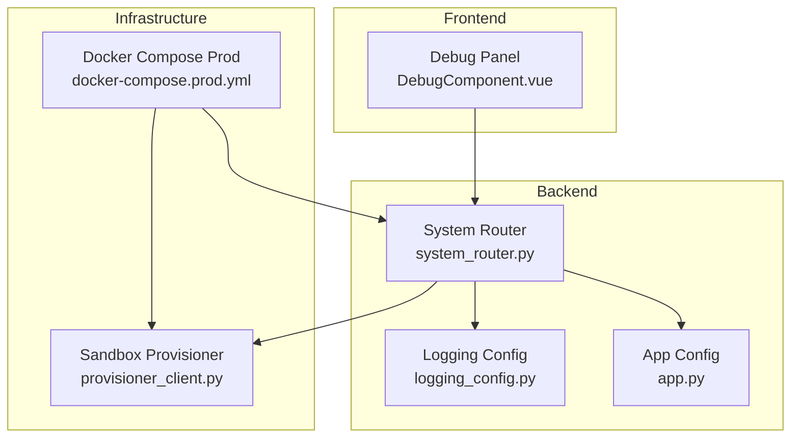
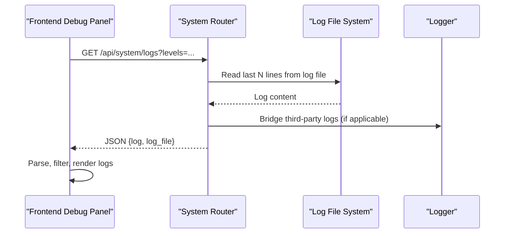
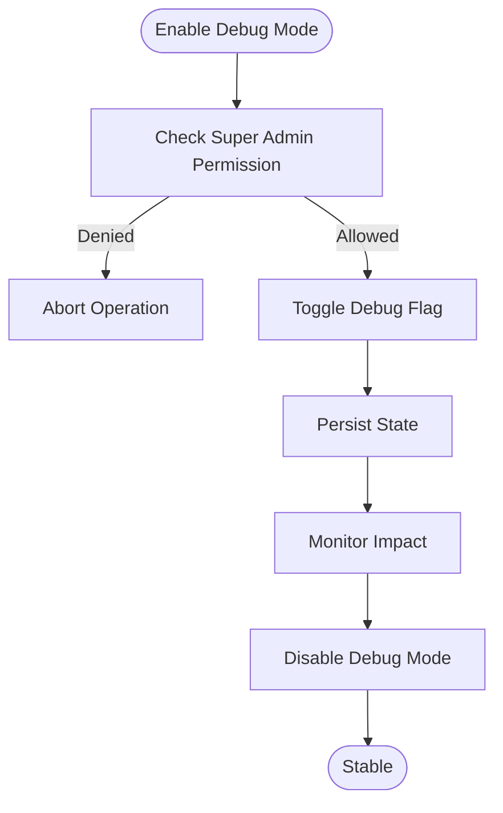
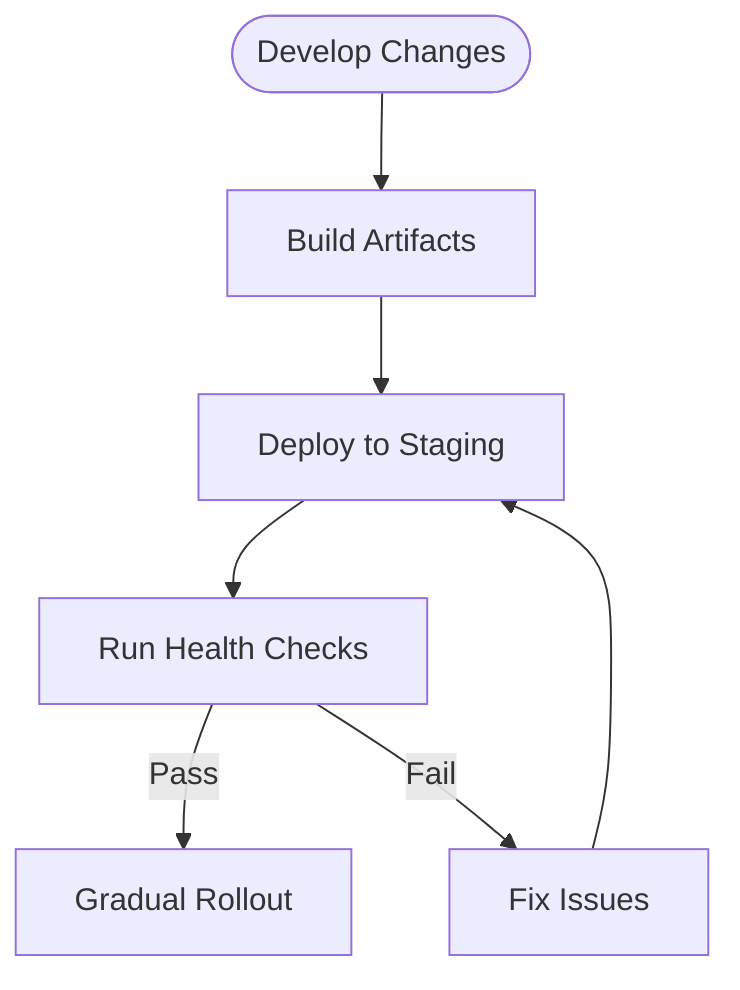
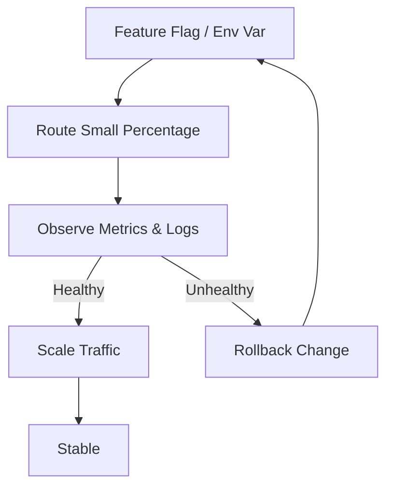
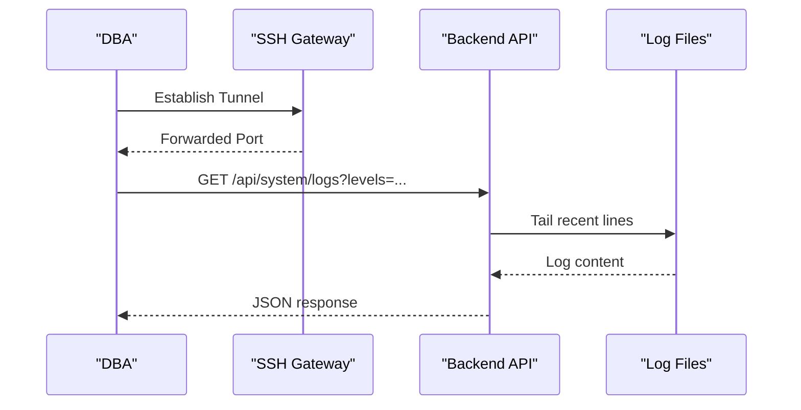
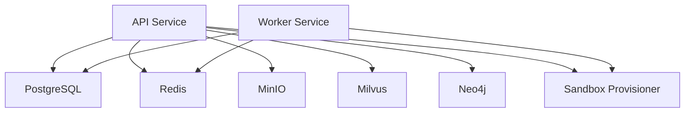
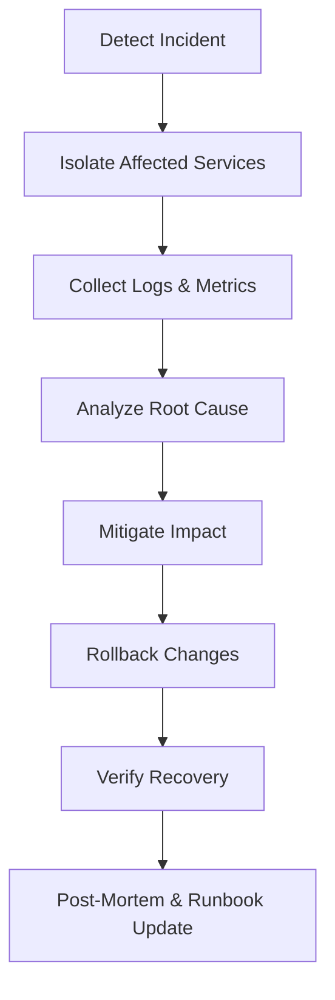
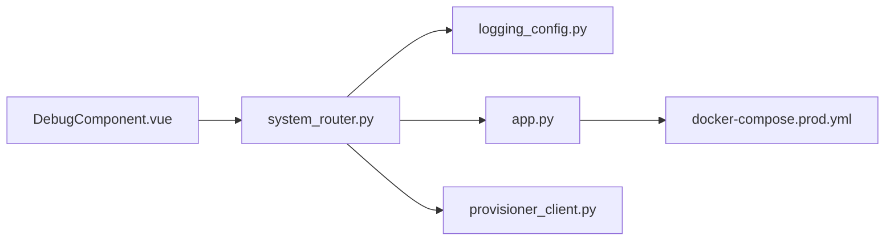

# Production Debugging

<cite>
**Referenced Files in This Document**
- [DebugComponent.vue](file://web/src/components/DebugComponent.vue)
- [logging_config.py](file://backend/package/yuxi/utils/logging_config.py)
- [system_router.py](file://backend/server/routers/system_router.py)
- [app.py](file://backend/package/yuxi/config/app.py)
- [docker-compose.prod.yml](file://docker-compose.prod.yml)
- [deployment.md](file://docs/advanced/deployment.md)
- [sandbox-architecture.md](file://docs/agents/sandbox-architecture.md)
- [mcp-integration.md](file://docs/agents/mcp-integration.md)
- [provisioner_client.py](file://backend/package/yuxi/agents/backends/sandbox/provisioner_client.py)
- [provider.py](file://backend/package/yuxi/agents/backends/sandbox/provider.py)
- [auth_router.py](file://backend/server/routers/auth_router.py)
- [errorHandler.js](file://web/src/utils/errorHandler.js)
</cite>

## Table of Contents
1. [Introduction](#introduction)
2. [Project Structure](#project-structure)
3. [Core Components](#core-components)
4. [Architecture Overview](#architecture-overview)
5. [Detailed Component Analysis](#detailed-component-analysis)
6. [Dependency Analysis](#dependency-analysis)
7. [Performance Considerations](#performance-considerations)
8. [Troubleshooting Guide](#troubleshooting-guide)
9. [Conclusion](#conclusion)
10. [Appendices](#appendices)

## Introduction
This document provides comprehensive production debugging guidance for the system. It focuses on safe debugging practices in production, including enabling debug mode responsibly, using staging environments, and rolling out features gradually. It also covers remote debugging techniques (SSH tunneling, secure shell access, and remote log viewing), debugging strategies for distributed systems (microservice coordination, inter-service communication, and data consistency), and incident response procedures (escalation, rollback, and post-mortem analysis). Practical examples address high-traffic scenarios and maintaining stability during debugging operations.

## Project Structure
The system comprises:
- Frontend Vue application with a debug panel for log viewing and system introspection
- Backend FastAPI service exposing system APIs, including health checks, configuration, logs, and diagnostics
- Supporting services orchestrated via Docker Compose (PostgreSQL, Redis, MinIO, Milvus, Neo4j, sandbox provisioner, OCR services)
- Logging pipeline powered by Loguru with bridged third-party libraries

**Diagram sources**
- [DebugComponent.vue:1-854](file://web/src/components/DebugComponent.vue#L1-L854)
- [system_router.py:1-320](file://backend/server/routers/system_router.py#L1-L320)
- [logging_config.py:1-99](file://backend/package/yuxi/utils/logging_config.py#L1-L99)
- [app.py:1-598](file://backend/package/yuxi/config/app.py#L1-L598)
- [docker-compose.prod.yml:1-373](file://docker-compose.prod.yml#L1-L373)
- [provisioner_client.py:1-73](file://backend/package/yuxi/agents/backends/sandbox/provisioner_client.py#L1-L73)

**Section sources**
- [DebugComponent.vue:1-854](file://web/src/components/DebugComponent.vue#L1-L854)
- [system_router.py:1-320](file://backend/server/routers/system_router.py#L1-L320)
- [logging_config.py:1-99](file://backend/package/yuxi/utils/logging_config.py#L1-L99)
- [app.py:1-598](file://backend/package/yuxi/config/app.py#L1-L598)
- [docker-compose.prod.yml:1-373](file://docker-compose.prod.yml#L1-L373)

## Core Components
- Remote log viewing and filtering: The frontend debug panel fetches and displays logs from the backend system endpoint, supports level filtering, search, auto-refresh, and fullscreen viewing. Access requires super administrator permission.
- Backend log aggregation and persistence: The logging configuration writes structured logs to files and console, bridges third-party library logs, and rotates logs with retention.
- System diagnostics and configuration: The system router exposes health checks, configuration retrieval, model status checks, and log retrieval with level filters.
- Environment and service orchestration: Production Docker Compose defines environment variables, health checks, and network connectivity for all services, including sandbox provisioner integration.

Practical implications:
- Use the debug panel for targeted log inspection without permanently raising log levels.
- Prefer level filtering and search to reduce noise and focus on relevant events.
- Combine backend health checks with infrastructure health checks to isolate failures.

**Section sources**
- [DebugComponent.vue:276-300](file://web/src/components/DebugComponent.vue#L276-L300)
- [system_router.py:54-94](file://backend/server/routers/system_router.py#L54-L94)
- [logging_config.py:55-99](file://backend/package/yuxi/utils/logging_config.py#L55-L99)
- [docker-compose.prod.yml:46-66](file://docker-compose.prod.yml#L46-L66)

## Architecture Overview
The production architecture integrates frontend diagnostics, backend APIs, and distributed infrastructure. The debug panel communicates with the system router, which reads logs from disk and returns them to the UI. Infrastructure services (PostgreSQL, Redis, MinIO, Milvus, Neo4j, sandbox provisioner) are managed via Docker Compose with health checks and environment-specific configuration.

**Diagram sources**
- [DebugComponent.vue:276-300](file://web/src/components/DebugComponent.vue#L276-L300)
- [system_router.py:54-94](file://backend/server/routers/system_router.py#L54-L94)
- [logging_config.py:33-53](file://backend/package/yuxi/utils/logging_config.py#L33-L53)

**Section sources**
- [system_router.py:54-94](file://backend/server/routers/system_router.py#L54-L94)
- [logging_config.py:33-53](file://backend/package/yuxi/utils/logging_config.py#L33-L53)

## Detailed Component Analysis

### Safe Debug Mode in Production
- Principle: Enable debug mode only when necessary and revert immediately after diagnosis.
- Mechanism: The debug panel toggles a debug flag in the frontend info store. Ensure this action is restricted to super administrators and logged as a sensitive operation.
- Recommendation: Use temporary environment overrides or feature flags rather than permanent configuration changes. Validate changes in staging first.

**Diagram sources**
- [DebugComponent.vue:470-474](file://web/src/components/DebugComponent.vue#L470-L474)
- [auth_router.py:788-828](file://backend/server/routers/auth_router.py#L788-L828)

**Section sources**
- [DebugComponent.vue:470-474](file://web/src/components/DebugComponent.vue#L470-L474)
- [auth_router.py:788-828](file://backend/server/routers/auth_router.py#L788-L828)

### Staging Environments for Testing
- Principle: Validate all production-grade changes in a staging environment that mirrors production topology and data characteristics.
- Mechanism: Use separate environment files and compose profiles to simulate production conditions without affecting live traffic.
- Recommendation: Run health checks against all dependent services (PostgreSQL, Redis, MinIO, Milvus, Neo4j, sandbox provisioner) in staging prior to rollout.

**Diagram sources**
- [deployment.md:1-71](file://docs/advanced/deployment.md#L1-L71)
- [docker-compose.prod.yml:1-373](file://docker-compose.prod.yml#L1-L373)

**Section sources**
- [deployment.md:1-71](file://docs/advanced/deployment.md#L1-L71)
- [docker-compose.prod.yml:1-373](file://docker-compose.prod.yml#L1-L373)

### Gradual Feature Rollouts
- Principle: Use canary or percentage-based rollouts to minimize risk.
- Mechanism: Combine environment variables and backend configuration to gate features. Validate metrics and logs before expanding traffic.
- Recommendation: Monitor system logs and model status endpoints to detect regressions early.

**Diagram sources**
- [app.py:216-273](file://backend/package/yuxi/config/app.py#L216-L273)
- [system_router.py:198-223](file://backend/server/routers/system_router.py#L198-L223)

**Section sources**
- [app.py:216-273](file://backend/package/yuxi/config/app.py#L216-L273)
- [system_router.py:198-223](file://backend/server/routers/system_router.py#L198-L223)

### Remote Debugging Techniques
- SSH Tunneling and Secure Shell Access:
  - Use SSH tunneling to securely access internal services for diagnostics without exposing ports publicly.
  - Limit access to trusted IP ranges and rotate credentials regularly.
- Remote Log Viewing:
  - Use the backend system logs endpoint to fetch recent log entries filtered by level.
  - For long-running diagnostics, enable auto-refresh in the debug panel while restricting access to super administrators.

**Diagram sources**
- [system_router.py:54-94](file://backend/server/routers/system_router.py#L54-L94)
- [DebugComponent.vue:276-300](file://web/src/components/DebugComponent.vue#L276-L300)

**Section sources**
- [system_router.py:54-94](file://backend/server/routers/system_router.py#L54-L94)
- [DebugComponent.vue:276-300](file://web/src/components/DebugComponent.vue#L276-L300)

### Distributed Systems Debugging
- Microservice Coordination:
  - Use health checks defined in Docker Compose to verify service readiness.
  - For sandbox-backed operations, confirm the sandbox provisioner is healthy and reachable.
- Inter-Service Communication:
  - Validate connectivity between API, workers, and auxiliary services (PostgreSQL, Redis, MinIO, Milvus, Neo4j).
  - Inspect model status endpoints to ensure external provider availability.
- Data Consistency Verification:
  - Cross-check logs across services and use model status endpoints to detect provider-side issues.
  - Confirm sandbox lifecycle operations (discover/create/touch/delete) succeed.

**Diagram sources**
- [docker-compose.prod.yml:29-373](file://docker-compose.prod.yml#L29-L373)
- [provisioner_client.py:15-73](file://backend/package/yuxi/agents/backends/sandbox/provisioner_client.py#L15-L73)

**Section sources**
- [docker-compose.prod.yml:29-373](file://docker-compose.prod.yml#L29-L373)
- [provisioner_client.py:15-73](file://backend/package/yuxi/agents/backends/sandbox/provisioner_client.py#L15-L73)

### Incident Response Procedures
- Error Escalation:
  - Use the backend’s model status endpoints to triage provider-side issues.
  - Capture logs with level filters to expedite root cause identification.
- Rollback Strategies:
  - Revert configuration changes via the system router’s configuration endpoints.
  - Roll back container images to previous versions and re-run health checks.
- Post-Mortem Analysis:
  - Aggregate logs across services and document mitigations.
  - Update runbooks with lessons learned and preventive measures.

**Diagram sources**
- [system_router.py:198-223](file://backend/server/routers/system_router.py#L198-L223)
- [system_router.py:54-94](file://backend/server/routers/system_router.py#L54-L94)

**Section sources**
- [system_router.py:198-223](file://backend/server/routers/system_router.py#L198-L223)
- [system_router.py:54-94](file://backend/server/routers/system_router.py#L54-L94)

### Practical Examples

#### Example: Investigating High-Volume OCR Failures
- Steps:
  - Use the debug panel to filter logs by ERROR and WARNING levels.
  - Check OCR health endpoints to confirm service availability.
  - Validate sandbox provisioner health and sandbox lifecycle operations.
  - If provider-side, consult model status endpoints; if infrastructure-side, inspect service health checks.
- Stability:
  - Avoid increasing log verbosity globally; rely on targeted filtering.
  - Use auto-refresh sparingly to prevent UI overhead.

**Section sources**
- [DebugComponent.vue:276-300](file://web/src/components/DebugComponent.vue#L276-L300)
- [system_router.py:152-191](file://backend/server/routers/system_router.py#L152-L191)
- [provisioner_client.py:28-66](file://backend/package/yuxi/agents/backends/sandbox/provisioner_client.py#L28-L66)

#### Example: Validating MCP Integration in Production
- Steps:
  - Confirm MCP server availability via system endpoints.
  - Use the debug panel to review logs around MCP activity.
  - If issues arise, temporarily disable specific MCP servers or tools via configuration endpoints.
- Stability:
  - Keep MCP configuration synchronized with code-defined defaults and avoid frequent manual changes in production.

**Section sources**
- [mcp-integration.md:1-52](file://docs/agents/mcp-integration.md#L1-L52)
- [system_router.py:229-292](file://backend/server/routers/system_router.py#L229-L292)

#### Example: Investigating Sandbox Execution Failures
- Steps:
  - Verify sandbox provisioner health and backend configuration.
  - Inspect sandbox lifecycle operations (discover/create/touch/delete).
  - Review logs for sandbox-related errors and adjust timeouts or output limits if needed.
- Stability:
  - Do not modify sandbox configuration frequently; validate changes in staging first.

**Section sources**
- [sandbox-architecture.md:21-31](file://docs/agents/sandbox-architecture.md#L21-L31)
- [app.py:245-273](file://backend/package/yuxi/config/app.py#L245-L273)
- [provisioner_client.py:15-73](file://backend/package/yuxi/agents/backends/sandbox/provisioner_client.py#L15-L73)

## Dependency Analysis
The debug panel depends on the system router for logs and on user permissions for access. The system router depends on the logging configuration and reads from persistent log files. The sandbox provider depends on the provisioner client and environment configuration.

**Diagram sources**
- [DebugComponent.vue:1-854](file://web/src/components/DebugComponent.vue#L1-L854)
- [system_router.py:1-320](file://backend/server/routers/system_router.py#L1-L320)
- [logging_config.py:1-99](file://backend/package/yuxi/utils/logging_config.py#L1-L99)
- [app.py:1-598](file://backend/package/yuxi/config/app.py#L1-L598)
- [docker-compose.prod.yml:1-373](file://docker-compose.prod.yml#L1-L373)
- [provisioner_client.py:1-73](file://backend/package/yuxi/agents/backends/sandbox/provisioner_client.py#L1-L73)

**Section sources**
- [DebugComponent.vue:1-854](file://web/src/components/DebugComponent.vue#L1-L854)
- [system_router.py:1-320](file://backend/server/routers/system_router.py#L1-L320)
- [logging_config.py:1-99](file://backend/package/yuxi/utils/logging_config.py#L1-L99)
- [app.py:1-598](file://backend/package/yuxi/config/app.py#L1-L598)
- [docker-compose.prod.yml:1-373](file://docker-compose.prod.yml#L1-L373)
- [provisioner_client.py:1-73](file://backend/package/yuxi/agents/backends/sandbox/provisioner_client.py#L1-L73)

## Performance Considerations
- Log volume: Use level filtering and search to reduce UI rendering and network overhead.
- Auto-refresh: Limit refresh intervals and disable when not actively diagnosing.
- Health checks: Rely on Docker Compose health checks to proactively detect failing services.
- Sandbox operations: Tune execution timeouts and output limits to balance safety and responsiveness.

[No sources needed since this section provides general guidance]

## Troubleshooting Guide
- Permission Denied:
  - Some actions require super administrator privileges; confirm role and reattempt.
- Log Retrieval Errors:
  - Ensure the log file path exists and is readable by the backend process.
- Model Status Failures:
  - Use model status endpoints to identify provider-side issues; verify credentials and quotas.
- Sandbox Lifecycle Errors:
  - Confirm provisioner health and backend configuration; inspect timeouts and output limits.
- Frontend Diagnostics:
  - Use the error handler utilities to surface and categorize errors consistently.

**Section sources**
- [auth_router.py:788-828](file://backend/server/routers/auth_router.py#L788-L828)
- [system_router.py:54-94](file://backend/server/routers/system_router.py#L54-L94)
- [system_router.py:198-223](file://backend/server/routers/system_router.py#L198-L223)
- [provisioner_client.py:15-73](file://backend/package/yuxi/agents/backends/sandbox/provisioner_client.py#L15-L73)
- [errorHandler.js:93-147](file://web/src/utils/errorHandler.js#L93-L147)

## Conclusion
Effective production debugging balances visibility with safety. Use the debug panel for targeted inspection, rely on backend diagnostics and health checks, and validate changes in staging before production rollout. For distributed systems, coordinate across services, monitor inter-service communication, and maintain strict access controls. Adopt robust incident response practices to minimize impact and improve resilience.

[No sources needed since this section summarizes without analyzing specific files]

## Appendices
- Production Deployment Notes:
  - Use dedicated environment files for production and keep secrets out of version control.
  - Run health checks and verify service readiness before enabling heavy traffic.

**Section sources**
- [deployment.md:1-71](file://docs/advanced/deployment.md#L1-L71)