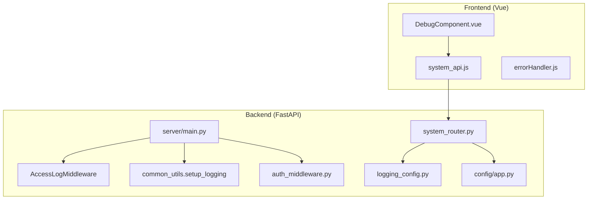
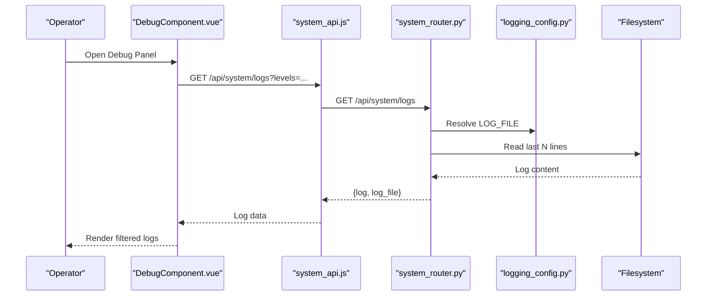
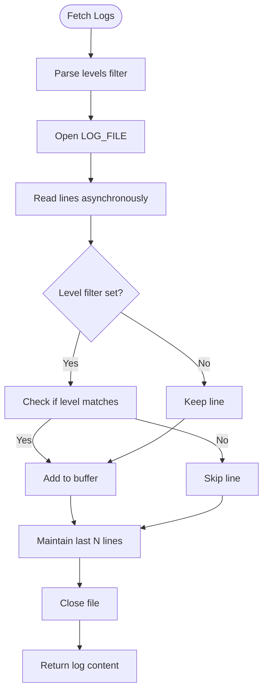
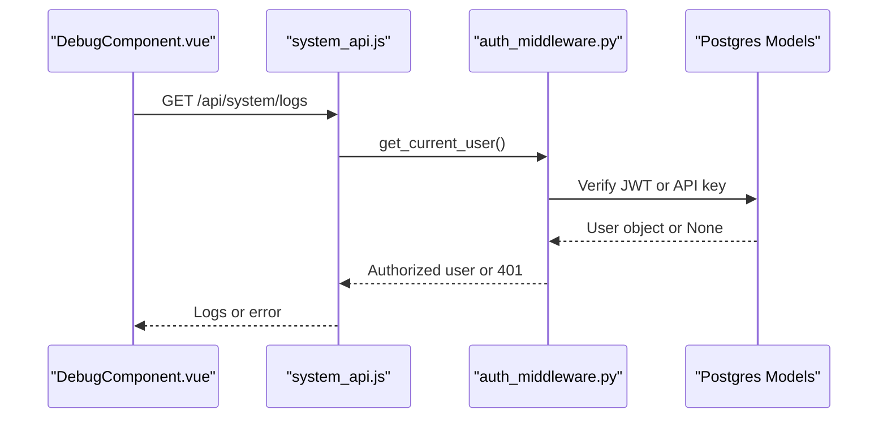
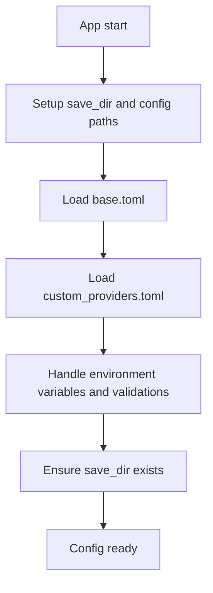
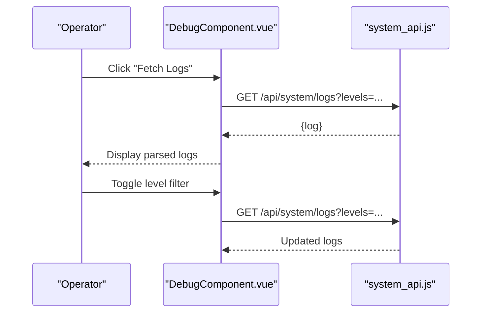
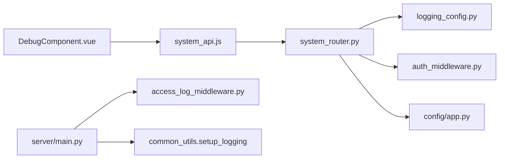

# Troubleshooting & Debugging

<cite>
**Referenced Files in This Document**
- [backend/server/main.py](file://backend/server/main.py)
- [backend/server/utils/access_log_middleware.py](file://backend/server/utils/access_log_middleware.py)
- [backend/server/utils/common_utils.py](file://backend/server/utils/common_utils.py)
- [backend/server/utils/auth_middleware.py](file://backend/server/utils/auth_middleware.py)
- [backend/server/routers/system_router.py](file://backend/server/routers/system_router.py)
- [backend/package/yuxi/utils/logging_config.py](file://backend/package/yuxi/utils/logging_config.py)
- [backend/package/yuxi/config/app.py](file://backend/package/yuxi/config/app.py)
- [web/src/components/DebugComponent.vue](file://web/src/components/DebugComponent.vue)
- [web/src/apis/system_api.js](file://web/src/apis/system_api.js)
- [web/src/utils/errorHandler.js](file://web/src/utils/errorHandler.js)
</cite>

## Table of Contents
1. [Introduction](#introduction)
2. [Project Structure](#project-structure)
3. [Core Components](#core-components)
4. [Architecture Overview](#architecture-overview)
5. [Detailed Component Analysis](#detailed-component-analysis)
6. [Dependency Analysis](#dependency-analysis)
7. [Performance Considerations](#performance-considerations)
8. [Troubleshooting Guide](#troubleshooting-guide)
9. [Conclusion](#conclusion)
10. [Appendices](#appendices)

## Introduction
This document provides comprehensive troubleshooting and debugging guidance for the Yuxi platform. It covers installation and configuration pitfalls, runtime diagnostics, logging and error tracking, performance tuning, and agent/API integration issues. It also includes practical workflows for production debugging, remote debugging, and collaborative problem resolution, along with references to built-in debugging tools in the frontend and backend.

## Project Structure
The Yuxi platform consists of:
- Backend server built with FastAPI and uvicorn, exposing system APIs for logs, configuration, health checks, and model status.
- Logging subsystem bridging Python logging to loguru with rotating file logs and optional console output.
- Frontend Vue application with a Debug Panel that fetches and filters logs via admin APIs, and a centralized error handler for network and validation errors.

**Diagram sources**
- [backend/server/main.py:1-150](file://backend/server/main.py#L1-L150)
- [backend/server/utils/access_log_middleware.py:1-68](file://backend/server/utils/access_log_middleware.py#L1-L68)
- [backend/server/utils/common_utils.py:1-62](file://backend/server/utils/common_utils.py#L1-L62)
- [backend/server/routers/system_router.py:1-320](file://backend/server/routers/system_router.py#L1-L320)
- [backend/package/yuxi/utils/logging_config.py:1-99](file://backend/package/yuxi/utils/logging_config.py#L1-L99)
- [backend/package/yuxi/config/app.py:1-598](file://backend/package/yuxi/config/app.py#L1-L598)
- [web/src/components/DebugComponent.vue:1-854](file://web/src/components/DebugComponent.vue#L1-L854)
- [web/src/apis/system_api.js:1-181](file://web/src/apis/system_api.js#L1-L181)
- [web/src/utils/errorHandler.js:93-147](file://web/src/utils/errorHandler.js#L93-L147)

**Section sources**
- [backend/server/main.py:1-150](file://backend/server/main.py#L1-L150)
- [backend/server/utils/access_log_middleware.py:1-68](file://backend/server/utils/access_log_middleware.py#L1-L68)
- [backend/server/utils/common_utils.py:1-62](file://backend/server/utils/common_utils.py#L1-L62)
- [backend/server/routers/system_router.py:1-320](file://backend/server/routers/system_router.py#L1-L320)
- [backend/package/yuxi/utils/logging_config.py:1-99](file://backend/package/yuxi/utils/logging_config.py#L1-L99)
- [backend/package/yuxi/config/app.py:1-598](file://backend/package/yuxi/config/app.py#L1-L598)
- [web/src/components/DebugComponent.vue:1-854](file://web/src/components/DebugComponent.vue#L1-L854)
- [web/src/apis/system_api.js:1-181](file://web/src/apis/system_api.js#L1-L181)
- [web/src/utils/errorHandler.js:93-147](file://web/src/utils/errorHandler.js#L93-L147)

## Core Components
- Logging and log retrieval:
  - Backend logging uses loguru with file rotation and console output, and bridges third-party libraries to loguru. Logs are stored under a saves directory with daily filenames.
  - The system logs endpoint streams recent log lines with optional level filtering.
- Access logging:
  - A dedicated access logger records request method, path, status code, and response time.
- Authentication and authorization:
  - Public paths bypass auth; protected endpoints require either JWT or API key validation.
- Configuration management:
  - Centralized configuration class loads user overrides from TOML, validates environment-dependent settings, and exposes admin APIs to read/update/save configuration.
- Frontend debugging panel:
  - Provides live log viewing, filtering by level, auto-refresh, and actions to inspect system info, user info, database state, and agent configuration.

**Section sources**
- [backend/package/yuxi/utils/logging_config.py:1-99](file://backend/package/yuxi/utils/logging_config.py#L1-L99)
- [backend/server/routers/system_router.py:54-94](file://backend/server/routers/system_router.py#L54-L94)
- [backend/server/utils/access_log_middleware.py:1-68](file://backend/server/utils/access_log_middleware.py#L1-L68)
- [backend/server/utils/auth_middleware.py:18-26](file://backend/server/utils/auth_middleware.py#L18-L26)
- [backend/package/yuxi/config/app.py:127-344](file://backend/package/yuxi/config/app.py#L127-L344)
- [web/src/components/DebugComponent.vue:277-300](file://web/src/components/DebugComponent.vue#L277-L300)

## Architecture Overview
The debugging pipeline integrates frontend and backend components to diagnose issues quickly.

**Diagram sources**
- [web/src/components/DebugComponent.vue:277-300](file://web/src/components/DebugComponent.vue#L277-L300)
- [web/src/apis/system_api.js:57-62](file://web/src/apis/system_api.js#L57-L62)
- [backend/server/routers/system_router.py:54-94](file://backend/server/routers/system_router.py#L54-L94)
- [backend/package/yuxi/utils/logging_config.py:9-11](file://backend/package/yuxi/utils/logging_config.py#L9-L11)

## Detailed Component Analysis

### Logging System and Log Retrieval
- Log destination and rotation:
  - Daily log files are written under a saves directory with rotation and compression.
- Bridge to loguru:
  - Third-party libraries are bridged to loguru with level mapping and structured formatting.
- Access logging:
  - Dedicated logger prints request method, path, status, and latency.
- Log retrieval API:
  - Reads the latest lines from the log file and optionally filters by levels.

**Diagram sources**
- [backend/server/routers/system_router.py:54-94](file://backend/server/routers/system_router.py#L54-L94)
- [backend/package/yuxi/utils/logging_config.py:9-11](file://backend/package/yuxi/utils/logging_config.py#L9-L11)

**Section sources**
- [backend/package/yuxi/utils/logging_config.py:55-99](file://backend/package/yuxi/utils/logging_config.py#L55-L99)
- [backend/server/utils/access_log_middleware.py:34-68](file://backend/server/utils/access_log_middleware.py#L34-L68)
- [backend/server/routers/system_router.py:54-94](file://backend/server/routers/system_router.py#L54-L94)

### Authentication and Authorization for Debugging
- Public paths:
  - Health checks and initialization endpoints are publicly accessible.
- Protected endpoints:
  - Admin-only endpoints require either JWT or API key validation and enforce role checks.
- Impersonation:
  - Super admins can switch identities for targeted debugging.

**Diagram sources**
- [web/src/apis/system_api.js:57-62](file://web/src/apis/system_api.js#L57-L62)
- [backend/server/utils/auth_middleware.py:74-124](file://backend/server/utils/auth_middleware.py#L74-L124)
- [backend/server/utils/auth_middleware.py:162-169](file://backend/server/utils/auth_middleware.py#L162-L169)

**Section sources**
- [backend/server/utils/auth_middleware.py:18-26](file://backend/server/utils/auth_middleware.py#L18-L26)
- [backend/server/utils/auth_middleware.py:74-124](file://backend/server/utils/auth_middleware.py#L74-L124)
- [backend/server/utils/auth_middleware.py:162-169](file://backend/server/utils/auth_middleware.py#L162-L169)

### Configuration Management and Validation
- Load-time behavior:
  - Loads user overrides from TOML, merges custom providers, handles environment variables, validates sandbox settings, and ensures at least one model provider is available.
- Save behavior:
  - Persists only user-modified fields to TOML.
- Admin APIs:
  - Expose read, single-update, batch-update, and reload endpoints for configuration.

**Diagram sources**
- [backend/package/yuxi/config/app.py:127-273](file://backend/package/yuxi/config/app.py#L127-L273)

**Section sources**
- [backend/package/yuxi/config/app.py:127-344](file://backend/package/yuxi/config/app.py#L127-L344)
- [backend/server/routers/system_router.py:32-52](file://backend/server/routers/system_router.py#L32-L52)

### Frontend Debug Panel
- Capabilities:
  - Fetch logs, clear logs, filter by level, auto-refresh, toggle fullscreen, impersonate users, and print system/user/database/agent info.
- Permissions:
  - Requires super admin permission for sensitive actions.

**Diagram sources**
- [web/src/components/DebugComponent.vue:277-300](file://web/src/components/DebugComponent.vue#L277-L300)
- [web/src/apis/system_api.js:57-62](file://web/src/apis/system_api.js#L57-L62)

**Section sources**
- [web/src/components/DebugComponent.vue:277-300](file://web/src/components/DebugComponent.vue#L277-L300)
- [web/src/components/DebugComponent.vue:411-468](file://web/src/components/DebugComponent.vue#L411-L468)
- [web/src/components/DebugComponent.vue:476-539](file://web/src/components/DebugComponent.vue#L476-L539)

### Error Handling in Frontend
- Centralized error handler supports:
  - Chat-specific errors, network errors, validation errors, and async wrappers.
- Provides consistent UX and context-aware messages.

**Section sources**
- [web/src/utils/errorHandler.js:93-147](file://web/src/utils/errorHandler.js#L93-L147)

## Dependency Analysis
- Logging:
  - system_router depends on logging_config for log file location.
  - access_log_middleware defines a dedicated access logger.
- Auth:
  - system_router depends on auth_middleware for admin-only endpoints.
- Config:
  - system_router reads/writes configuration via config/app.py.
- Frontend:
  - DebugComponent uses system_api to call backend endpoints.

**Diagram sources**
- [backend/server/main.py:1-150](file://backend/server/main.py#L1-L150)
- [backend/server/utils/access_log_middleware.py:1-68](file://backend/server/utils/access_log_middleware.py#L1-L68)
- [backend/server/utils/common_utils.py:1-62](file://backend/server/utils/common_utils.py#L1-L62)
- [backend/server/routers/system_router.py:1-320](file://backend/server/routers/system_router.py#L1-L320)
- [backend/package/yuxi/utils/logging_config.py:1-99](file://backend/package/yuxi/utils/logging_config.py#L1-L99)
- [backend/package/yuxi/config/app.py:1-598](file://backend/package/yuxi/config/app.py#L1-L598)
- [web/src/components/DebugComponent.vue:1-854](file://web/src/components/DebugComponent.vue#L1-L854)
- [web/src/apis/system_api.js:1-181](file://web/src/apis/system_api.js#L1-L181)

**Section sources**
- [backend/server/main.py:1-150](file://backend/server/main.py#L1-L150)
- [backend/server/routers/system_router.py:1-320](file://backend/server/routers/system_router.py#L1-L320)

## Performance Considerations
- Access logging overhead:
  - Minimal cost; ensure log levels are appropriate for production.
- Log file I/O:
  - Reading last N lines is efficient; avoid excessive filtering in real-time for very large logs.
- Model provider health checks:
  - Use system endpoints to monitor provider availability and latency.
- Sandbox and agent execution:
  - Validate timeouts and output limits; adjust sandbox settings if execution is slow or blocked.

[No sources needed since this section provides general guidance]

## Troubleshooting Guide

### Installation and Environment Setup
- Missing model directory:
  - If MODEL_DIR is set but does not exist, the configuration logs a debug message; ensure the path exists or unset the variable.
- No model providers available:
  - If no provider is valid after environment checks, the configuration raises an error; verify environment variables and custom provider configurations.
- Sandbox configuration:
  - Only the provisioner provider is supported; ensure SANDBOX_PROVISIONER_URL is set and reachable.

**Section sources**
- [backend/package/yuxi/config/app.py:216-273](file://backend/package/yuxi/config/app.py#L216-L273)

### Configuration Errors
- Unknown keys in TOML:
  - Unknown keys are ignored with a warning; verify spelling and supported fields.
- Saving configuration:
  - Only user-modified fields are persisted; confirm base.toml reflects intended changes.

**Section sources**
- [backend/package/yuxi/config/app.py:140-171](file://backend/package/yuxi/config/app.py#L140-L171)
- [backend/package/yuxi/config/app.py:274-307](file://backend/package/yuxi/config/app.py#L274-L307)

### Runtime Failures and Diagnostics
- Health checks:
  - Use the public health endpoint to verify service availability.
- Access logs:
  - Inspect access logs for request latencies and frequent 4xx/5xx responses.
- System logs:
  - Use the Debug Panel to fetch and filter logs by level; auto-refresh helps track ongoing issues.
- Model status:
  - Test individual providers/models to isolate provider-side failures.

**Section sources**
- [backend/server/routers/system_router.py:21-24](file://backend/server/routers/system_router.py#L21-L24)
- [backend/server/utils/access_log_middleware.py:34-68](file://backend/server/utils/access_log_middleware.py#L34-L68)
- [web/src/components/DebugComponent.vue:277-300](file://web/src/components/DebugComponent.vue#L277-L300)
- [backend/server/routers/system_router.py:198-223](file://backend/server/routers/system_router.py#L198-L223)

### Agent Execution and Knowledge Processing
- Agent routing and visibility:
  - Composite backend routes depend on runtime context; ensure user_id, thread_id, and visible knowledge bases are present.
- Sandbox execution:
  - Confirm provisioner URL and timeouts; check output limits and keepalive intervals.

**Section sources**
- [backend/server/routers/system_router.py:294-320](file://backend/server/routers/system_router.py#L294-L320)
- [backend/package/yuxi/config/app.py:78-86](file://backend/package/yuxi/config/app.py#L78-L86)

### API Integration Issues
- Authentication failures:
  - Verify JWT/API key validity and roles; public paths bypass auth.
- Rate limiting:
  - Login attempts are rate-limited; excessive failures trigger 429 responses.

**Section sources**
- [backend/server/utils/auth_middleware.py:74-124](file://backend/server/utils/auth_middleware.py#L74-L124)
- [backend/server/main.py:63-96](file://backend/server/main.py#L63-L96)

### Production Debugging and Remote Debugging
- Use the Debug Panel:
  - Filter logs by level and search terms; enable auto-refresh to monitor live events.
- Impersonation:
  - Switch to affected user sessions for targeted debugging.
- Access logs:
  - Correlate request IDs and timestamps with backend logs for end-to-end tracing.

**Section sources**
- [web/src/components/DebugComponent.vue:277-300](file://web/src/components/DebugComponent.vue#L277-L300)
- [web/src/components/DebugComponent.vue:564-599](file://web/src/components/DebugComponent.vue#L564-L599)
- [backend/server/utils/access_log_middleware.py:34-68](file://backend/server/utils/access_log_middleware.py#L34-L68)

### Collaborative Debugging Workflows
- Share filtered logs:
  - Export logs from the Debug Panel and share with team members for review.
- Standardize error messages:
  - Use the centralized error handler to ensure consistent messaging across the frontend.

**Section sources**
- [web/src/utils/errorHandler.js:93-147](file://web/src/utils/errorHandler.js#L93-L147)

### Support Resources and Escalation
- Health and info endpoints:
  - Use the public health endpoint and info configuration endpoint for initial triage.
- Admin endpoints:
  - Use system APIs to manage configuration, test providers, and reload branding info.

**Section sources**
- [backend/server/routers/system_router.py:21-24](file://backend/server/routers/system_router.py#L21-L24)
- [backend/server/routers/system_router.py:125-145](file://backend/server/routers/system_router.py#L125-L145)

## Conclusion
The Yuxi platform provides robust logging, access logging, admin-protected debugging endpoints, and a frontend Debug Panel to streamline troubleshooting. By leveraging these tools—configuration validation, log retrieval, access logs, and model health checks—teams can quickly diagnose installation issues, configuration errors, runtime failures, and performance bottlenecks. For production, combine the Debug Panel with access logs and model status checks, and use impersonation to reproduce user-specific issues efficiently.

## Appendices

### Quick Reference: Common Commands and Endpoints
- Health check: GET /api/system/health
- Logs: GET /api/system/logs?levels=INFO,ERROR
- Config read: GET /api/system/config
- Config update (single): POST /api/system/config
- Config update (batch): POST /api/system/config/update
- Provider health: GET /api/system/chat-models/all/status
- Brand info: GET /api/system/info
- Brand reload: POST /api/system/info/reload

**Section sources**
- [backend/server/routers/system_router.py:21-24](file://backend/server/routers/system_router.py#L21-L24)
- [backend/server/routers/system_router.py:54-94](file://backend/server/routers/system_router.py#L54-L94)
- [backend/server/routers/system_router.py:32-52](file://backend/server/routers/system_router.py#L32-L52)
- [backend/server/routers/system_router.py:213-223](file://backend/server/routers/system_router.py#L213-L223)
- [backend/server/routers/system_router.py:125-145](file://backend/server/routers/system_router.py#L125-L145)